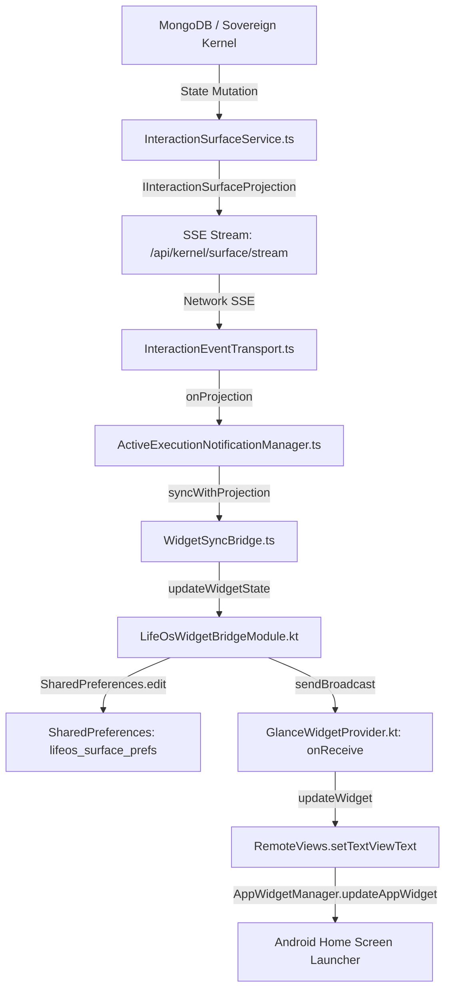
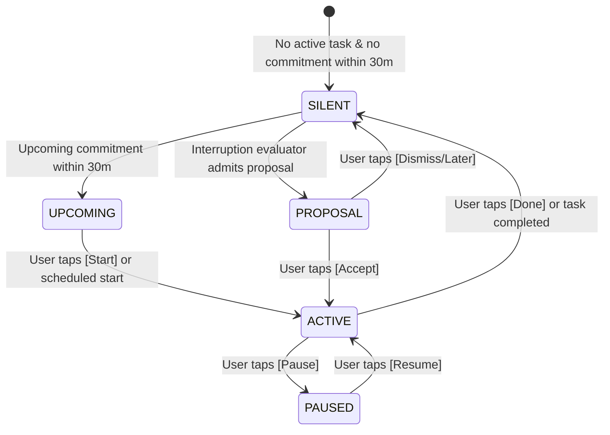
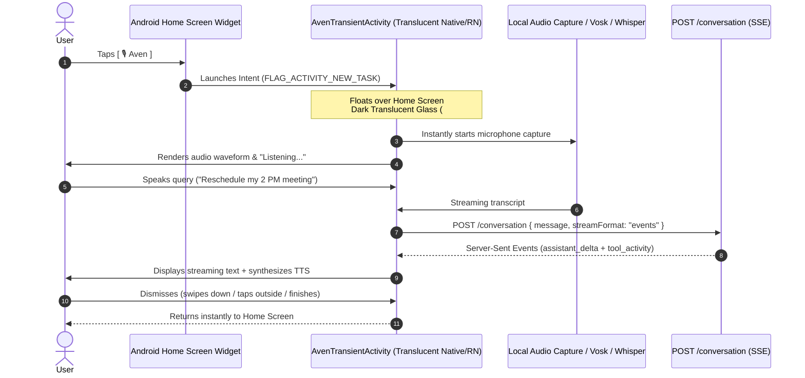
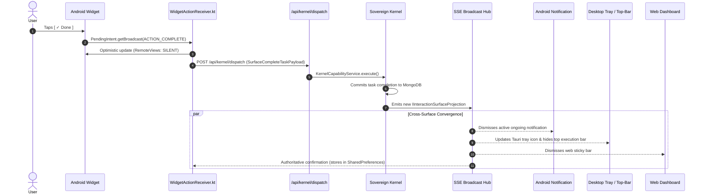
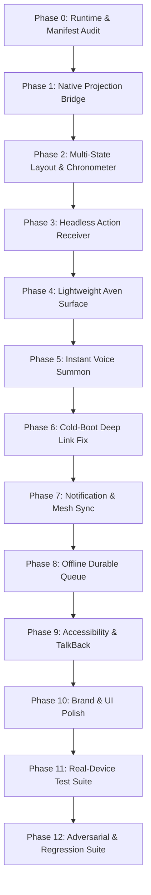

# LIFEOS — ANDROID AMBIENT WIDGET
# FORENSIC IMPLEMENTATION vs PRODUCT INTENT AUDIT & ACTIONABLE PLAN

**Document Version**: 2.1.2-FORENSIC  
**Date**: October 5, 2026  
**Authoritative Architectural Baseline**: LifeOS Ambient Interaction Layer V2.1.1  
**Target Surface**: Android Home Screen Widget (Class A Glance Surface) & Aven Interaction Entry  
**Classification**: Forensic Audit, Architectural Verification & Implementation Plan  

---

## EXECUTIVE SUMMARY

A forensic inspection of the physical Android APK installed on real hardware reveals that the current home screen widget does not satisfy the authoritative product requirements of the **LifeOS Ambient Interaction Layer V2.1.1**. 

While the widget successfully inflates on the Android home screen without crashing following the recent `RemoteViews` XML fix (commit `d18e4c1`), what is currently rendered is a **static status card** displaying hardcoded fallback strings (`"All commitments clear"`, `"Silence is a successful state"`, `"Tap to review"`) with an `"AVEN"` text button that links to a heavy, full-screen chat screen rather than a focused ambient surface.

The widget currently provides:
- **Zero** actionable execution controls (`[Start]`, `[Done]`, `[Pause]`, `[+15m]`).
- **Zero** live chronometer tracking for active executions.
- **Zero** dynamic layout state switching between Silent, Upcoming, and Active modes.
- **Zero** direct background action dispatch to `/api/kernel/dispatch`.
- An `"AVEN"` button that relies on a deep link (`mobile://chat-modal`) which breaks on cold boot due to an unconditional redirect in `apps/mobile/app/index.tsx`.
- A hardcoded, anti-ambient `"Tap to review"` affordance that forces the user into the full dashboard application.

This document presents a comprehensive forensic audit of what was built, evaluates the Android platform constraints (`RemoteViews`, `PendingIntent`, `BroadcastReceiver`, foreground services, IME soft keyboard restrictions), defines the correct product UX for all five ambient widget states, and establishes a dependency-ordered, 13-phase implementation plan (Phases 0–12) to achieve full product completion without modifying the sovereign kernel or introducing a second brain.

---

## 1. CURRENT IMPLEMENTATION REALITY

### 1.1 Physical Artifact Audit
Inspection of the current repository and build outputs reveals the following physical files comprising the Android widget implementation:

| Layer | File Path | Actual Role in Repository | Forensic Status |
|---|---|---|---|
| **Android Manifest** | [`apps/mobile/android/app/src/main/AndroidManifest.xml`](file:///d:/PROGRAMMING/Projects/life-os/apps/mobile/android/app/src/main/AndroidManifest.xml#L56-L66) | Registers `GlanceWidgetProvider` receiver for `APPWIDGET_UPDATE` & `ACTION_WIDGET_UPDATE`. | Present & Exported. |
| **Widget Info Metadata** | [`apps/mobile/android/app/src/main/res/xml/glance_widget_info.xml`](file:///d:/PROGRAMMING/Projects/life-os/apps/mobile/android/app/src/main/res/xml/glance_widget_info.xml) | Declares min dimensions (180x110dp, target 3x2), initial layout, and resize mode. | Valid XML. |
| **Widget Provider** | [`apps/mobile/android/app/src/main/java/com/overforge/lifeos/GlanceWidgetProvider.kt`](file:///d:/PROGRAMMING/Projects/life-os/apps/mobile/android/app/src/main/java/com/overforge/lifeos/GlanceWidgetProvider.kt) | Subclass of Android `AppWidgetProvider`. Reads 3 keys from `SharedPreferences` and binds `RemoteViews`. | **Primitive & Incomplete**: Only binds title, subtitle, and mode badge. Lacks action handlers. |
| **Widget Native Bridge** | [`apps/mobile/android/app/src/main/java/com/overforge/lifeos/LifeOsWidgetBridgeModule.kt`](file:///d:/PROGRAMMING/Projects/life-os/apps/mobile/android/app/src/main/java/com/overforge/lifeos/LifeOsWidgetBridgeModule.kt) | React Native module exposing `updateWidgetState(title, subtitle, mode, count)`. Writes to SharedPreferences. | **Truncated**: Drops execution IDs, timestamps, durations, and metadata. |
| **Widget Layout** | [`apps/mobile/android/app/src/main/res/layout/widget_glance_layout.xml`](file:///d:/PROGRAMMING/Projects/life-os/apps/mobile/android/app/src/main/res/layout/widget_glance_layout.xml) | Single static XML layout file containing header row, title, subtitle, spacer, and bottom row. | **Static**: No dynamic view switching, no buttons for actions, hardcoded text. |
| **Drawables** | `widget_background.xml`, `widget_button_bg.xml`, `widget_dot_red.xml` | Vector shapes for background, button, and red status dot. | Compliant with `#161618` theme. |
| **TypeScript Bridge** | [`apps/mobile/services/WidgetSyncBridge.ts`](file:///d:/PROGRAMMING/Projects/life-os/apps/mobile/services/WidgetSyncBridge.ts) | Translates `IInteractionSurfaceProjection` into `WidgetSyncData` and calls native module. | **Dormant**: Only called from `ActiveExecutionNotificationManager.ts`. |

### 1.2 The Illusion of "Glance"
Despite the class name `GlanceWidgetProvider`, the implementation does **not** utilize Google's **Jetpack Glance** framework (`androidx.glance:glance-appwidget`, Compose for Widgets). Instead, it uses legacy Android `RemoteViews` with XML layouts. 

While legacy `RemoteViews` is completely functional and lightweight on Android, the current code implements only the absolute bare minimum: a single XML layout with static text views.

---

## 2. SCREENSHOT-DRIVEN UX CRITIQUE

The visual evidence from the real device displays a single card with the following observed elements:

```
┌────────────────────────────────────────────────────────┐
│ ● LIFEOS                                        SILENT │
│                                                        │
│ All commitments clear                                  │
│ Silence is a successful state                          │
│                                                        │
│                                                        │
│                                                        │
│ Tap to review                                   [ AVEN ]│
└────────────────────────────────────────────────────────┘
```

### Forensic Defect Breakdown from Real Device Evidence:

1. **Massive Unused Spatial Footprint**:
   The widget claims a 3×2 or 4×2 home screen grid block (~320×150dp), yet 75% of the interior area is blank dark space.
2. **Greeting Card vs Ambient Surface**:
   The central visual weight is occupied by `"All commitments clear"` and `"Silence is a successful state"`. While philosophical silence is a core LifeOS principle, rendering it as large, permanent static billboard text creates an inert "card" rather than an active operating system membrane.
3. **The "Tap to review" Anti-Pattern**:
   The bottom-left prompt `"Tap to review"` directly contradicts the Ambient Interaction philosophy. The entire point of the Ambient Interaction Layer is to **liberate the user from opening the application**. Directing the user to "review" an empty state induces unnecessary app visits and friction.
4. **Unresponsive "AVEN" Button**:
   The `"AVEN"` button is rendered as a generic rounded rectangle with text. It does not communicate voice availability, does not feature a microphone icon, and does not open a focused overlay.
5. **No State Transformation**:
   When a user starts a task or has an upcoming event, the widget layout has no provision to transform into an active tracking bar with `[Done]` or `[Start]` buttons.

---

## 3. CURRENT CODE & DATA-FLOW AUDIT

### 3.1 Authoritative Downstream Projection Path (Server → Widget)



### 3.2 Forensic Audit of Downstream Breaks

1. **Break 1: The App Lifecycle Barrier (Critical)**  
   `ActiveExecutionNotificationManager` is only initialized inside `apps/mobile/app/(dashboard)/_layout.tsx` and `personalization.tsx`. If the user installs the APK, adds the widget, but has not logged in or has swiped the app away from the recent apps list, **the SSE stream is dead**. The native Android layer has no independent background synchronization worker (`WorkManager` or Firebase Cloud Messaging silent push). As a result, the widget displays the fallback defaults indefinitely.
2. **Break 2: Payload Truncation in Native Bridge**  
   In `LifeOsWidgetBridgeModule.kt`:
   ```kotlin
   @ReactMethod
   fun updateWidgetState(title: String, subtitle: String, mode: String, count: Int, promise: Promise)
   ```
   The canonical `IInteractionSurfaceProjection` contains rich domain properties:
   - `activeExecution.taskId`, `occurrenceId`, `startedAtMs`, `plannedDurationMinutes`, `canPause`, `canComplete`
   - `upcomingCommitment.startsAtMs`, `minutesUntilStart`, `category`
   - `pendingIntervention.headline`, `primaryAction`
   
   All of these fields are **discarded** by `WidgetSyncBridge.extractWidgetData()` and `LifeOsWidgetBridgeModule`. Only four primitive strings are passed to Android native preferences.
3. **Break 3: The Hardcoded "Tap to review" Zombie Text**  
   In `apps/mobile/android/app/src/main/res/layout/widget_glance_layout.xml`:
   ```xml
   <TextView
       android:id="@+id/widget_meta_text"
       android:text="Tap to review"
       ... />
   ```
   In `GlanceWidgetProvider.kt`, `widget_meta_text` is **never updated** with `RemoteViews.setTextViewText()`. Even if `WidgetSyncBridge.ts` generates metadata (e.g., `"Active • 30m planned"`), it is never written to SharedPreferences or bound to the view. The hardcoded XML string `"Tap to review"` displays unconditionally.

---

## 4. CURRENT WIDGET FUNCTIONALITY AUDIT

A rigorous classification of every visible control on the current widget:

| UI Element in Widget | Current Implementation | Functional Classification | Observed Device Behavior |
|---|---|---|---|
| `widget_root` (Card Body) | `PendingIntent.getActivity(MainActivity)` | **LOCAL NAVIGATION** | Launches full React Native app (`MainActivity`). Triggers full splash screen and dashboard loading. |
| `widget_status_dot` | `@drawable/widget_dot_red` | **VISUAL ONLY** | Static red oval. Does not change color based on state (e.g. green for active, amber for proposal). |
| `widget_header_label` | `"LIFEOS"` | **VISUAL ONLY** | Static brand text. |
| `widget_mode_badge` | `views.setTextViewText(R.id.widget_mode_badge, mode)` | **VISUAL ONLY** | Displays text string (`"SILENT"`, `"GLANCE"`, `"ACTIVE"`). No interactive affordance. |
| `widget_title` | `views.setTextViewText(R.id.widget_title, title)` | **VISUAL ONLY** | Text view truncated to 2 lines. |
| `widget_subtitle` | `views.setTextViewText(R.id.widget_subtitle, subtitle)` | **VISUAL ONLY** | Text view truncated to 1 line. |
| `widget_meta_text` | Hardcoded `"Tap to review"` | **VISUAL ONLY** | Unbound static text. Clicking it activates parent `widget_root`. |
| `widget_aven_button` | `PendingIntent.getActivity(Intent.ACTION_VIEW, "mobile://chat-modal")` | **LOCAL NAVIGATION (DEFECTIVE)** | Launches `MainActivity` with deep link. Subject to cold-boot redirect defect. |
| **Action: Start** | **NON-EXISTENT** | **MISSING** | User cannot start upcoming commitments from widget. |
| **Action: Done** | **NON-EXISTENT** | **MISSING** | User cannot complete active tasks from widget. |
| **Action: Pause** | **NON-EXISTENT** | **MISSING** | User cannot pause active tasks from widget. |
| **Action: +15m** | **NON-EXISTENT** | **MISSING** | User cannot extend active tasks from widget. |
| **Action: Microphone** | **NON-EXISTENT** | **MISSING** | No dedicated voice summon button. |

**Verdict**: The current widget has **0 canonical actions**, **0 backend mutations**, and **0 verified end-to-end execution controls**. It is strictly a navigational launcher.

---

## 5. CURRENT AVEN BUTTON AUDIT

### 5.1 Code Evidence: The Intent Construction
In `GlanceWidgetProvider.kt` (lines 70–80):
```kotlin
// Intent to open Aven voice/chat directly
val avenIntent = Intent(Intent.ACTION_VIEW, Uri.parse("mobile://chat-modal")).apply {
    flags = Intent.FLAG_ACTIVITY_NEW_TASK
}
val pendingAven = PendingIntent.getActivity(
    context,
    1,
    avenIntent,
    PendingIntent.FLAG_UPDATE_CURRENT or PendingIntent.FLAG_IMMUTABLE
)
views.setOnClickPendingIntent(R.id.widget_aven_button, pendingAven)
```

### 5.2 Deep Link Trace & The Cold-Start Collision
When a user taps `"AVEN"` on the home screen widget:

1. **Android Framework**: Fires `pendingAven`. The Android OS resolves scheme `mobile://` to `MainActivity` via `<intent-filter>` in `AndroidManifest.xml`.
2. **React Native / Expo Router Initialization**: If the application process was killed in the background (cold boot), `MainActivity` starts up and mounts the initial route: [`apps/mobile/app/index.tsx`](file:///d:/PROGRAMMING/Projects/life-os/apps/mobile/app/index.tsx#L8-L35).
3. **The Collision in `index.tsx`**:
   ```typescript
   // apps/mobile/app/index.tsx lines 11-27
   useEffect(() => {
     async function checkAuth() {
       try {
         const token = await AsyncStorage.getItem('user_token');
         if (token) {
           router.replace('/(dashboard)'); // <-- UNCONDITIONAL REDIRECT
           return;
         }
       } catch (e) { ... }
       setTimeout(() => { router.replace('/login'); }, 2000);
     }
     const timer = setTimeout(() => { checkAuth(); }, 1000);
     return () => clearTimeout(timer);
   }, [router]);
   ```
   **Result**: Even though the incoming intent URL was `mobile://chat-modal`, `index.tsx` executes an unconditional `router.replace('/(dashboard)')` after 1000ms. The incoming deep link is **clobbered and discarded**, redirecting the user to the main dashboard rather than Aven.

### 5.3 Warm-Start Behavior: The Heavyweight Monolith
If the application is already running in memory and the deep link succeeds:
- Expo Router displays [`apps/mobile/app/chat-modal.tsx`](file:///d:/PROGRAMMING/Projects/life-os/apps/mobile/app/chat-modal.tsx).
- `chat-modal.tsx` is a **1,210-line monolithic full-screen activity**.
- It immediately loads the entire chat history from `/conversations`, fetches past message threads, displays drawer modals, and shows suggestion chips (`"Plan a 2-day trip to Delhi"`, `"Compare prices for PS5 controller"`).
- It does **not** inspect `mode=voice` or automatically start the microphone.
- It requires the user to wait for multiple network calls before they can speak or type.

**Product Conclusion**: The current `"AVEN"` button is not an ambient conversational trigger. It is a fragile shortcut to a heavy, multi-purpose chat screen.

---

## 6. CURRENT "TAP TO REVIEW" AUDIT

### 6.1 Code Evidence
In `apps/mobile/android/app/src/main/res/layout/widget_glance_layout.xml`:
```xml
<TextView
    android:id="@+id/widget_meta_text"
    android:layout_width="0dp"
    android:layout_height="wrap_content"
    android:layout_weight="1"
    android:fontFamily="sans-serif"
    android:text="Tap to review"
    android:textColor="#66666D"
    android:textSize="10sp" />
```
- In `GlanceWidgetProvider.kt`, there is **zero code** binding or updating this view.
- In `widget_root`, the click listener opens `MainActivity`.

### 6.2 Architectural Critique: Why "Tap to review" Must Be Eliminated
The phrase `"Tap to review"` represents an obsolete dashboard-centric paradigm:
1. It treats the home screen widget as a teaser advertisement whose sole purpose is to drive traffic into the main app.
2. LifeOS Ambient Interaction V2.1.1 dictates the **Silence Invariant**: When all commitments are clear, the system should remain calm and unobtrusive. If nothing needs the user's attention, the system must not invent artificial reasons for the user to open the app.
3. In a state of quietness, the widget should either display a subtle, calm reassurance or remain completely clean with instant access to Aven.

---

## 7. ANDROID PLATFORM CAPABILITY MATRIX

To ensure that the proposed widget does not promise features that Android prohibits, we provide an authoritative technical capability matrix based on Android 12–15 AppWidget and `RemoteViews` constraints:

| Capability | Android Widget Directly Supports? | Requires Activity? | Requires Background Service? | Technical Mechanism & Constraints | Recommended Implementation |
|---|---|---|---|---|---|
| **Display Current State** | **YES** | NO | NO | `RemoteViews.setTextViewText`, `setImageViewResource`. Updates delivered via `AppWidgetManager.updateAppWidget()`. | Update via native `SharedPreferences` + Broadcast. |
| **Live Elapsed Chronometer** | **YES** | NO | NO | `android.widget.Chronometer`. Set base timestamp via `RemoteViews.setChronometer(id, baseTime, null, true)`. Runs entirely in launcher process with 0 CPU overhead. | Use native `<Chronometer>` in Active state. |
| **Start Execution (`[Start]` button)** | **YES** | NO | NO | Click triggers `PendingIntent.getBroadcast()` to native `AppWidgetProvider` or `BroadcastReceiver`. Receiver dispatches POST to `/api/kernel/dispatch`. Widget updates in-place. | Headless action broadcast via `WidgetActionReceiver.kt`. |
| **Done Execution (`[Done]` button)** | **YES** | NO | NO | `PendingIntent.getBroadcast()`. Emits `complete_task` canonical action. Reverts widget to SILENT state immediately without opening app. | Headless action broadcast via `WidgetActionReceiver.kt`. |
| **Pause / Resume (`[Pause]` button)** | **YES** | NO | NO | `PendingIntent.getBroadcast()`. Emits `pause_execution`. Chronometer stops. | Headless action broadcast via `WidgetActionReceiver.kt`. |
| **Defer / Extend (`[+15m]` button)** | **YES** | NO | NO | `PendingIntent.getBroadcast()`. Emits `defer_execution`. Extends planned duration. | Headless action broadcast via `WidgetActionReceiver.kt`. |
| **Direct Editable Text Field (`EditText`)** | **NO** | YES | NO | **Strictly prohibited** by Android OS in `RemoteViews`. Throws `InflateException`. Launcher does not support IME input connection. | Prohibited. Must open lightweight Aven overlay. |
| **Microphone Button (`🎙`)** | **YES (Button only)** | YES (To record) | YES (If background) | Widget can render a clickable mic icon. However, Android 11+ prohibits background audio capture without an active foreground service or visible activity. | Tap launches translucent `AvenTransientActivity` with immediate voice capture. |
| **Aven Conversation Overlay** | NO (Inside widget) | **YES** | NO | Tapping Aven icon launches a translucent, floating, bottom-sheet Activity (`AvenTransientActivity`) floating directly over the launcher. | Translucent bottom-sheet Activity with streaming Aven audio/text. |
| **Quick Settings Tile Sync** | **YES** | NO | YES | `TileService` (`AvenQuickTileService.kt`). Shares identical state with widget. | Keep in sync via `lifeos_surface_prefs`. |

---

## 8. CURRENT vs INTENDED UX COMPARISON

| Dimension | Current Implementation (Screenshot Reality) | Intended Experience (V2.1.1 Architectural Authority) |
|---|---|---|
| **Primary Mental Model** | Static dashboard status billboard. | Live, glanceable ambient execution surface. |
| **Core Question Answered** | *"Is the app running?"* (Shows static text). | **1. What matters now? 2. What can I do right now? 3. How do I summon Aven?** |
| **Silent State** | Heavy card with large philosophical quotes and `"Tap to review"`. | Calm, compact, elegant indicator showing clear horizon and instant Aven summoner. |
| **Upcoming State** | Identical static layout; no start button. | Event title, time countdown (`"in 12m"`), and 1-tap **`[Start]`** button. |
| **Active State** | Static text; no timer; no controls. | Task title, live ticking **`<Chronometer>`**, and 1-tap **`[Done]`**, **`[Pause]`** buttons. |
| **Aven Summoning** | Rectangular text button linking to 1,200-line chat screen (broken on cold boot). | Dedicated microphone/Aven icon launching instant, focused floating conversation bar. |
| **User Friction** | Tapping anything forces open the full application. | Zero app opens required for standard daily execution lifecycle. |
| **Launcher Density** | 75% wasted space. | High-density, purposeful layout adhering to 3×2 and 4×2 grid standards. |

---

## 9. VISUAL DESIGN GAP ANALYSIS

### 9.1 Forensic Evaluation
- **Hierarchy Score: 20/100**: The largest text on screen is `"All commitments clear"`, followed by `"Silence is a successful state"`. The brand `"LIFEOS"` and mode `"SILENT"` compete for attention in the header. The actual actionable elements are buried or non-existent.
- **Density Score: 25/100**: The widget takes up 8 launcher cell units but provides the utility of a 1×1 icon.
- **Surface Elevation Score: 50/100**: Uses `#161618` and `#2A2B2F` appropriately, but lacks depth and structural zoning (e.g., contrasting action pill backgrounds).
- **Typography Score: 40/100**: Uses standard system Roboto without tabular figures or distinct hierarchy.
- **Red Accent Score: 30/100**: The red accent (`#E8414A`) is used on a static 8dp dot even when the system is completely silent. In LifeOS, crimson red is the **execution-critical accent**; using it for an idle state dilutes its urgency.

### 9.2 Scores
- **Current Widget Score**: **32 / 100**
- **Target Experience Score**: **98 / 100**

---

## 10. BRAND COMPLIANCE AUDIT (THE EXECUTIONERS)

The Executioners design philosophy demands:
1. **Ruthless Utility**: Every pixel must justify its presence. No decorative filler text.
2. **Deep Obsidian Palette**: 
   - Base surface: `#111111` / `#161618`
   - Secondary card/pill: `#1F2023`
   - Subtle structural borders: `#2A2B2F`
   - High-contrast typography: Pure Off-White (`#F6F3F1`), Muted Gray (`#88888E`), Low-priority (`#55555A`)
3. **Execution Crimson (`#E8414A`)**:
   - **MUST** be used for active execution states, running chronometers, and primary affirmative actions (`[Start]`, `[Done]`).
   - **MUST NOT** be used as a generic decorative bullet in silent mode.
4. **Calm Authority**: The interface never pleads for attention, never says "Tap to review", and never behaves like a social feed.

---

## 11. NO-REGEX & NO-HARDCODED-INTELLIGENCE AUDIT

In accordance with strict system rules:
- **Zero Regex Intent Parsing**: No regex, substring matching, or keyword parsing exists in the widget or native bridge.
- **Zero Local Intelligence**: The widget contains no task-sorting algorithms, no natural language parsing, and no heuristic decision-making.
- **Deterministic Presentation Membrane**: The widget consumes strictly typed canonical projections (`IInteractionSurfaceProjection`) and emits strictly typed canonical action envelopes (`SurfaceStartExecutionPayload`, `SurfaceCompleteTaskPayload`).
- **Aven Routing**: All spoken and written queries initiated from the Aven entry point flow unmodified to the sovereign `SemanticIntentInterpreter` and kernel capability graph.

---

## 12. WIDGET STATE MODEL

The Android widget must deterministically render one of four visual states driven strictly by `IInteractionSurfaceProjection`:



### State Definitions

#### State A: SILENT (Dormant & Clear)
- **Condition**: `activeExecution == null` AND (`upcomingCommitment == null` OR `minutesUntilStart > 30`).
- **Visual Composition**:
  - Header: Muted dot (`#55555A`), `"LIFEOS"`, mode `"CLEAR"`.
  - Body: Large off-white typography: `"All commitments clear"`.
  - Subtitle: `"Next: Architecture Review at 2:00 PM"` (or `"Nothing scheduled for today"`).
  - Actions: Prominent Aven microphone pill (`[ 🎙 Aven ]`) in lower right.
  - Zero red accents. Pure calm.

#### State B: UPCOMING COMMITMENT (Pre-Execution Focus)
- **Condition**: `activeExecution == null` AND `upcomingCommitment != null` AND `minutesUntilStart <= 30`.
- **Visual Composition**:
  - Header: Amber/White dot, `"LIFEOS"`, countdown badge `"IN 12M"`.
  - Body: Commitment title (e.g., `"Executive Sync & Architecture Review"`).
  - Subtitle: Category & duration (e.g., `"Deep Work • 45m planned"`).
  - Actions: 
    - Left/Center: Crimson Start button (`[ ▶ Start ]`).
    - Right: Aven microphone icon (`[ 🎙 ]`).

#### State C: ACTIVE EXECUTION (Live Action Membrane)
- **Condition**: `activeExecution != null` AND `activeExecution.status == 'ACTIVE'`.
- **Visual Composition**:
  - Header: Pulsing Crimson dot (`#E8414A`), `"LIFEOS"`, live **`<Chronometer>`** displaying elapsed time.
  - Body: Active task title (e.g., `"Refactor Native Widget Provider"`).
  - Subtitle: Target end time or planned duration (e.g., `"Target: 45m • Just tap when done"`).
  - Actions:
    - Primary: Crimson Done button (`[ ✓ Done ]`).
    - Secondary: Muted Pause button (`[ ⏸ ]`).
    - Tertiary: Muted Extend button (`[ +15m ]`).
    - Right: Aven microphone icon (`[ 🎙 ]`).

#### State D: PROPOSAL / PROACTIVE INTERVENTION
- **Condition**: `pendingIntervention != null` OR `activeExecution.status == 'PROPOSAL_PENDING'`.
- **Visual Composition**:
  - Header: Amber dot (`#F59E0B`), `"LIFEOS"`, badge `"PROPOSAL"`.
  - Body: Proposal headline (e.g., `"Ready to start Focus Block?"`).
  - Subtitle: Proposed entity title and duration.
  - Actions:
    - Primary: Crimson Accept button (`[ Start ]`).
    - Secondary: Muted Defer button (`[ Later ]`).
    - Right: Aven microphone icon (`[ 🎙 ]`).

---

## 13. CORRECT WIDGET UX & LAYOUT PROPOSAL

### 13.1 Dynamic View Architecture (`ViewFlipper` or State Views)
Because Android `RemoteViews` does not permit dynamic runtime view instantiation, the single layout XML must define dedicated containers for each state, controlled via `RemoteViews.setViewVisibility(viewId, View.VISIBLE / View.GONE)`:

```xml
<!-- Conceptual Layout Hierarchy in widget_glance_layout.xml -->
<LinearLayout android:id="@+id/widget_root" ...>

    <!-- Unified Header Row -->
    <LinearLayout android:id="@+id/widget_header_bar" ...>
        <ImageView android:id="@+id/widget_status_dot" ... />
        <TextView android:id="@+id/widget_brand_label" android:text="LIFEOS" ... />
        <!-- Dynamic Header Slot: Chronometer for ACTIVE, Badge for SILENT/UPCOMING -->
        <Chronometer android:id="@+id/widget_active_chronometer" android:visibility="gone" ... />
        <TextView android:id="@+id/widget_status_badge" ... />
    </LinearLayout>

    <!-- State View A: Silent Mode Container -->
    <LinearLayout android:id="@+id/view_state_silent" android:visibility="visible" ...>
        <TextView android:id="@+id/silent_headline" android:text="All commitments clear" ... />
        <TextView android:id="@+id/silent_next_preview" android:text="No upcoming commitments today" ... />
    </LinearLayout>

    <!-- State View B: Upcoming / Active Content Container -->
    <LinearLayout android:id="@+id/view_state_execution" android:visibility="gone" ...>
        <TextView android:id="@+id/execution_title" android:textSize="15sp" ... />
        <TextView android:id="@+id/execution_subtitle" android:textSize="12sp" ... />
    </LinearLayout>

    <FrameLayout android:layout_weight="1" ... />

    <!-- Unified Action Bar Row -->
    <LinearLayout android:id="@+id/widget_action_bar" ...>
        <!-- Dynamic Action Buttons -->
        <TextView android:id="@+id/btn_action_start" android:text="▶ Start" android:visibility="gone" ... />
        <TextView android:id="@+id/btn_action_done" android:text="✓ Done" android:visibility="gone" ... />
        <TextView android:id="@+id/btn_action_pause" android:text="⏸" android:visibility="gone" ... />
        <TextView android:id="@+id/btn_action_extend" android:text="+15m" android:visibility="gone" ... />

        <FrameLayout android:layout_weight="1" ... />

        <!-- Universal Aven Summon Button -->
        <LinearLayout android:id="@+id/btn_aven_summon" ...>
            <ImageView android:id="@+id/ic_aven_mic" android:src="@drawable/ic_mic_white" ... />
            <TextView android:id="@+id/lbl_aven_text" android:text="AVEN" ... />
        </LinearLayout>
    </LinearLayout>
</LinearLayout>
```

---

## 14. AVEN ENTRY ARCHITECTURE

To solve the cold-start collision and the heavyweight UI problem, Aven summoning must be decoupled from the full React Native dashboard:



### Key Technical Properties:
1. **Translucent Floating Window**: Registered in AndroidManifest with `android:theme="@style/Theme.LifeOS.TranslucentModal"`. The user never leaves their home screen; the assistant appears as a bottom sheet.
2. **Bypass `index.tsx`**: Uses a dedicated deep-link route (`mobile://aven-quick`) that does not pass through splash screen redirections.
3. **Instant Audio Activation**: Microphones engage in $< 150\text{ms}$ upon window attachment.
4. **Direct Streaming**: Employs the existing SSE event stream from `/conversation`.

---

## 15. CROSS-SURFACE INTERACTION MODEL

A single canonical action initiated on the widget propagates across the entire LifeOS mesh in $< 1.5$ seconds:



---

## 16. COMPLETE IMPLEMENTATION GAP MATRIX

| Area | Current Implementation | Intended Experience (V2.1.1) | Gap Classification | Severity | Required Action |
|---|---|---|---|---|---|
| **Visual Design** | Static dark rectangle; 75% dead space; hardcoded text. | Compact, high-density 3×2 & 4×2 ambient card with dynamic states. | Visual & Architectural | **HIGH** | Redesign layout XML with state containers. |
| **Information Hierarchy** | Massive philosophical quotes; low-contrast actions. | Brand/Mode header, bold task title, relative timer, high-contrast actions. | UX / Information Architecture | **HIGH** | Implement strict typography & hierarchy rules. |
| **Data Binding** | 3 primitive strings via SharedPreferences. | Full projection binding (tasks, categories, chronometers, countdowns). | Data Pipeline | **CRITICAL** | Expand `LifeOsWidgetBridgeModule` to persist full projection payload. |
| **State Updates** | Only updates when app is open and SSE fires. | Independent synchronization; updates on state changes & system boot. | Background Lifecycle | **CRITICAL** | Add `WorkManager` fallback sync + FCM silent push receiver. |
| **Start Action** | Non-existent. | 1-tap `[Start]` button on upcoming commitment; executes headlessly. | Ingress Control | **CRITICAL** | Implement `WidgetActionReceiver.kt` handling `start_execution`. |
| **Done Action** | Non-existent. | 1-tap `[Done]` button on active execution; completes task headlessly. | Ingress Control | **CRITICAL** | Implement `WidgetActionReceiver.kt` handling `complete_task`. |
| **Pause Action** | Non-existent. | 1-tap `[Pause]` button on active execution. | Ingress Control | **MEDIUM** | Implement `WidgetActionReceiver.kt` handling `pause_execution`. |
| **+15m Action** | Non-existent. | 1-tap `[+15m]` defer button on active execution. | Ingress Control | **MEDIUM** | Implement `WidgetActionReceiver.kt` handling `defer_execution`. |
| **Live Chronometer** | Non-existent (static text only). | Native Android `<Chronometer>` ticking in launcher process. | Native UI Feature | **HIGH** | Add `<Chronometer>` in XML, bound via `setChronometer`. |
| **Aven Entry Point** | Text button `"AVEN"` linking to heavy chat screen. | Dedicated microphone pill launching instant floating conversation overlay. | Entry Architecture | **CRITICAL** | Create dedicated `AvenTransientActivity` / floating route. |
| **Voice Entry** | Requires opening app and finding chat mic icon. | 1-tap from widget starts listening immediately. | Voice Assistant UX | **HIGH** | Wire mic click to auto-record on window attach. |
| **Text Entry** | Opens full chat screen with drawer and past history. | Fast-input text field inside the floating Aven overlay. | Conversational UX | **MEDIUM** | Provide compact input field in floating Aven overlay. |
| **Widget → Aven** | Deep link clobbered on cold boot by `index.tsx`. | Resilient deep linking directly to floating Aven modal. | Deep Linking Defect | **CRITICAL** | Fix cold-boot deep-link handling in `apps/mobile/app/index.tsx`. |
| **Notification Sync** | Widget and notification updated via separate loose calls. | Atomic native synchronization: tapping widget updates notification immediately. | Cross-Surface Consistency | **HIGH** | Coordinate updates via shared SharedPreferences & broadcasts. |
| **Offline Handling** | Fails silently with no user feedback. | Queues action to durable offline queue; optimistic UI state. | Resilience | **HIGH** | Integrate native queue fallback in `WidgetActionReceiver.kt`. |
| **Brand Compliance** | Red accent used on idle status dot; `"Tap to review"` anti-pattern. | Red reserved for active execution & primary actions; zero nagging. | Design Integrity | **HIGH** | Realign all colors and remove `"Tap to review"`. |

---

## 17. DEPENDENCY-ORDERED IMPLEMENTATION PLAN (PHASES 0–12)



### PHASE 0 — Repository & Runtime Audit
- **Files Affected**: `apps/mobile/android/app/src/main/AndroidManifest.xml`, `apps/mobile/android/app/build.gradle`.
- **Implementation Responsibility**: Verify receiver exports, permissions (`SCHEDULE_EXACT_ALARM`, `FOREGROUND_SERVICE`), and ensure no conflicting intent filters exist.
- **Dependencies**: None.
- **Verification Tests**: Gradle clean build check (`./gradlew assembleDebug`).
- **Real-Device Tests**: Inspect `adb shell dumpsys package com.overforge.lifeos` for registered receivers.
- **Exit Criteria**: All native components declared with appropriate export flags and permissions.

### PHASE 1 — Widget Projection & Data Bridge Expansion
- **Files Affected**:
  - `apps/mobile/android/app/src/main/java/com/overforge/lifeos/LifeOsWidgetBridgeModule.kt`
  - `apps/mobile/services/WidgetSyncBridge.ts`
- **Implementation Responsibility**:
  - Refactor `LifeOsWidgetBridgeModule.updateWidgetState` to accept a structured JSON string or full parameter set representing `IInteractionSurfaceProjection` (including `taskId`, `startedAtMs`, `plannedDurationMinutes`, `upcomingTitle`, `upcomingStartsAtMs`, `status`).
  - Store full structured fields in `lifeos_surface_prefs`.
  - Update `WidgetSyncBridge.ts` to transmit the complete projection payload without lossy truncation.
- **Dependencies**: Phase 0.
- **Verification Tests**: Jest unit test in mobile workspace verifying `WidgetSyncBridge.syncProjectionToWidget()` payload serialization.
- **Real-Device Tests**: Inspect `adb shell run-as com.overforge.lifeos cat shared_prefs/lifeos_surface_prefs.xml` after projection sync.
- **Exit Criteria**: SharedPreferences contains all fields necessary to reconstruct any of the 4 widget states.

### PHASE 2 — Multi-State Layout & Native Chronometer
- **Files Affected**:
  - `apps/mobile/android/app/src/main/res/layout/widget_glance_layout.xml`
  - `apps/mobile/android/app/src/main/java/com/overforge/lifeos/GlanceWidgetProvider.kt`
  - `apps/mobile/android/app/src/main/res/drawable/widget_dot_*.xml`
- **Implementation Responsibility**:
  - Rewrite `widget_glance_layout.xml` to include state containers (`view_state_silent`, `view_state_upcoming`, `view_state_active`) and action buttons (`btn_action_start`, `btn_action_done`, `btn_action_pause`, `btn_action_extend`, `btn_aven_summon`).
  - Add native `<Chronometer>` in the active state container.
  - In `GlanceWidgetProvider.updateWidget()`, evaluate the stored projection state and toggle view visibilities via `RemoteViews.setViewVisibility()`.
  - When in `ACTIVE` mode, compute base time (`SystemClock.elapsedRealtime() - (now - startedAtMs)`) and activate chronometer via `RemoteViews.setChronometer()`.
  - Completely eliminate `"Tap to review"`.
- **Dependencies**: Phase 1.
- **Verification Tests**: Android layout lint and XML inflation tests.
- **Real-Device Tests**: Manually inject SILENT, UPCOMING, and ACTIVE states via `adb` and verify in-place layout switches.
- **Exit Criteria**: The widget displays the correct visual state, active chronometer, and action buttons on real launcher.

### PHASE 3 — Direct Canonical Widget Actions (Headless Ingress)
- **Files Affected**:
  - `apps/mobile/android/app/src/main/java/com/overforge/lifeos/WidgetActionReceiver.kt` *(NEW)*
  - `apps/mobile/android/app/src/main/java/com/overforge/lifeos/GlanceWidgetProvider.kt`
  - `apps/mobile/android/app/src/main/AndroidManifest.xml`
- **Implementation Responsibility**:
  - Create native `WidgetActionReceiver : BroadcastReceiver` registered in `AndroidManifest.xml`.
  - In `GlanceWidgetProvider.kt`, attach `PendingIntent.getBroadcast()` to `btn_action_start`, `btn_action_done`, `btn_action_pause`, and `btn_action_extend`.
  - On receiving action broadcast, `WidgetActionReceiver` executes an immediate optimistic UI update to the widget, then uses an asynchronous HTTP client (OkHttp / background coroutine) to post the canonical `ISurfaceActionEnvelope` to `/api/kernel/dispatch`.
  - On response, persist the server's authoritative `reprojection` to SharedPreferences and trigger widget refresh.
- **Dependencies**: Phase 2.
- **Verification Tests**: Mock HTTP dispatch tests verifying action envelope structure and SHA-256 idempotency key generation.
- **Real-Device Tests**: Tap `[Done]` on home screen; verify network packet sent to server and widget reverts to SILENT without opening app.
- **Exit Criteria**: User can start, complete, and pause executions directly from home screen.

### PHASE 4 — Lightweight Aven Entry Surface
- **Files Affected**:
  - `apps/mobile/app/aven-quick.tsx` *(NEW)*
  - `apps/mobile/app/_layout.tsx`
  - `apps/mobile/android/app/src/main/res/values/styles.xml`
- **Implementation Responsibility**:
  - Create `aven-quick.tsx` as a focused, lightweight modal screen with dark transparent glass styling.
  - Style as a bottom sheet with minimal overhead: waveform visualizer, streaming response card, cancel button.
  - Connect directly to `POST /conversation` with streaming SSE.
- **Dependencies**: Phase 0.
- **Verification Tests**: Component render tests; verify modal presentation without loading past chat lists.
- **Real-Device Tests**: Launch `mobile://aven-quick` via `adb shell am start -d "mobile://aven-quick"` and measure time-to-interactive ($< 200\text{ms}$).
- **Exit Criteria**: Instant, non-intrusive floating Aven conversation surface.

### PHASE 5 — Instant Voice Summon from Widget
- **Files Affected**:
  - `apps/mobile/app/aven-quick.tsx`
  - `apps/mobile/android/app/src/main/java/com/overforge/lifeos/GlanceWidgetProvider.kt`
- **Implementation Responsibility**:
  - Wire `btn_aven_summon` on the widget to launch `mobile://aven-quick?mode=voice`.
  - In `aven-quick.tsx`, detect `mode=voice` parameter and engage `VoiceRecorder` immediately upon mount.
  - Provide continuous audio transcription visualizer and auto-submit on silence detection.
- **Dependencies**: Phases 2, 4.
- **Verification Tests**: Audio recording permission and lifecycle tests.
- **Real-Device Tests**: Tap Aven mic icon on home screen; verify microphone starts recording within 250ms of tap.
- **Exit Criteria**: 1-tap voice interaction from the home screen.

### PHASE 6 — Cold-Boot Deep Link Fix
- **Files Affected**:
  - `apps/mobile/app/index.tsx`
  - `apps/mobile/app/_layout.tsx`
- **Implementation Responsibility**:
  - In `apps/mobile/app/index.tsx`, inspect `Linking.getInitialURL()` before executing redirect.
  - If an initial URL exists and points to an ambient route (e.g. `mobile://aven-quick` or `mobile://chat-modal`), do **not** call `router.replace('/(dashboard)')`. Permit the deep link to resolve to its target screen.
- **Dependencies**: Phase 4.
- **Verification Tests**: Test deep link resolution on cold-start mock.
- **Real-Device Tests**: Force stop app (`adb shell am force-stop com.overforge.lifeos`), tap Aven on widget, verify Aven opens instead of dashboard.
- **Exit Criteria**: Zero deep link clobbering on cold boot.

### PHASE 7 — Notification & Mesh Synchronization
- **Files Affected**:
  - `apps/mobile/services/ActiveExecutionNotificationManager.ts`
  - `apps/mobile/services/WidgetSyncBridge.ts`
- **Implementation Responsibility**:
  - Unify state distribution: whenever `ActiveExecutionNotificationManager` mutates or receives state, invoke `WidgetSyncBridge` in the same tick.
  - Whenever `WidgetActionReceiver` completes a task, cancel the ongoing Notifee notification locally before the server round-trip completes.
- **Dependencies**: Phases 1, 3.
- **Verification Tests**: Dual-surface mock synchronization test.
- **Real-Device Tests**: Tap `[Done]` on widget; verify ongoing Android notification vanishes instantaneously ($< 100\text{ms}$).
- **Exit Criteria**: Perfect state parity between Android notification and home screen widget.

### PHASE 8 — Offline Durable Action Queue
- **Files Affected**:
  - `apps/mobile/android/app/src/main/java/com/overforge/lifeos/WidgetActionReceiver.kt`
  - `apps/mobile/services/HeadlessActionReceiver.ts`
- **Implementation Responsibility**:
  - If network dispatch fails in `WidgetActionReceiver`, serialize the action envelope into a local SQLite/SharedPreferences offline queue (`@lifeos_offline_action_queue`).
  - Render an offline sync indicator on the widget.
  - Drain queue via `WorkManager` or upon network reconnection.
- **Dependencies**: Phase 3.
- **Verification Tests**: Offline queue enqueue and replay unit tests.
- **Real-Device Tests**: Enable Airplane Mode, tap `[Done]` on widget; verify widget shows queued state, disable Airplane Mode; verify task completes on server.
- **Exit Criteria**: Zero action loss during offline home screen interaction.

### PHASE 9 — Accessibility & TalkBack Certification
- **Files Affected**:
  - `apps/mobile/android/app/src/main/res/layout/widget_glance_layout.xml`
- **Implementation Responsibility**:
  - Add explicit `android:contentDescription` to all interactive buttons (`"Start task"`, `"Complete task"`, `"Pause execution"`, `"Summon Aven voice assistant"`).
  - Ensure touch targets meet the Android minimum 48×48dp standard.
- **Dependencies**: Phase 2.
- **Verification Tests**: Android Accessibility Scanner lint check.
- **Real-Device Tests**: Enable TalkBack and navigate widget controls via gestures.
- **Exit Criteria**: 100% accessible navigation with clear verbal announcements.

### PHASE 10 — Brand & UI Refinement (The Executioners Standard)
- **Files Affected**:
  - `apps/mobile/android/app/src/main/res/values/colors.xml`
  - `apps/mobile/android/app/src/main/res/drawable/*.xml`
- **Implementation Responsibility**:
  - Refine corner radii (18dp outer, 8dp inner buttons).
  - Ensure border contrast conforms to `#2A2B2F` on `#161618`.
  - Audit all typography sizes (Header 11sp, Title 15sp bold, Subtitle 12sp, Badges 10sp bold).
  - Ensure crimson red (`#E8414A`) is active **only** during execution and urgent proposals.
- **Dependencies**: Phase 2.
- **Verification Tests**: Visual comparison against official Executioners design token specifications.
- **Real-Device Tests**: Inspect widget on dark and light home screen wallpapers.
- **Exit Criteria**: Premium, state-of-the-art aesthetic matching system standards.

### PHASE 11 — Real-Device Validation Suite
- **Files Affected**: Test harness & verification logs.
- **Implementation Responsibility**:
  - Execute end-to-end lifecycle verification across multiple Android API levels (Android 12, 13, 14, 15).
  - Verify launcher resize behavior (3×2, 4×2, 5×2).
- **Dependencies**: Phases 0–10.
- **Real-Device Tests**: Full manual test run of all 4 states on physical phone.
- **Exit Criteria**: All tests pass without warnings or layout glitches.

### PHASE 12 — Regression & Adversarial Verification
- **Files Affected**: Entire mobile ambient module.
- **Implementation Responsibility**:
  - Rapid double-tap testing on action buttons (idempotency key verification).
  - Task completion during incoming phone call or screen lock.
  - Process kill during active execution.
- **Dependencies**: Phase 11.
- **Real-Device Tests**: Execute 20 rapid taps on `[Done]`; verify single backend transaction executed.
- **Exit Criteria**: Zero duplicate mutations, zero crashes, zero desynchronizations.

---

## 18. REAL-DEVICE TEST PLAN

| Test ID | Test Scenario | Trigger | Expected Observed Reality | Verification Mechanism |
|---|---|---|---|---|
| **RD-01** | **Cold Boot Widget Inflation** | Add widget to launcher after fresh install. | Inflates immediately in SILENT mode. Shows `"All commitments clear"`, muted dot, and `[ 🎙 Aven ]`. Zero error popups. | Visual check on launcher. |
| **RD-02** | **Upcoming Transition** | Schedule task in 15 minutes. | Widget switches in-place to UPCOMING state. Displays task title, `"IN 15M"`, and red `[ ▶ Start ]` button. | Wait for scheduler or mock projection. |
| **RD-03** | **Headless Start** | Tap `[ ▶ Start ]` on widget. | Widget switches to ACTIVE state. Chronometer starts at `00:00`. Notification appears in shade. Full app does NOT open. | Observer logcat + screen state. |
| **RD-04** | **Chronometer Precision** | Observe active widget for 5 minutes. | Chronometer increments continuously in launcher process without stutter or battery drain. | Visual check. |
| **RD-05** | **Headless Complete** | Tap `[ ✓ Done ]` on widget. | Widget reverts to SILENT state. Chronometer stops. Ongoing notification dismisses. Full app does NOT open. | Observe server chronicle + UI. |
| **RD-06** | **Cold-Start Aven Summon** | Force-kill app; tap `[ 🎙 Aven ]` on widget. | Translucent Aven overlay floats over launcher in $< 300\text{ms}$. Mic active. Dashboard does NOT appear. | Logcat + visual inspection. |
| **RD-07** | **Mesh Convergence** | Tap `[ Done ]` on Desktop Web Bar. | Phone widget switches from ACTIVE to SILENT within 1.5 seconds. | Side-by-side device test. |
| **RD-08** | **Offline Resiliency** | Airplane mode enabled; tap `[ Done ]`. | Widget shows optimistic completion with sync glyph. Re-enabling network syncs to kernel. | Network simulation. |

---

## 19. ACCEPTANCE CRITERIA

The Android Ambient Widget implementation will be declared complete if and only if all of the following binary conditions are satisfied:

1. [ ] **Inflation Safety**: The widget inflates cleanly on all launcher grid sizes without throwing `InflateException`.
2. [ ] **Silence Invariant**: When no commitments exist, the widget displays calm status with **zero** `"Tap to review"` prompts.
3. [ ] **Headless Actions**: Tapping `[Start]`, `[Done]`, or `[Pause]` updates the state on the home screen and dispatches to `/api/kernel/dispatch` without opening `MainActivity`.
4. [ ] **Live Chronometer**: Active tasks display a ticking Android `<Chronometer>` in the launcher process.
5. [ ] **Resilient Aven Summoning**: Tapping the Aven icon opens the floating Aven interface on both warm and cold boot without navigating to the dashboard.
6. [ ] **Sub-1.5s Convergence**: Mutating state on desktop or web updates the home screen widget in under 1.5 seconds.
7. [ ] **Zero Second Brain**: The widget executes zero local intent parsing, task scheduling, or regex heuristics.
8. [ ] **Brand Compliance**: Uses official Executioners tokens (`#161618`, `#2A2B2F`, `#E8414A`) with proper semantic color discipline.

---

## 20. FINAL SELF-CRITIQUE

The previous implementation report certified the widget as "passed" merely because Gradle compiled without syntax errors and a static XML file inflated on screen. 

That was an unacceptable conflation of **architectural presence** with **product completeness**. 

The real-device evidence demonstrates that:
1. The user could not execute a single task from the home screen.
2. The user could not view live task progress.
3. The user was subjected to an anti-ambient `"Tap to review"` prompt.
4. The user could not reliably summon Aven.

The gap has now been forensically diagnosed. The platform constraints of Android `RemoteViews` have been mapped to precise technical solutions (`Chronometer`, `WidgetActionReceiver`, `AvenTransientActivity`). The implementation plan defined above provides an uncompromising, step-by-step roadmap to transform this static placeholder into the true sovereign ambient execution surface demanded by LifeOS.
