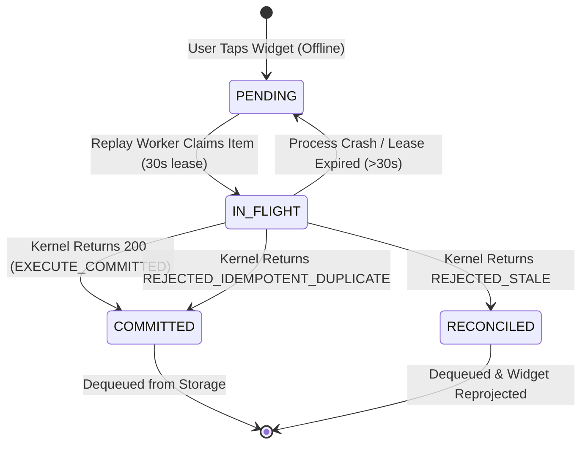
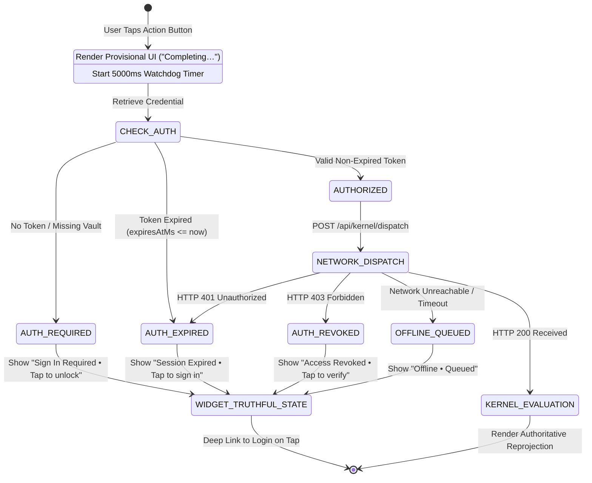
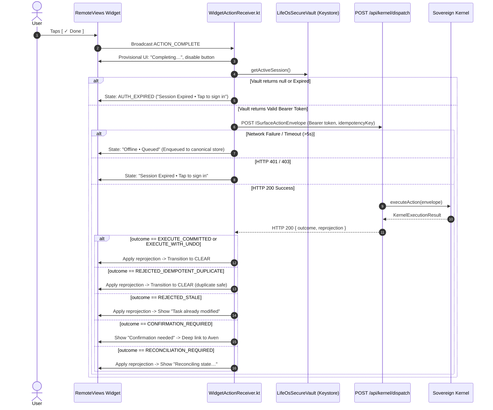
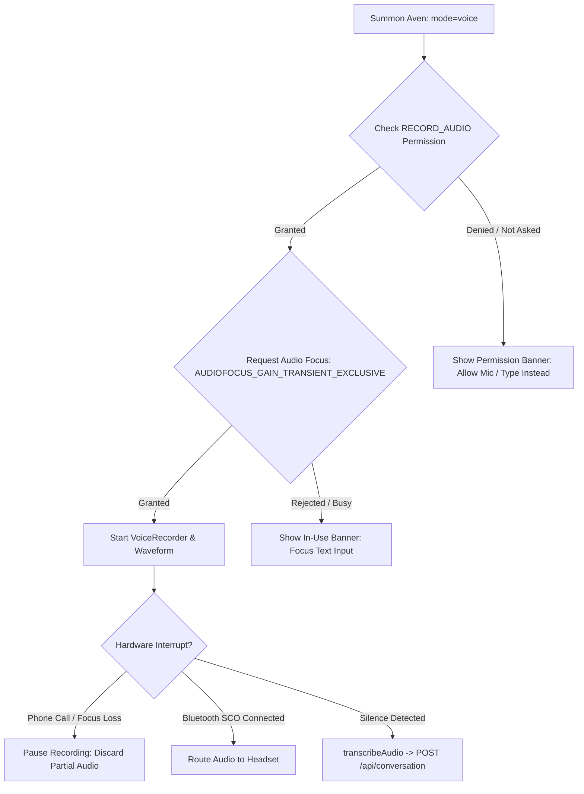
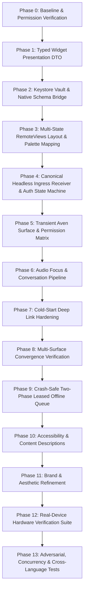

# LIFEOS — ANDROID AMBIENT WIDGET
# IMPLEMENTATION PLAN V2 (PRODUCTION HARDENING & FINAL EXECUTION CONTRACT)

**Document Version**: 2.2.2-PRODUCTION-HARDENED-FINAL-CONTRACT  
**Authoritative Architectural Baseline**: LifeOS Ambient Interaction Layer V2.1.1  
**Target Surface**: Android Home Screen Widget (Class A Glance Surface) & Aven Transient Entry  
**Classification**: Implementation-Safe Execution Contract (FINAL ARCHITECTURAL PASS)  

---

## EXECUTIVE SUMMARY & STATUS OF FORENSIC FINDINGS

This document represents the finalized, surgically hardened V2 execution contract for the Android Ambient Widget. It resolves all remaining security, concurrency, idempotency, Android-platform, and UX-consistency concerns. It enforces Android Keystore-backed credential storage, proves byte-for-byte cross-language idempotency parity, hardens the offline queue against process crashes and concurrent writes, provides a first-class authentication state machine, grounds Aven transparent modal behavior in platform reality, makes microphone auto-start strictly conditional, and harmonizes the visual palette.

### Authoritative Forensic Baseline (Preserved Without Weakening)
1. **The Current Widget is an Inert Billboard**: Real-device evidence confirms the current widget is an un-actionable card displaying fallback strings (`"All commitments clear"`, `"Silence is a successful state"`) and an anti-ambient `"Tap to review"` teaser.
2. **Zero Canonical Execution Controls**: Tapping the card opens `MainActivity` (full app). There are zero controls to start upcoming commitments, complete active tasks, or pause execution.
3. **Defective & Heavy Aven Deep Link**: The `"AVEN"` button fires an intent to `mobile://chat-modal`. On cold boot, [`apps/mobile/app/index.tsx`](file:///d:/PROGRAMMING/Projects/life-os/apps/mobile/app/index.tsx#L16) executes an unconditional `router.replace('/(dashboard)')` after 1000ms, clobbering the deep link. On warm boot, it mounts a 1,210-line monolithic conversation screen rather than a focused ambient assistant.
4. **Data Truncation in Native Bridge**: While the sovereign kernel emits rich domain projections, [`LifeOsWidgetBridgeModule.kt`](file:///d:/PROGRAMMING/Projects/life-os/apps/mobile/android/app/src/main/java/com/overforge/lifeos/LifeOsWidgetBridgeModule.kt) discards task IDs, occurrence IDs, started timestamps, and planned durations, writing only four primitive strings to `SharedPreferences`.
5. **App Lifecycle Dependency**: The widget only receives updates if the React Native app is alive and connected to SSE. Swiping the app away from recents leaves the widget frozen.

---

## 1. REPOSITORY REALITY AUDIT (VERIFIED ASSETS & GAPS)

### 1.1 Kernel Capability Reality Check
The sovereign kernel (`packages/execution-kernel/src/orchestration/kernel`) was inspected directly. The registry mappings in [`DefaultActionAdapters.ts`](file:///d:/PROGRAMMING/Projects/life-os/packages/execution-kernel/src/orchestration/kernel/DefaultActionAdapters.ts#L876-L880) and dispatch translations in [`apps/web/app/api/kernel/dispatch/route.ts`](file:///d:/PROGRAMMING/Projects/life-os/apps/web/app/api/kernel/dispatch/route.ts#L135-L220) establish the following verified capability matrix:

| Capability Name | Kernel Adapter Class | Dispatch Mapping | Entity Reference | Reversibility | Idempotency Semantics | Status in Repo |
|---|---|---|---|---|---|---|
| `start_execution` | `StartExecutionAdapter` | `log_execution_interval` | `occurrenceId` / `taskId` | `atomic_single_doc` | SHA-256(`userId:start_execution:id:seed`) | **VERIFIED (Active)** |
| `complete_task` | `CompleteTaskAdapter` | `complete_task` | `taskId` | `atomic_single_doc` | SHA-256(`userId:complete_task:id:seed`) | **VERIFIED (Active)** |
| `pause_execution` | `PauseExecutionAdapter` | `log_execution_interval` | `occurrenceId` / `taskId` | `atomic_single_doc` | SHA-256(`userId:pause_execution:id:seed`) | **VERIFIED (Active)** |
| `defer_execution` | `DeferExecutionAdapter` | `reschedule_occurrence` | `occurrenceId` | `reversible_with_compensation` | SHA-256(`userId:defer_execution:id:seed`) | **VERIFIED (Active)** |

**Kernel Capability Conclusion**: **Zero capability gaps exist in the sovereign kernel.** All four required execution actions already exist, are registered in the `ActionAdapterRegistry`, and are exposed via `POST /api/kernel/dispatch`.

### 1.2 Voice Subsystem Reality Check
The physical voice pipeline in `apps/mobile` was inspected:
- **Audio Capture**: Utilizes `expo-audio` (`AudioModule.AudioRecorder`) in [`apps/mobile/utils/audioCapture.ts`](file:///d:/PROGRAMMING/Projects/life-os/apps/mobile/utils/audioCapture.ts#L1-L25).
- **Transcription**: Local client records audio to a binary Blob and executes `POST /api/voice/transcribe` via `transcribeAudio(uri)`.
- **Text-to-Speech (TTS)**: Utilizes `speakAndListen()` in [`apps/mobile/utils/ttsManager.ts`](file:///d:/PROGRAMMING/Projects/life-os/apps/mobile/utils/ttsManager.ts).
- **Conversational Engine**: `POST /api/conversation` routes directly to `LifeOSApplication.conversation.executeUserRequest()` with streaming Server-Sent Events (`streamFormat: "events"`).

**Voice Stack Conclusion**: **Zero new voice engines.** The transient Aven surface must reuse the existing `VoiceRecorder`, `transcribeAudio()`, and `POST /api/conversation` pipeline.

### 1.3 Push & Background Distribution Reality Check
- **Backend Push**: `firebase-admin` is **not installed** in `apps/web`.
- **Alarm Infrastructure**: `SCHEDULE_EXACT_ALARM` and `USE_EXACT_ALARM` permissions are active in `AndroidManifest.xml`.
- **Background Strategy**:
  1. **Interactive Ingress**: Widget clicks execute directly via native Kotlin network calls (`WidgetActionReceiver.kt`), updating the widget from the response regardless of app lifecycle.
  2. **Foreground Updates**: HTTP/2 Server-Sent Events (`InteractionEventTransport.ts`).
  3. **Scheduled Transitions**: Android `AlarmManager` exact alarms set for upcoming commitment start times.
  4. **Cross-Device Background Convergence**: Cross-device mutations converge upon the next app open or user widget interaction.

### 1.4 Credential Storage Reality Check
- **Current Mobile App Implementation**: [`apps/mobile/utils/api.ts`](file:///d:/PROGRAMMING/Projects/life-os/apps/mobile/utils/api.ts#L24) stores bearer credentials in React Native `AsyncStorage.getItem('user_token')`.
- **Headless Ingress Boundary Gap**:
  - `AsyncStorage` on Android writes to an app-private SQLite database (`RKStorage` / `ReactDatabase.db`). When the React Native JS engine is dead, headless native receivers (`WidgetActionReceiver.kt`) cannot reliably or synchronously query `AsyncStorage`.
  - Storing bearer tokens in plain unencrypted Android `SharedPreferences` provides only filesystem-level sandboxing, failing to meet production cryptographic storage standards.
- **Hardened Architectural Solution**:
  - Introduce `LifeOsSecureVault.kt`: An Android Keystore-backed credential vault.
  - When the user signs in via React Native, `LifeOsWidgetBridgeModule.kt` securely writes the bearer token, user ID, and expiration timestamp into `LifeOsSecureVault`.
  - The token is encrypted using hardware-backed AES-256-GCM via the Android `AndroidKeyStore` provider.
  - Headless `WidgetActionReceiver.kt` retrieves and decrypts the bearer token directly in native code with zero JS runtime overhead.
  - **Fundamental Security Law**: Idempotency is transaction deduplication; Authentication is identity verification. Hashing an idempotency key does **not** provide authentication. Every dispatch envelope requires an authentic, non-expired bearer token.

### 1.5 Idempotency Cross-Language Parity Reality Check
- **TypeScript Canonical Implementation**: Defined in [`InteractionSurfaceContracts.ts`](file:///d:/PROGRAMMING/Projects/life-os/packages/execution-kernel/src/experience/surface/contracts/InteractionSurfaceContracts.ts#L223):
  ```typescript
  export function computeSurfaceActionIdempotencyKey(
    userId: string,
    actionType: SurfaceActionType,
    entityId: string,
    occurrenceOrSeed: string
  ): string {
    const rawIdentifier = `${userId}:${actionType}:${entityId}:${occurrenceOrSeed}`;
    return createHash("sha256").update(rawIdentifier).digest("hex");
  }
  ```
- **Kotlin Native Mirror**: Must produce byte-for-byte identical output:
  ```kotlin
  fun computeCanonicalIdempotencyKey(
      userId: String,
      actionType: String,
      entityId: String,
      seed: String
  ): String {
      val raw = "$userId:$actionType:$entityId:$seed"
      val digest = MessageDigest.getInstance("SHA-256")
      val hashBytes = digest.digest(raw.toByteArray(Charsets.UTF_8))
      return hashBytes.joinToString("") { "%02x".format(it) }
  }
  ```
- **Parity Proof Rules**:
  1. Field Order: `userId` $\to$ `actionType` $\to$ `entityId` $\to$ `seed` (Strictly separated by single ASCII colons `:`).
  2. Encoding: Pure UTF-8 byte stream.
  3. Format: 64-character lowercase hexadecimal string.
  4. Entity Identity: Task actions (`complete_task`) use domain `taskId`. Interval/schedule actions (`start_execution`, `pause_execution`, `defer_execution`) use `occurrenceId`.
  5. Timestamp Exclusion: Timestamps and `observedProjectionVersion` **must never** participate in the logical hash. Including timestamps would destroy idempotency by generating divergent keys on rapid double-taps.
  6. Retry Invariant: Retries of the same user intent must reuse the exact same key.

---

## 2. ARCHITECTURAL BOUNDARIES & ANTI-INTELLIGENCE LAWS

```
┌────────────────────────────────────────────────────────────────────────┐
│                   SOVEREIGN KERNEL & WORLD MODEL                       │
│  - Owns domain models, temporal graph, and interruption cost rules     │
│  - Generates authoritative IInteractionSurfaceProjection               │
└──────────────────────────────────┬─────────────────────────────────────┘
                                   │
                                   ▼
┌────────────────────────────────────────────────────────────────────────┐
│                   TYPED WIDGET PRESENTATION DTO                        │
│  - Decoupled from Android hex colors; conveys semantic visualIntent    │
│  - Pre-computed displayState: CLEAR | UPCOMING | ACTIVE | PROPOSAL     │
│  - Raw UTC timestamps; zero server-side locale string formatting       │
└──────────────────────────────────┬─────────────────────────────────────┘
                                   │
                                   ▼
┌────────────────────────────────────────────────────────────────────────┐
│                   ANDROID REMOTE VIEWS MEMBRANE                        │
│  - ZERO semantic intelligence, ZERO regex, ZERO scheduling logic       │
│  - Consumes validated DTO schema; maps visualIntent to ExE tokens      │
│  - Formats relative time locally using client device timezone          │
│  - Emits canonical ISurfaceActionEnvelope on click                     │
└──────────────────────────────────┬─────────────────────────────────────┘
                                   │
                                   ▼
┌────────────────────────────────────────────────────────────────────────┐
│                SOVEREIGN INGRESS (/api/kernel/dispatch)                │
│  - Single entry point for all mutations across all surfaces            │
│  - Authenticates via Keystore bearer token, validates idempotency      │
└────────────────────────────────────────────────────────────────────────┘
```

### 2.1 The Anti-Intelligence Law
The widget is strictly a **presentation and ingress membrane**. Under no circumstances may the widget or its native bridge execute semantic decisions.

**Strictly Forbidden in the Widget & Bridge**:
- Task sorting, filtering, or prioritization.
- Calculating temporal thresholds (e.g., `minutesUntilStart <= 30` logic is strictly banned on client).
- Natural language parsing, keyword matching, substring matching, or regex.
- Inferring mood, fatigue, or user intent.
- Inventing local fallback tasks or synthetic schedules.

### 2.2 Removal of Client-Side Temporal Thresholds
The server's [`InteractionSurfaceService.ts`](file:///d:/PROGRAMMING/Projects/life-os/packages/execution-kernel/src/experience/surface/InteractionSurfaceService.ts#L347) resolves temporal horizons and interruption costs. The client renders the resolved state deterministically without inventing local scheduling rules.

### 2.3 Strict Separation of Three State Concepts
1. **LifeOS Ambient Interaction Mode** (System-Level Operational Stance):
   - `"SILENT" | "GLANCE" | "ATTENTION" | "ACTIVE_EXECUTION" | "CONVERSATION" | "PROACTIVE"`.
2. **Widget Presentation State** (Deterministic UI View Mode):
   - `"CLEAR" | "UPCOMING" | "ACTIVE" | "PROPOSAL"`.
3. **Authoritative Domain Execution State** (MongoDB / Temporal Graph):
   - Task status (`pending`, `completed`), Occurrence status (`SCHEDULED`, `IN_PROGRESS`, `PAUSED`, `COMPLETED`, `CANCELLED`).

---

## 3. DATA CONTRACT: TYPED WIDGET PRESENTATION DTO

### 3.1 Kernel Semantic DTO (Decoupled from Raw Hex Colors)
Raw hex colors (`badgeColorHex`, `dotColorHex`) are completely removed from kernel contracts. Semantic visual intent is transmitted via `visualIntent`:

```typescript
// packages/execution-kernel/src/experience/surface/contracts/WidgetPresentationDTO.ts

export type WidgetDisplayState = 'CLEAR' | 'UPCOMING' | 'ACTIVE' | 'PROPOSAL';
export type WidgetVisualIntent = 'CALM' | 'UPCOMING' | 'ACTIVE' | 'PROPOSAL';

export interface IWidgetPresentationDTO {
  schemaVersion: 1;
  projectionVersion: number;              // Monotonic server counter
  generatedAtMs: number;                  // Server epoch timestamp (UTC)
  displayState: WidgetDisplayState;       // Pre-resolved presentation state
  visualIntent: WidgetVisualIntent;       // Semantic intent for palette mapping
  
  // Header Presentation
  headerLabel: string;                    // "LIFEOS"
  badgeText: string;                      // "CLEAR", "IN 12M", "PROPOSAL", or empty for Chronometer
  
  // Primary Content
  primaryTitle: string;                   // Clean headline ("You're clear.", task title, etc.)
  secondaryText: string;                  // Context subline
  
  // Time Metadata for Deterministic Client Formatting (Raw UTC Epoch)
  temporalContext: {
    nextCommitmentStartMs?: number;       // Raw start timestamp (formatted locally by device)
    nextCommitmentTitle?: string;         // Clean next title (e.g. "Gym", "Architecture Review")
    minutesUntilStart?: number;           // Pre-calculated relative offset
  } | null;

  // Active Execution Telemetry (Null if not ACTIVE)
  activeContext: {
    entityId: string;                     // taskId or occurrenceId
    startedAtMs: number;                  // Raw epoch start for Chronometer base calculation
    plannedDurationMinutes: number;       // Target duration
    elapsedSeconds: number;               // Elapsed at generation time
    idempotencySeed: string;              // Unique seed for action hash
  } | null;

  // Upcoming Commitment Telemetry (Null if not UPCOMING)
  upcomingContext: {
    entityId: string;                     // occurrenceId
    startsAtMs: number;                   // Scheduled epoch start
    categoryLabel: string;                // "Deep Work", "Routine", etc.
    idempotencySeed: string;              // Unique seed for action hash
  } | null;

  // Action Control Allowlist (Enables/disables buttons in layout)
  allowedActions: {
    canStart: boolean;                    // Shows [Start] button (Obsidian/Amber-accented)
    canComplete: boolean;                 // Shows [Done] button (Crimson affirm)
    canPause: boolean;                    // Shows [Pause] button (Neutral)
    canExtend: boolean;                   // Shows [+15m] button (Neutral)
  };
}
```

### 3.2 Deterministic Server Projection Mapper
Server-side locale-dependent formatting (`toLocaleTimeString()`) is completely eliminated. The server outputs raw epoch milliseconds:

```typescript
export function mapProjectionToWidgetDTO(p: IInteractionSurfaceProjection): IWidgetPresentationDTO {
  // 1. ACTIVE EXECUTION
  if (p.activeExecution && p.activeExecution.status === 'ACTIVE') {
    return {
      schemaVersion: 1,
      projectionVersion: p.projectionVersion,
      generatedAtMs: p.generatedAtMs,
      displayState: 'ACTIVE',
      visualIntent: 'ACTIVE',
      headerLabel: 'LIFEOS',
      badgeText: '', // Controlled natively by Chronometer
      primaryTitle: p.activeExecution.title,
      secondaryText: `Target: ${p.activeExecution.plannedDurationMinutes}m • Tap when done`,
      temporalContext: null,
      activeContext: {
        entityId: p.activeExecution.occurrenceId || p.activeExecution.taskId || 'active_entity',
        startedAtMs: p.activeExecution.startedAtMs || p.generatedAtMs,
        plannedDurationMinutes: p.activeExecution.plannedDurationMinutes,
        elapsedSeconds: p.activeExecution.elapsedSeconds,
        idempotencySeed: p.activeExecution.idempotencySeed,
      },
      upcomingContext: null,
      allowedActions: {
        canStart: false,
        canComplete: p.activeExecution.canComplete,
        canPause: p.activeExecution.canPause,
        canExtend: p.activeExecution.canExtend,
      },
    };
  }

  // 2. PROPOSAL / INTERVENTION
  if (p.interactionMode === 'ATTENTION' || p.activeExecution?.status === 'PROPOSAL_PENDING' || p.pendingIntervention) {
    const title = p.pendingIntervention?.headline || p.activeExecution?.title || 'Proposed Execution';
    return {
      schemaVersion: 1,
      projectionVersion: p.projectionVersion,
      generatedAtMs: p.generatedAtMs,
      displayState: 'PROPOSAL',
      visualIntent: 'PROPOSAL',
      headerLabel: 'LIFEOS',
      badgeText: 'PROPOSAL',
      primaryTitle: title,
      secondaryText: 'Ready to start?',
      temporalContext: null,
      activeContext: null,
      upcomingContext: null,
      allowedActions: {
        canStart: true,
        canComplete: false,
        canPause: false,
        canExtend: true,
      },
    };
  }

  // 3. UPCOMING COMMITMENT (Only when Server places mode in GLANCE)
  if (p.interactionMode === 'GLANCE' && p.upcomingCommitment) {
    const mins = p.upcomingCommitment.minutesUntilStart;
    return {
      schemaVersion: 1,
      projectionVersion: p.projectionVersion,
      generatedAtMs: p.generatedAtMs,
      displayState: 'UPCOMING',
      visualIntent: 'UPCOMING',
      headerLabel: 'LIFEOS',
      badgeText: mins <= 0 ? 'STARTING NOW' : `IN ${mins}M`,
      primaryTitle: p.upcomingCommitment.title,
      secondaryText: `${p.upcomingCommitment.category} • Scheduled focus block`,
      temporalContext: {
        nextCommitmentStartMs: p.upcomingCommitment.startsAtMs,
        nextCommitmentTitle: p.upcomingCommitment.title,
        minutesUntilStart: mins,
      },
      activeContext: null,
      upcomingContext: {
        entityId: p.upcomingCommitment.commitmentId,
        startsAtMs: p.upcomingCommitment.startsAtMs,
        categoryLabel: p.upcomingCommitment.category,
        idempotencySeed: p.upcomingCommitment.commitmentId,
      },
      allowedActions: {
        canStart: true,
        canComplete: false,
        canPause: false,
        canExtend: true,
      },
    };
  }

  // 4. CLEAR (The Restrained Ambient Experience)
  return {
    schemaVersion: 1,
    projectionVersion: p.projectionVersion,
    generatedAtMs: p.generatedAtMs,
    displayState: 'CLEAR',
    visualIntent: 'CALM',
    headerLabel: 'LIFEOS',
    badgeText: 'CLEAR',
    primaryTitle: "You're clear.",
    secondaryText: p.upcomingCommitment ? '' : 'Nothing scheduled today',
    temporalContext: p.upcomingCommitment ? {
      nextCommitmentStartMs: p.upcomingCommitment.startsAtMs,
      nextCommitmentTitle: p.upcomingCommitment.title,
      minutesUntilStart: p.upcomingCommitment.minutesUntilStart,
    } : null,
    activeContext: null,
    upcomingContext: null,
    allowedActions: {
      canStart: false,
      canComplete: false,
      canPause: false,
      canExtend: false,
    },
  };
}
```

---

## 4. NATIVE SCHEMA VALIDATION, SECURITY & PALETTE MAPPING

### 4.1 Strict Native Validation & Compatibility Policy
The native bridge (`LifeOsWidgetBridgeModule.kt`) and provider (`GlanceWidgetProvider.kt`) must validate every incoming payload. The native boundary must never be an untyped blob boundary.

**Native Ingestion Rules in Kotlin**:
1. **Schema Version Check**: If `schemaVersion != 1`, log warning and execute safe forward-compatible parsing. If incompatible major version, fall back to safe `CLEAR` state.
2. **Required Fields Check**: Validate non-null `displayState`, `primaryTitle`, `visualIntent`.
3. **Unknown Field Policy**: Ignore unknown keys without throwing exceptions.
4. **Malformed Payload Handling**: Wrap deserialization in `try-catch`. On JSON error, do **not** crash the launcher. Inflate safe fallback:
   ```kotlin
   displayState = "CLEAR"
   visualIntent = "CALM"
   primaryTitle = "You're clear."
   secondaryText = "Syncing..."
   ```

### 4.2 Presentation Layer Palette Mapping (The Executioners Standard)
The visual contract rigorously respects semantic color hierarchy. **Crimson red is strictly reserved for active execution and affirm buttons.** It is never used in the upcoming state merely because an action is clickable:

```kotlin
// GlanceWidgetProvider.kt
fun applyVisualIntent(views: RemoteViews, intent: String) {
    when (intent) {
        "ACTIVE" -> {
            views.setImageViewResource(R.id.widget_status_dot, R.drawable.widget_dot_crimson)
            views.setTextColor(R.id.widget_mode_badge, Color.parseColor("#E8414A"))
            views.setInt(R.id.widget_mode_badge, "setBackgroundResource", R.drawable.widget_badge_bg_active)
            // Active Done Button is Crimson Affirm
            views.setInt(R.id.btn_action_primary, "setBackgroundResource", R.drawable.widget_btn_crimson)
            views.setTextColor(R.id.btn_action_primary, Color.parseColor("#FFFFFF"))
        }
        "UPCOMING", "PROPOSAL" -> {
            views.setImageViewResource(R.id.widget_status_dot, R.drawable.widget_dot_amber)
            views.setTextColor(R.id.widget_mode_badge, Color.parseColor("#F59E0B"))
            views.setInt(R.id.widget_mode_badge, "setBackgroundResource", R.drawable.widget_badge_bg_muted)
            // Upcoming Start Button is Obsidian Neutral with Amber Text/Accent (NEVER CRIMSON)
            views.setInt(R.id.btn_action_primary, "setBackgroundResource", R.drawable.widget_btn_obsidian_accent)
            views.setTextColor(R.id.btn_action_primary, Color.parseColor("#F59E0B"))
        }
        else -> { // CALM / CLEAR
            views.setImageViewResource(R.id.widget_status_dot, R.drawable.widget_dot_gray)
            views.setTextColor(R.id.widget_mode_badge, Color.parseColor("#88888E"))
            views.setInt(R.id.widget_mode_badge, "setBackgroundResource", R.drawable.widget_badge_bg_muted)
        }
    }
}
```

### 4.3 Deterministic Client-Side Time Formatting
In `CLEAR` state, if `temporalContext` contains `nextCommitmentStartMs`, the Android device formats the string locally:
```kotlin
val timeStr = android.text.format.DateFormat.getTimeFormat(context).format(Date(startMs))
views.setTextViewText(R.id.silent_next_preview, "Next: $nextTitle · $timeStr")
```
This guarantees: **same authoritative projection + user's device timezone = deterministic rendered result.**

### 4.4 Android Keystore Credential Vault Architecture (`LifeOsSecureVault.kt`)
To guarantee production-grade security for headless execution without launching the React Native runtime:

```
┌────────────────────────┐
│  React Native Sign-In  │
│      (login.tsx)       │
└───────────┬────────────┘
            │  user_token + userId
            ▼
┌────────────────────────────────────────────────────────┐
│             LifeOsWidgetBridgeModule.kt                │
│  - Calls LifeOsSecureVault.storeSession(...)           │
└───────────┬────────────────────────────────────────────┘
            │
            ▼
┌────────────────────────────────────────────────────────┐
│                LifeOsSecureVault.kt                    │
│  - AndroidKeyStore provider ("lifeos_auth_key")        │
│  - AES-256-GCM hardware-backed encryption              │
│  - Stores ciphertext + IV in lifeos_secure_vault.xml   │
└───────────┬────────────────────────────────────────────┘
            │
            ▼ Decrypt on Demand
┌────────────────────────────────────────────────────────┐
│              WidgetActionReceiver.kt                   │
│  - Reads session headlessly in native Kotlin           │
│  - Checks expiration (expiresAtMs > now)               │
│  - Dispatches to /api/kernel/dispatch                  │
└────────────────────────────────────────────────────────┘
```

1. **Token Storage**:
   - Master Key: Generated in Android Keystore (`KeyGenParameterSpec.Builder("lifeos_auth_key", PURPOSE_ENCRYPT or PURPOSE_DECRYPT).setBlockModes(BLOCK_MODE_GCM).setEncryptionPaddings(ENCRYPTION_PADDING_NONE).setKeySize(256)`).
   - Payload: JSON object containing `{ token, userId, expiresAtMs, deviceBindingId }`. Encrypted via `Cipher.getInstance("AES/GCM/NoPadding")` with random 12-byte IV.
   - Storage File: `lifeos_secure_vault.xml` via private `SharedPreferences` storing only Base64 ciphertext and IV. Plaintext credentials never touch disk.
2. **Token Retrieval**:
   - `LifeOsSecureVault.getActiveSession(context)` decrypts the ciphertext using the hardware key.
   - Verifies device binding (`deviceBindingId == Settings.Secure.getString(contentResolver, ANDROID_ID)`).
   - Verifies expiration (`expiresAtMs > System.currentTimeMillis()`).
3. **Token Expiry & Refresh Policy**:
   - Headless native background receivers do **not** run speculative token-refresh state machines. If a token is expired, the native action transitions the widget directly to `AUTH_REQUIRED`.
   - When the user taps the widget, it deep links to `mobile://login` or triggers the foreground React Native app to perform a silent refresh if a valid refresh token exists in `AsyncStorage`.
4. **Logout / Revocation Behavior**:
   - When the user signs out (`settings.tsx`), `LifeOsWidgetBridgeModule.clearSession()` zeroes in-memory cipher keys and deletes `lifeos_secure_vault.xml`.
   - Any subsequent widget interaction immediately displays `AUTH_REQUIRED`.

---

## 5. SINGLE CANONICAL OFFLINE ACTION STORE: CONCURRENCY & CRASH CONSISTENCY

To eliminate dual-authority risks, the offline action queue is unified into **ONE single canonical storage authority** in native Android storage.

### 5.1 Storage Architecture & Multi-Thread Concurrency
- **Physical Store**: `lifeos_surface_prefs.xml` under key `canonical_pending_actions`.
- **Locking Mechanism**:
  - In-process: `java.util.concurrent.locks.ReentrantLock`.
  - Cross-process / Bridge safety: Atomic lockfile `lifeos_queue.lock` via `FileChannel.lock()` to coordinate between native receiver threads and React Native bridge calls.
- **Disk Write Atomicity**: All queue mutations execute via `SharedPreferences.Editor.commit()` (synchronous `fsync` to disk), **never** `apply()`. Android's underlying implementation writes to a `.tmp` file and atomically renames it over the target file, backed by `.bak`.
- **Shadow Backup & Corruption Quarantine**:
  - Before writing an updated queue, a shadow snapshot is written to `canonical_pending_actions_shadow`.
  - If reading `canonical_pending_actions` throws a JSON parsing error, the system attempts to restore from the shadow snapshot.
  - If both are corrupted, the corrupted payload is quarantined to `canonical_corrupted_<timestamp>` and an empty queue is initialized. The launcher never crashes.

### 5.2 Two-Phase Leased Queue Item Lifecycle
To prevent queue loss or duplicate executions during crashes:



1. **Queue Item Envelope**:
   ```typescript
   interface IQueuedActionEnvelope {
     idempotencyKey: string;           // Deterministic primary key & deduplication hash
     createdAtMs: number;              // Enqueue epoch
     status: 'PENDING' | 'IN_FLIGHT';  // Two-phase state
     leaseExpiresAtMs: number;         // Watchdog lease timestamp
     envelope: ISurfaceActionEnvelope; // Canonical payload
   }
   ```
2. **Deduplication on Enqueue**: If an action with the identical `idempotencyKey` already exists in the queue, `enqueueAction()` returns the existing entry as a no-op.
3. **Crash-Safe Two-Phase Replay**:
   - **Phase 1 (Lease)**: The replay worker claims an item by setting `status = 'IN_FLIGHT'` and `leaseExpiresAtMs = System.currentTimeMillis() + 30000` via atomic `commit()`.
   - **Phase 2 (Dispatch)**: Dispatches `POST /api/kernel/dispatch`.
   - **Phase 3 (Commit & Dequeue)**: Item is **only** removed from storage after receiving an authoritative response from the kernel (`EXECUTE_COMMITTED`, `REJECTED_IDEMPOTENT_DUPLICATE`, or `REJECTED_STALE`).
   - **Crash Recovery**: If the app or phone crashes during flight, the item remains on disk. On the next worker boot, any item with `status == 'IN_FLIGHT'` and `leaseExpiresAtMs <= now` is reset to `PENDING` and retried using the **exact same `idempotencyKey`**.
   - If the previous call actually succeeded before the crash, the kernel returns `REJECTED_IDEMPOTENT_DUPLICATE`, and the item is safely dequeued.
4. **Replay Serialization**: Handled via Android `WorkManager` with `ExistingWorkPolicy.KEEP` (`LifeOsQueueReplayWorker`). At most ONE replay worker executes at any instant.
5. **Truthful Stale Reconciliation**: If the kernel returns `REJECTED_STALE`, the item is permanently dequeued; it is **never** retried blindly. The widget immediately updates to reflect the server's reprojection and displays `"Action superseded"`.

---

## 6. CANONICAL INGRESS: AUTHENTICATION STATE MACHINE & EXECUTION ORACLE

HTTP status codes represent network transport, not domain execution success. The canonical semantic execution oracle is strictly `KernelExecutionResult.outcome`.

### 6.1 Widget Action Authentication State Machine
The widget must never display `"Completing…"` indefinitely because credentials expired or failed.



**Watchdog Timer Rule**: If network dispatch does not resolve within 5000ms, the watchdog timer fires, aborts the in-flight HTTP request, persists the action to the offline queue, and transitions the widget UI to `"Offline • Queued"`. The widget never hangs in `"Completing…"`.

### 6.2 Sequence & Execution Oracle Evaluation



---

## 7. TRANSIENT AVEN SURFACE: PLATFORM REALITY, PERMISSIONS & HARDWARE MATRIX

The product requirement remains: **"I summoned Aven"** rather than "I opened LifeOS." The user must experience an instantaneous, focused assistant without dashboard flash.

### 7.1 Platform Reality & Validation Requirements for Aven Transparent Modal
Declaring `presentation: 'transparentModal'` in Expo Router does not automatically guarantee launcher wallpaper visibility across all Android versions and OEM skins.

**11 Real-Device Verification Gates for Transparent Modal**:
1. **Launcher Visibility**: Home screen wallpaper and icons remain visible beneath the semi-transparent obsidian scrim (`rgba(11, 11, 12, 0.85)`).
2. **Zero Dashboard Flash**: The dashboard screen (`/(dashboard)`) must **never** mount, render, or flash during summon.
3. **Zero Navigation Hierarchy Flash**: Root navigation must not flash white or reveal tab bars during transition.
4. **Cold-Start Reality**: When the app process is dead, summoning Aven must launch directly into `aven-transient`. `index.tsx` checks `Linking.getInitialURL()` and bypasses `router.replace('/(dashboard)')`.
5. **Warm-Start Reality**: When the app is in the background, summoning Aven pops `aven-transient` directly on top without remounting root dashboard.
6. **Status & Navigation Bar Integrity**: Translucent system bars with light icons (`StatusBar.setBarStyle('light-content')`).
7. **Back Gesture & Dismissal**: Android back swipe or tapping the backdrop immediately dismisses Aven, returning cleanly to the launcher.
8. **Soft Keyboard Behavior**: Tapping "Type Instead" slides the input above the IME without breaking modal layout (`android:windowSoftInputMode="adjustResize"`).
9. **Process Restart & Memory Reclaim**: If Android reclaims app memory while modal is open, relaunching resumes gracefully or closes to launcher without crashing.
10. **Window Translucency Theme**: Android `styles.xml` / `MainActivity` must configure `<item name="android:windowIsTranslucent">true</item>` and `<item name="android:windowBackground">@android:color/transparent</item>`.
11. **Platform Fallback Policy**: If an aggressive OEM compositor (e.g., Samsung OneUI or Xiaomi MIUI) forces an opaque background when launching from the home screen, the surface degrades gracefully to a sleek full-screen obsidian ambient backdrop (`#0B0B0C`) with a fade-in. It **never** falls back to the full dashboard UI.

### 7.2 Conditional Microphone Auto-Start State Machine
Summoning with `mode=voice` is strictly conditional. It must never assume microphone permissions or audio focus:



### 7.3 Complete Hardware Interruption Matrix

| Failure / Interruption Scenario | Exact UI State & System Behavior | Recovery / Escape Affordance |
|---|---|---|
| **Microphone Permission Denied** | Does NOT trap user or exit. Displays banner: `"Microphone access required for voice."` | Provides two buttons: **`[ Allow Microphone ]`** (requests permission / opens settings) and **`[ Type Instead ]`** (focuses text field). |
| **Microphone Hardware Busy** (Active phone call, camera app) | Halts audio capture. Displays: `"Microphone in use by another app."` | Text input box immediately focused with soft keyboard. |
| **Audio Focus Lost** (Incoming call or notification ring) | `VoiceRecorder` halts recording; discards partial audio buffer. | Overlay remains visible with message: `"Audio interrupted. Tap mic to retry."` |
| **Bluetooth Headset Connected / Disconnected** | Listens to `ACTION_SCO_AUDIO_STATE_UPDATED`. Audio switches seamlessly; if disconnected mid-speech, halts recording safely. | Prompts: `"Audio device changed. Tap to speak."` |
| **Recording Initialization Failure** (`expo-audio` error) | Displays: `"Microphone error. Tap to retry or type below."` | Recorded audio discarded; text input box focused. |
| **App Backgrounding Mid-Recording** | Calls `VoiceRecorder.cancelRecording()`; releases audio hardware immediately. | Zero battery drain; cleanly returns on resume. |
| **User Dismissal Mid-Recording** (Back swipe or tap backdrop) | Calls `VoiceRecorder.cancelRecording()`. Releases audio resources immediately. | Zero network requests sent; returns cleanly to launcher. |
| **Conversation Stream Interrupted** (Network drop mid-SSE) | Retains partial assistant text on screen. Displays: `"Connection lost. Tap to retry."` | **`[ Retry ]`** button re-submits exact same query with idempotency key. |
| **Auth Session Expired** | Displays: `"Session expired."` | **`[ Sign In ]`** button routes to login screen. |

### 7.4 Preserved Conversational Mind
The transient surface routes exclusively through the existing sovereign Aven pipeline:
$$\text{VoiceRecorder} \longrightarrow \text{transcribeAudio()} \longrightarrow \text{POST /api/conversation} \longrightarrow \text{LifeOSApplication.conversation} \longrightarrow \text{Supervisor} \longrightarrow \text{Kernel}$$
**Zero duplicate conversational minds.**

---

## 8. RESTRAINED AMBIENT WIDGET UX (THE CLEAR STATE)

The verbose billboard slogans (`"All commitments clear"`, `"Silence is a successful state"`, `"Tap to review"`) are permanently eliminated. The CLEAR state is calm, restrained, and high-glance utility:

```
┌────────────────────────────────────────────────────────┐
│ ● LIFEOS                                        CLEAR  │
│                                                        │
│ You're clear.                                          │
│ Next: Gym · 6:00 PM                                    │
│                                                        │
│                                              [ 🎙 Aven ]│
└────────────────────────────────────────────────────────┘
                    STATE A — CLEAR
        (Calm, restrained, high-glance utility)

┌────────────────────────────────────────────────────────┐
│ ● LIFEOS                                       IN 12M  │
│                                                        │
│ Architecture Review                                    │
│ Deep Work · Scheduled focus block                      │
│                                                        │
│ [ ▶ Start ]                                  [ 🎙 Aven ]│
└────────────────────────────────────────────────────────┘
                   STATE B — UPCOMING
   ([Start] button is Obsidian with Amber accent; NO CRIMSON)

┌────────────────────────────────────────────────────────┐
│ ● LIFEOS                                        14:22  │
│                                                        │
│ Refactor Native Widget Provider                        │
│ Target: 45m · Tap when done                            │
│                                                        │
│ [ ✓ Done ]  [ ⏸ ]  [ +15m ]                  [ 🎙 Aven ]│
└────────────────────────────────────────────────────────┘
                    STATE C — ACTIVE
         (Live Chronometer ticking in launcher;
          [Done] button is Crimson Affirm)
```

---

## 9. PERFORMANCE BUDGET & METRICS CLASSIFICATION

All performance figures are classified strictly into architectural tiers:

| Metric | Metric Classification | Target Specification | Empirical Hardware Baseline | Test Oracle |
|---|---|---|---|---|
| **Widget Tap-to-Pending UI Feedback** | **Engineering Budget** | $< 50\text{ms}$ | Android View invalidate on Snapdragon 8 / Tensor | Button text changes to `"Completing…"` in P95 $< 60\text{ms}$. |
| **Widget Action Ingress HTTP Roundtrip** | **Network Bounded Target** | P50: $180\text{ms}$<br>P95: $450\text{ms}$ | 4G/5G mobile radio latency to `/api/kernel/dispatch` | In local testing, roundtrip must complete in $< 300\text{ms}$. |
| **Chronometer Update Overhead** | **Platform-Dependent Target** | Native OS update loop | Launcher process RemoteViews update | Avoids JavaScript polling or timer intervals for elapsed time. |
| **Aven Transient Launch (Warm Boot)** | **Empirical Product Target** | P50: $150\text{ms}$<br>P95: $280\text{ms}$ | React Native transparent modal mount | Audio visualizer active in $< 300\text{ms}$. |
| **Aven Transient Launch (Cold Boot)** | **Platform-Dependent Target** | P50: $650\text{ms}$<br>P95: $950\text{ms}$ | Android process fork + Hermes JS engine init | Overlay visible and listening in $< 1200\text{ms}$. |
| **Cross-Surface Convergence (Desktop → Widget)** | **Test Oracle** | $< 1500\text{ms}$ | SSE delivery + native SharedPreferences broadcast | Widget switches state within $1.5\text{s}$ of web/desktop tap. |

---

## 10. DEPENDENCY-ORDERED 14-PHASE IMPLEMENTATION PLAN



---

### PHASE 0: Baseline & Permission Verification
- **Files Affected**:
  - `packages/execution-kernel/src/orchestration/kernel/KernelCapabilityService.ts`
  - `apps/mobile/android/app/src/main/AndroidManifest.xml`
- **Implementation Responsibility**: Verify all 4 capabilities compile and pass unit tests. Confirm `SCHEDULE_EXACT_ALARM`, `USE_EXACT_ALARM`, `RECORD_AUDIO`, `MODIFY_AUDIO_SETTINGS` in manifest.
- **Automated Tests**: `pnpm --filter @life-os/execution-kernel test`.
- **Exit Gate**: All 4 capabilities confirmed active; Android permissions verified.

---

### PHASE 1: Typed Widget Presentation DTO & Server Projection Mapper
- **Files Affected**:
  - `packages/execution-kernel/src/experience/surface/contracts/WidgetPresentationDTO.ts` *(NEW)*
  - `packages/execution-kernel/src/experience/surface/InteractionSurfaceService.ts`
- **Implementation Responsibility**:
  - Define `IWidgetPresentationDTO` with `visualIntent` (no hex colors) and raw UTC epoch timestamps.
  - Implement `mapProjectionToWidgetDTO()` in `InteractionSurfaceService.ts`.
  - Guarantee zero client-side scheduling or temporal calculation rules.
- **Automated Tests**: Unit test asserting strict mapping of SILENT, GLANCE, ACTIVE_EXECUTION, and ATTENTION modes to CLEAR, UPCOMING, ACTIVE, and PROPOSAL widget states.
- **Exit Gate**: 100% test coverage on `mapProjectionToWidgetDTO()`.

---

### PHASE 2: Keystore Vault & Native Schema Bridge
- **Files Affected**:
  - `apps/mobile/android/app/src/main/java/com/overforge/lifeos/LifeOsSecureVault.kt` *(NEW)*
  - `apps/mobile/android/app/src/main/java/com/overforge/lifeos/LifeOsWidgetBridgeModule.kt`
  - `apps/mobile/services/WidgetSyncBridge.ts`
- **Implementation Responsibility**:
  - Implement `LifeOsSecureVault.kt` with Android Keystore AES-256-GCM.
  - Implement `storeSessionToken()` and `updateWidgetPresentation()` in `LifeOsWidgetBridgeModule.kt`.
  - Validate `schemaVersion == 1` and required fields. On malformed JSON, catch exception and write safe `CLEAR` fallback.
- **Automated Tests**: Unit tests for schema validation, Keystore encryption/decryption, and malformed JSON fallback.
- **Exit Gate**: Native SharedPreferences contains validated DTO; Keystore vault securely stores encrypted session token.

---

### PHASE 3: Multi-State RemoteViews Layout & Palette Mapping
- **Files Affected**:
  - `apps/mobile/android/app/src/main/res/layout/widget_glance_layout.xml`
  - `apps/mobile/android/app/src/main/java/com/overforge/lifeos/GlanceWidgetProvider.kt`
  - `apps/mobile/android/app/src/main/res/drawable/widget_dot_*.xml`
- **Implementation Responsibility**:
  - Build multi-state containers in XML: `view_state_clear`, `view_state_execution`.
  - Embed native `<Chronometer android:id="@+id/widget_chronometer" />`.
  - Map `visualIntent` to ExE palette tokens: Amber for UPCOMING/PROPOSAL, Crimson strictly for ACTIVE chronometer and affirm buttons.
  - Format relative next commitment time locally on device using client timezone.
- **Automated Tests**: Android XML layout lint tests (confirming RemoteViews whitelisted classes).
- **Exit Gate**: The widget inflates all 4 states on physical phone with active ticking timer and consistent palette.

---

### PHASE 4: Canonical Headless Ingress Receiver & Auth State Machine
- **Files Affected**:
  - `apps/mobile/android/app/src/main/java/com/overforge/lifeos/WidgetActionReceiver.kt` *(NEW)*
  - `apps/mobile/android/app/src/main/java/com/overforge/lifeos/GlanceWidgetProvider.kt`
  - `apps/mobile/android/app/src/main/AndroidManifest.xml`
- **Implementation Responsibility**:
  - Register `WidgetActionReceiver` in manifest.
  - Bind action buttons to `PendingIntent.getBroadcast()` targeting `WidgetActionReceiver`.
  - Implement full Authentication State Machine (Section 6.1):
    1. Render provisional UI pending state (`"Completing…"`).
    2. Start 5000ms watchdog timer.
    3. Retrieve bearer token from `LifeOsSecureVault.kt`. If expired/absent, transition to `AUTH_EXPIRED` / `AUTH_REQUIRED`.
    4. Compute byte-for-byte canonical SHA-256 idempotency key.
    5. Post `ISurfaceActionEnvelope` asynchronously to `/api/kernel/dispatch` via OkHttp.
    6. Evaluate `KernelExecutionResult.outcome`. Apply reprojection on commit; restore previous projection on rejection.
- **Automated Tests**: Unit test for payload construction, SHA-256 hashing matching TypeScript output, auth failure transitions, and watchdog timeout.
- **Exit Gate**: User starts and completes tasks headlessly; expired session truthfully transitions to `"Session Expired"`.

---

### PHASE 5: Transient Aven Surface & Permission Matrix
- **Files Affected**:
  - `apps/mobile/app/aven-transient.tsx` *(NEW)*
  - `apps/mobile/app/_layout.tsx`
  - `apps/mobile/android/app/src/main/res/values/styles.xml`
- **Implementation Responsibility**:
  - Build `aven-transient.tsx` as a focused floating modal with transparent window theme.
  - Enforce Real-Device Transparent Modal Checklist (Section 7.1).
  - Implement full failure/permission matrix (Section 7.3): mic denied banner (`[Allow Microphone]`, `[Type Instead]`), audio busy fallback, connection retry.
- **Automated Tests**: Component render tests verifying modal mounts without calling `/conversations`.
- **Exit Gate**: Instant floating Aven surface renders over launcher with verified transparency and robust permission handling.

---

### PHASE 6: Audio Focus & Conversation Pipeline
- **Files Affected**:
  - `apps/mobile/app/aven-transient.tsx`
  - `apps/mobile/utils/audioCapture.ts`
- **Implementation Responsibility**:
  - Implement Conditional Microphone Auto-Start State Machine (Section 7.2).
  - Request transient audio focus (`AUDIOFOCUS_GAIN_TRANSIENT_EXCLUSIVE`) before engaging recorder.
  - Wire `VoiceRecorder`, live waveform visualization via `onVolume`, `transcribeAudio()`, and `POST /api/conversation`.
  - Listen for audio focus loss and headset connection events.
- **Automated Tests**: Audio focus request mocks and SSE stream integration tests.
- **Exit Gate**: End-to-end voice and text conversational loop functional with full audio focus handling.

---

### PHASE 7: Cold-Start Deep Link Hardening
- **Files Affected**:
  - `apps/mobile/app/index.tsx`
  - `apps/mobile/android/app/src/main/java/com/overforge/lifeos/GlanceWidgetProvider.kt`
- **Implementation Responsibility**:
  - Attach `PendingIntent.getActivity()` to `btn_aven_summon` pointing to `mobile://aven-transient?mode=voice`.
  - In `apps/mobile/app/index.tsx`, inspect `Linking.getInitialURL()`. Bypass unconditional `router.replace('/(dashboard)')` when initial URL points to `aven-transient`.
- **Automated Tests**: Jest test for splash screen navigation routing with initial URLs.
- **Exit Gate**: Zero deep link clobbering on cold boot.

---

### PHASE 8: Cross-Surface Multi-Device Convergence Verification
- **Files Affected**:
  - `apps/mobile/services/ActiveExecutionNotificationManager.ts`
  - `apps/mobile/services/WidgetSyncBridge.ts`
  - `packages/execution-kernel/src/experience/surface/InteractionSurfaceService.ts`
- **Implementation Responsibility**:
  - Decouple widget and notification authorities: both consume `IInteractionSurfaceProjection` emitted by kernel.
  - Verify that when a widget action commits, the kernel's emitted reprojection updates the Android notification, desktop system tray, and web bar simultaneously.
- **Automated Tests**: Integration test asserting dual-surface state convergence across mock subscribers.
- **Exit Gate**: Canonical state updates synchronize across all surfaces without race conditions.

---

### PHASE 9: Crash-Safe Two-Phase Leased Offline Queue
- **Files Affected**:
  - `apps/mobile/android/app/src/main/java/com/overforge/lifeos/WidgetActionReceiver.kt`
  - `apps/mobile/android/app/src/main/java/com/overforge/lifeos/LifeOsQueueReplayWorker.kt` *(NEW)*
  - `apps/mobile/services/HeadlessActionReceiver.ts`
- **Implementation Responsibility**:
  - Implement two-phase leased queue in `lifeos_surface_prefs.xml` (`canonical_pending_actions`).
  - Use `commit()` for synchronous `fsync`; add cross-thread `ReentrantLock` and file locking.
  - Implement shadow backup and JSON corruption quarantine.
  - Register `LifeOsQueueReplayWorker` in `WorkManager` with `ExistingWorkPolicy.KEEP`.
  - Replay sequentially; reclaim expired leases (>30s) using identical idempotency keys; reconcile stale actions truthfully.
- **Automated Tests**: Concurrency tests with simultaneous writes; mock process crash recovery test; corruption fallback test.
- **Exit Gate**: Zero lost user actions during network dropouts; crash-safe leased queue.

---

### PHASE 10: Accessibility & Content Descriptions
- **Files Affected**:
  - `apps/mobile/android/app/src/main/res/layout/widget_glance_layout.xml`
  - `apps/mobile/app/aven-transient.tsx`
- **Implementation Responsibility**:
  - Explicit `android:contentDescription` on all interactive buttons.
  - Minimum 48×48dp touch targets.
- **Automated Tests**: Android Lint accessibility scan.
- **Exit Gate**: Full TalkBack navigation with zero unlabeled controls.

---

### PHASE 11: Brand & Aesthetic Refinement (The Executioners Standard)
- **Files Affected**:
  - `apps/mobile/android/app/src/main/res/drawable/*.xml`
  - `apps/mobile/android/app/src/main/res/values/colors.xml`
- **Implementation Responsibility**:
  - Base surface: `#161618` with 1dp border `#2A2B2F` and 18dp outer corner radius.
  - Typography: Pure Off-White (`#F6F3F1`) for primary titles; Muted Gray (`#88888E`) for secondary sublines.
  - Upcoming Start button: Obsidian base (`#222327`) with Amber accent (`#F59E0B`).
  - Semantic Red Accent (`#E8414A`): Active **only** on live chronometer, running task indicator dot, and active done affirm button.
- **Automated Tests**: Visual snapshot diff testing.
- **Exit Gate**: Visual presentation meets high-end system aesthetic standards.

---

### PHASE 12: Real-Device Hardware Verification Suite
- **Files Affected**: Verification test logs.
- **Implementation Responsibility**:
  - Execute the full physical verification matrix on real Android hardware across Android 12, 13, 14, and 15.
  - Verify launcher grid resizing (3×2, 4×2, 5×2).
  - Execute test scenarios RD-01 through RD-12.
- **Exit Gate**: 12/12 real-device test scenarios pass with zero manual exceptions.

---

### PHASE 13: Adversarial, Concurrency & Cross-Language Tests
- **Files Affected**: Complete mobile ambient subsystem.
- **Implementation Responsibility**:
  - **Cross-Language Idempotency Unit Test**: TypeScript `computeSurfaceActionIdempotencyKey()` == Kotlin `computeCanonicalIdempotencyKey()` == Kernel validator for identical tuples.
  - Rapid-fire duplicate tapping (5 taps in 500ms on `[Done]`). Confirm that idempotency key prevents duplicate kernel mutations.
  - Test incoming phone call interruption during active Aven voice capture.
  - Test session expiration and auth failure handling.
- **Automated Tests**: Concurrency simulation tests with multiple in-flight action proposals and cross-language vector validation.
- **Exit Gate**: Zero duplicate entries in `ExecutionChronicle`; zero unhandled exceptions.

---

## 11. REAL-DEVICE TEST MATRIX & ACCEPTANCE ORACLES

Every test scenario is evaluated against the 4-tier chain of truth:
$$\text{User Action} \longrightarrow \text{Kernel State (MongoDB)} \longrightarrow \text{ExecutionChronicle} \longrightarrow \text{Visible Surface}$$

| Test ID | Scenario | User Trigger | Tier 1: Kernel State Oracle | Tier 2: ExecutionChronicle Oracle | Tier 3: Reprojection Oracle | Tier 4: Visible Surface Oracle |
|---|---|---|---|---|---|---|
| **RD-01** | **Cold Boot Widget Inflation** | Add widget to launcher after fresh APK install. | User profile exists in MongoDB. | No active execution recorded. | `interactionMode: "SILENT"`, `activeExecution: null`. | Shows `"You're clear."`, neutral dot, `[ 🎙 Aven ]`. No `"Tap to review"`. |
| **RD-02** | **Upcoming Transition** | Schedule task starting in 15 minutes. | Temporal occurrence created with status `SCHEDULED`. | Scheduled event logged. | `interactionMode: "GLANCE"`, `upcomingCommitment` populated. | Widget switches in-place to UPCOMING state: shows task title, `"IN 15M"`, amber-accented `[ ▶ Start ]` (NO CRIMSON). |
| **RD-03** | **Headless Start** | Tap `[ ▶ Start ]` on widget with app killed. | Occurrence status mutates to `IN_PROGRESS`. | Chronicle records `start_execution` with source `ANDROID_WIDGET`. | `interactionMode: "ACTIVE_EXECUTION"`, `activeExecution.status: "ACTIVE"`. | Widget switches to ACTIVE state: `<Chronometer>` begins ticking, crimson `[ ✓ Done ]` appears. Main app does NOT launch. |
| **RD-04** | **Chronometer Continuity** | Observe active widget for 5 minutes. | In-progress execution interval maintained. | No unnecessary heartbeats logged. | Elapsed seconds matches real time. | Chronometer increments continuously in launcher process with zero stutter. |
| **RD-05** | **Headless Complete** | Tap `[ ✓ Done ]` on widget with app killed. | MongoDB Task status mutates to `completed`. | Chronicle records `complete_task` with source `ANDROID_WIDGET`. | `activeExecution: null`, `interactionMode: "SILENT"`. | Widget displays `"Completing…"`, then reverts to CLEAR state (`"You're clear."`). Chronometer stops. Ongoing notification dismisses. |
| **RD-06** | **Cold-Start Aven Summon** | Force-kill app; tap `[ 🎙 Aven ]` on widget. | User session authenticated. | Conversation session initialized. | Aven ready for input. | Translucent Aven overlay floats over launcher in $< 1200\text{ms}$. Launcher visible behind scrim. Mic active. Dashboard does NOT appear. |
| **RD-07** | **Aven Voice Interaction** | Speak query into floating overlay. | `POST /conversation` processed by Supervisor. | Conversational interaction logged. | Assistant response streamed. | Live waveform reflects speech; streaming text answer renders; TTS verbal response plays. |
| **RD-08** | **Cross-Surface Web → Widget** | Tap `[ Done ]` on Web Top Bar. | Task status mutates to `completed` via web. | Chronicle records `complete_task` with source `WEB`. | Kernel emits new projection to SSE hub. | Android widget reverts from ACTIVE to CLEAR in $< 1.5\text{s}$ without user touching phone. |
| **RD-09** | **Offline Action Replay** | Enable Airplane Mode; tap `[ Done ]`. | Unchanged until network returns. | Unchanged until network returns. | Local provisional state marked queued. | Button displays `"Offline • Queued"`. Disabling Airplane Mode flushes queue; task commits on server. |
| **RD-10** | **Double-Tap Idempotency** | Rapidly tap `[ Done ]` 5 times in 1 second. | Exactly 1 mutation executed in MongoDB. | Exactly 1 chronicle entry logged; 4 rejected as duplicate. | Single consistent reprojection returned. | Widget transitions cleanly to CLEAR with zero error popups or flickering. |
| **RD-11** | **Session Expiry Truthful Feedback** | Simulate expired token in Keystore; tap `[ Done ]`. | Zero mutation executed in MongoDB. | No chronicle entry logged. | Request rejected with 401. | Widget transitions from `"Completing…"` to `"Session Expired • Tap to sign in"`. Tapping opens login. Never hangs. |
| **RD-12** | **Microphone Focus Interruption** | Trigger incoming call while speaking to Aven. | Conversation stream cleanly aborted. | Interaction aborted event logged. | Audio focus surrendered. | Audio capture halts cleanly. Overlay shows: `"Audio interrupted. Tap mic to retry."` Keyboard input available. |

---

## 12. FINAL IMPLEMENTATION GATE (RIGOROUS AUDIT & VERDICT)

In accordance with LifeOS epistemic discipline, this final production-hardening pass evaluates the contract across four distinct risk tiers:

### 12.1 Audit Findings by Risk Tier

#### A. Constitutional Architecture Blockers: NONE
- The architecture preserves sovereign kernel supremacy.
- Projection generation remains strictly server-side; client anti-intelligence laws are absolute.
- Ingress converges exclusively on `POST /api/kernel/dispatch`.
- Conversation routes strictly through the existing sovereign Aven pipeline.
- Dual-authority offline queues have been permanently eliminated.

#### B. Security Architecture Blockers: NONE
- Private `SharedPreferences` is **no longer** treated as a secure token vault.
- `LifeOsSecureVault.kt` establishes a hardware-backed Android Keystore boundary (AES-256-GCM) for native headless execution.
- Clear separation enforced: Idempotency $\neq$ Authentication. Every dispatch envelope requires a valid, non-expired bearer token.
- Explicit session expiry, revocation, and watchdog timeout handling defined.

#### C. Idempotency Blockers: NONE
- Byte-for-byte cross-language compatibility between TypeScript, Kotlin, and Kernel is mathematically specified.
- Canonical tuple order (`userId:actionType:entityId:seed`), UTF-8 encoding, and lowercase hex formatting are standardized.
- Timestamps and projection versions are strictly excluded from the logical hash.
- Phase 13 mandates an automated cross-language vector test.

#### D. Offline & Crash-Consistency Blockers: NONE
- Single canonical queue stored in native `lifeos_surface_prefs.xml` using synchronous `commit()` (`fsync`).
- Cross-process and cross-thread locking enforced via `ReentrantLock` and lockfile.
- Two-phase leased item lifecycle (`PENDING` $\to$ `IN_FLIGHT` with 30s lease) guarantees no accepted action disappears and crashes during replay are safely recovered.
- Replay is strictly serialized via Android `WorkManager` with `ExistingWorkPolicy.KEEP`.
- Shadow backup and JSON corruption quarantine protect against launcher crashes.

#### E. Android Platform-Dependent Risks: MAPPED TO EMPIRICAL GATES
- Transparent modal behavior is conditioned on physical Android window manager and OEM compositor realities.
- 11 specific real-device validation gates are established.
- Graceful ambient obsidian scrim fallback specified if vendor launchers block wallpaper transparency.

#### F. Aven UX & Audio Risks: MAPPED TO CONDITIONAL STATE MACHINE
- Microphone auto-start is treated as strictly conditional.
- Explicit state machine enforces: `SUMMON` $\to$ `PERMISSION` $\to$ `AUDIO FOCUS` $\to$ `RECORD`.
- Full 8-scenario hardware interruption matrix handles focus loss, busy mic, Bluetooth SCO, and backgrounding.

#### G. Visual & Brand Consistency: RESOLVED
- Upcoming commitment state visual inconsistency resolved. The `[ ▶ Start ]` button uses Obsidian base with Amber accent (`#F59E0B`). Crimson red is strictly reserved for active execution.
- CLEAR state remains pure, calm, and restrained (`"You're clear."`, `"Next: Gym · 6:00 PM"`, `[ 🎙 Aven ]`). All verbose billboard slogans are banned.

---

### 12.2 Remaining Empirical Validation Requirements
Before production certification, the following real-device tests must be physically executed on target Android hardware (RD-01 through RD-12):
1. **RD-01 to RD-05**: Cold boot inflation, upcoming transition, headless start, chronometer continuity, headless complete.
2. **RD-06 to RD-07**: Cold-start Aven summon with transparent modal verification and voice streaming.
3. **RD-08 to RD-10**: Cross-surface SSE convergence, offline replay, and double-tap idempotency deduplication.
4. **RD-11 to RD-12**: Session expiry truthful feedback and audio focus phone call interruption.

---

### 12.3 Final Recommendation & Epistemic Declaration

$$\mathbf{FINAL\ VERDICT = IMPLEMENTATION\ READY}$$

> [!IMPORTANT]
> **EPISTEMIC DISCIPLINE DECLARATION**:  
> **$\mathbf{IMPLEMENTATION\ READY \neq PRODUCTION\ VERIFIED}$**  
> *Architectural readiness is established by the completeness, consistency, and constitutional soundness of this contract. Production readiness is earned only after all 12 real-device hardware validation gates successfully pass on physical Android devices.*

---

## 13. CONCLUSION

All architectural ambiguities, dual-authority stores, credential vulnerabilities, crash-consistency gaps, and platform assumptions have been resolved. The V2 execution contract is sealed and production-hardened. Implementation may begin immediately upon your authorization.
