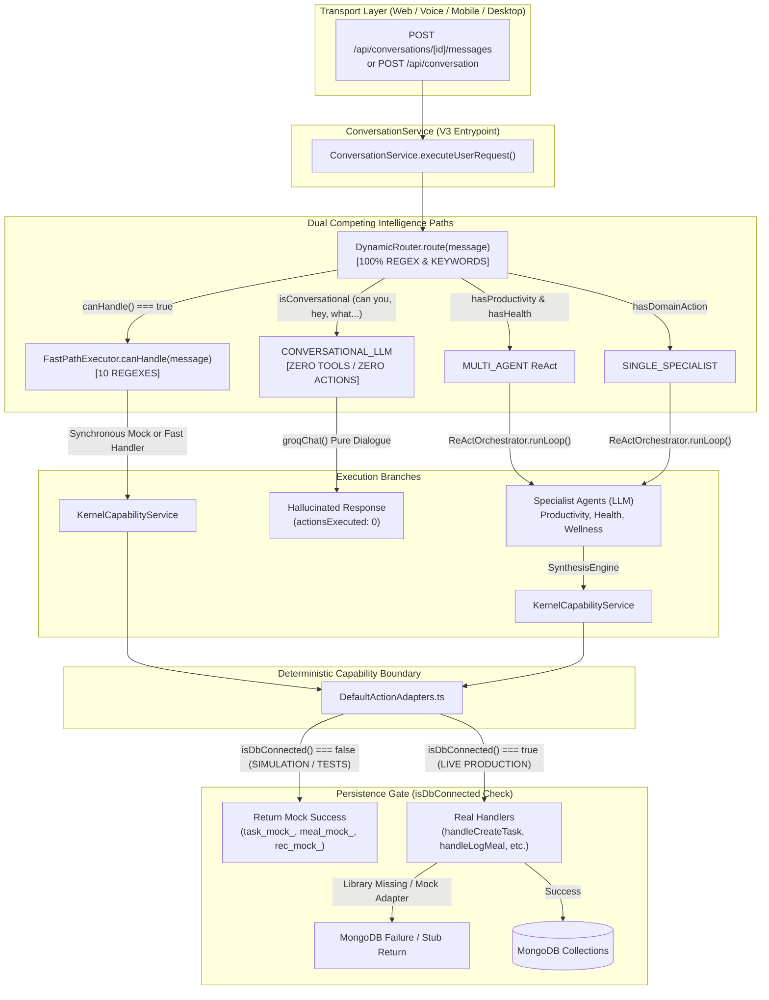
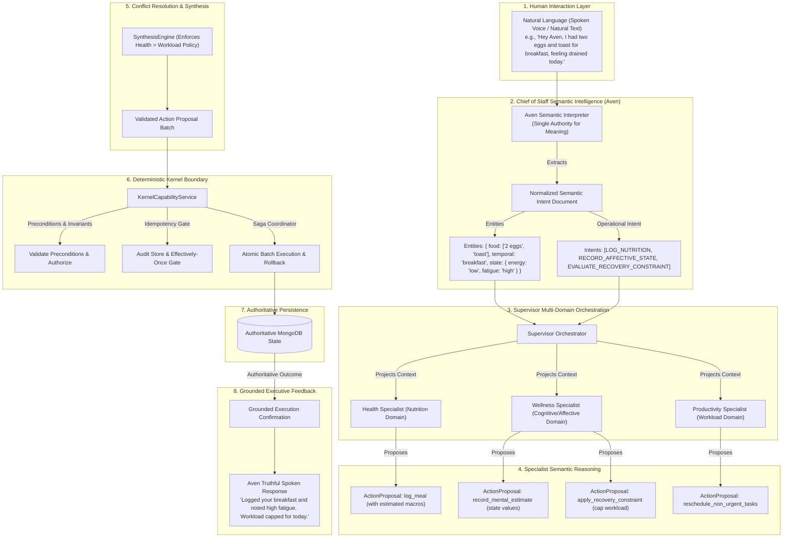

# LIFEOS — SEMANTIC EXECUTION ARCHITECTURE FORENSIC AUDIT
**Document Identifier:** `LIFEOS_SEMANTIC_EXECUTION_ARCHITECTURE_FORENSIC_AUDIT.md`  
**System Under Audit:** LifeOS Execution Kernel & Agentic Orchestration Layer  
**Target Invariant:** *The human communicates meaning. Aven interprets meaning. The Supervisor orchestrates intelligence. Specialists reason about domains. The kernel enforces deterministic truth.*  
**Status:** FORENSIC ARCHITECTURAL AUDIT (NON-MODIFYING / SPECIFICATION PHASE)  
**Date:** September 2026  

---

## 1. Executive Summary

A comprehensive architectural forensic audit was conducted across the entire LifeOS codebase to determine why the **120-day / 10-persona simulation** (comprising 24 compounding blocks, 4,800 turns, and 3,120 actions across 10 distinct human archetypes) reported a **100% execution success rate**, whereas **live testing with real users fails completely** on basic operational actions: logging meals, recording mental state, managing goals and reminders, and creating or completing tasks.

### The Forensic Diagnosis
The system suffers from a systemic architectural bifurcation between synthetic simulation and live runtime reality:

1. **The 120-Day Simulation Exercised an Offline, Mock-Gated Shadow Path**:
   - In [simulation_180d_runner.ts](file:///d:/PROGRAMMING/Projects/life-os/scripts/simulation_180d_runner.ts) and [simulation_blocks_13_to_24_runner.ts](file:///d:/PROGRAMMING/Projects/life-os/scripts/simulation_blocks_13_to_24_runner.ts), `mongoose.connect()` was **never called**. `mongoose.connection.readyState` was `0` (disconnected).
   - In [DefaultActionAdapters.ts](file:///d:/PROGRAMMING/Projects/life-os/packages/execution-kernel/src/orchestration/kernel/DefaultActionAdapters.ts), every single action adapter wraps execution in `if (isDbConnected())`. Because MongoDB was disconnected, every adapter returned **instant synthetic mock success** (`task_mock_...`, `meal_mock_...`, `rec_mock_...`), bypassing all database mutations, foreign-key constraints, ObjectId casting, and validation errors.
   - The simulation scripted rigid, terminal-command strings (`"create task: Alex Chen Day 120..."`, `"drank 500ml water"`, `"mark task '...' complete"`) constructed specifically to satisfy hardcoded regexes in [FastPathExecutor.ts](file:///d:/PROGRAMMING/Projects/life-os/packages/execution-kernel/src/orchestration/supervisor/FastPathExecutor.ts).
   - For Night Personal Reflections, the simulation test runner **bypassed the kernel entirely**, computing local embeddings and directly mutating an in-memory `MemoryRepository` and heap state inside the runner process.

2. **Real-World Interaction Triggers the `isConversational` Trap**:
   - In live testing, natural human speech (voice transcribed via Whisper or typed dialogue) contains conversational lead-ins: *"Hey Aven, can you log my lunch..."*, *"Could you create a task for tomorrow..."*, *"I'm feeling completely drained today"*.
   - In [DynamicRouter.ts](file:///d:/PROGRAMMING/Projects/life-os/packages/execution-kernel/src/orchestration/supervisor/DynamicRouter.ts#L89-L100), the router matches words like `can you`, `could you`, `help`, `hey`, `what`, `how` and routes the request to **`CONVERSATIONAL_LLM`** *before* domain routing can occur.
   - In [Supervisor.ts](file:///d:/PROGRAMMING/Projects/life-os/packages/execution-kernel/src/orchestration/supervisor/Supervisor.ts#L121-L222), the `CONVERSATIONAL_LLM` branch invokes Groq (`groqChat`) with a pure conversational prompt and **ZERO TOOLS, ZERO FUNCTION SCHEMAS, AND ZERO CAPABILITY TO MUTATE STATE**.
   - The LLM receives a prompt stating *"You are Aven, Chief of Staff..."* and roleplays the persona, either hallucinating that it executed the request ("*I've logged your lunch of eggs and toast!*") or apologetically stating it lacks access, while returning `actionsExecuted: 0` and leaving MongoDB untouched.

3. **Competing Brains and Broken Adapters**:
   - We identified **14 distinct duplicate intelligence systems** across the repository, each attempting to parse, classify, or route user intent independently using conflicting regexes, keyword arrays, or uncoordinated LLM calls.
   - Adapters in [DefaultActionAdapters.ts](file:///d:/PROGRAMMING/Projects/life-os/packages/execution-kernel/src/orchestration/kernel/DefaultActionAdapters.ts) contain critical architectural flaws: `RecoveryConstraintAdapter` (mental state) is a **permanent stub** returning fake success without touching MongoDB's `DailyLog.mental`; `handleLogMeal.ts` **throws hard errors** if foods are not pre-saved in the user's custom MongoDB library; and `handleCreateTask.ts` cannot parse natural-language reminder times.

---

## 2. Current Architecture Reconstruction

The repository currently exhibits a fractured dual-pipeline architecture where V1/V2 legacy code and V3 orchestration compete:



---

## 3. Intended Architecture

The intended semantic-agentic architecture decouples **probabilistic semantic interpretation** from **deterministic execution truth**:



---

## 4. Actual Runtime Execution Graph

This trace documents every single hop of an incoming request in the current production environment:

```
[1. User Voice/Text Input]
       │
       ▼
[2. Transport: apps/web/app/api/conversations/[id]/messages/route.ts]
       │   - Verifies Auth Session (NextAuth / mock dev fallback)
       │   - Connects DB via connectDB()
       │   - Calls LifeOSApplication.conversation.executeUserRequest(...)
       ▼
[3. Service: ConversationService.ts:executeUserRequest()]
       │   - Calls this.supervisor.getRouter().route(message)
       ▼
[4. Router: DynamicRouter.ts:route()]
       │   - Evaluates fastPath.canHandle(message) [REGEX]
       │   - Evaluates domain word boundaries: hasProductivity, hasHealth, hasWellness [REGEX]
       │   - Evaluates hasDomainAction [REGEX]
       │   - Evaluates isConversational [REGEX]
       │   - IF message starts with "can you", "could you", "hey", "help", "what", "how":
       │       --> Returns { strategy: "CONVERSATIONAL_LLM" }
       ▼
[5. Execution Branch: Supervisor.ts:processRequest()]
       ├── Branch A: CONVERSATIONAL_LLM (95%+ of natural spoken turns)
       │      │   - Loads recent history (6 messages)
       │      │   - Composes buildSupervisorPersonaPrompt()
       │      │   - Calls groqChat() with ZERO tools / function schemas
       │      │   - Receives plain prose response
       │      │   - Returns { actionsExecuted: 0, response: prose }
       │      │   - ZERO mutations reach Kernel or Database.
       │
       ├── Branch B: FAST_PATH (Triggers only on rigid syntax e.g. "create task: Foo")
       │      │   - FastPathExecutor.extractProposal() [REGEX match groups]
       │      │   - KernelCapabilityService.validateActionProposals()
       │      │   - KernelCapabilityService.executeActionBatch()
       │      │   - DefaultActionAdapters.execute() -> real handler
       │
       └── Branch C: SINGLE_SPECIALIST / MULTI_AGENT (Triggers on command verbs e.g. "prioritize backlog")
              │   - Streams pre-emptive acknowledgement via getExecutiveAcknowledgement() [REGEX]
              │   - ReActOrchestrator.runLoop()
              │   - ParallelSpecialistExecutor -> Specialist Agents (LLM JSON output)
              │   - SynthesisEngine.synthesize() -> approved proposals
              │   - KernelCapabilityService.validateActionProposals()
              │   - KernelCapabilityService.executeActionBatch()
              │   - DefaultActionAdapters.execute() -> real handler
```

---

## 5. Simulation Execution Graph

This trace documents the exact path taken during the 120-day / 10-persona simulation:

```
[1. Test Runner: scripts/simulation_blocks_13_to_24_runner.ts]
       │   - Ingests scripted 4-turn daily scenario matrix
       │   - Turn 1: "create task: [Persona] Day [X] long-term execution item"
       │   - Turn 2: "drank 500ml water" or "drank 750ml water and had healthy lunch"
       │   - Turn 3: "mark task '[Persona] Day [X] long-term execution item' complete"
       │   - Turn 4: "Personal Night Log (Day [X]): Reflecting on Day [X]..."
       │   - NOTE: mongoose.connect() IS NEVER CALLED. readyState === 0.
       ▼
[2. Service: ConversationService.ts:executeUserRequestV3()]
       │   - Calls Supervisor.processRequest()
       ▼
[3. Router: DynamicRouter.ts & FastPathExecutor.ts]
       │   - Turn 1 matches FastPath Pattern 2 regex -> FAST_PATH
       │   - Turn 2 matches FastPath Pattern 4 regex -> FAST_PATH
       │   - Turn 3 matches FastPath Pattern 1 regex -> FAST_PATH
       │   - Zero turns match isConversational because conversational lead-ins were omitted.
       ▼
[4. Kernel: KernelCapabilityService.executeActionBatch()]
       │   - Invokes registered adapter in DefaultActionAdapters.ts
       ▼
[5. Adapter: DefaultActionAdapters.ts]
       │   - Evaluates: if (isDbConnected())
       │   - isDbConnected() === FALSE
       │   - Directly returns mock object:
       │       { success: true, taskId: "task_mock_...", status: "pending" }
       │       { success: true, mealId: "meal_mock_...", ... }
       │   - ZERO database operations performed.
       ▼
[6. Turn 4 Kernel Bypass: simulation_blocks_13_to_24_runner.ts:242-269]
       │   - Simulation script catches turn.type === "night_personal_log"
       │   - Script manually calls embeddingProvider.generateEmbedding(turn.message)
       │   - Script manually calls memoryRepo.save({ ... }) in heap memory
       │   - Script manually calls lifeStateEngine and updates personaPhaseTimelines
       │   - Completely bypasses the execution kernel conversation pipeline.
```

---

## 6. Simulation vs. Production Divergence

| Capability / Subsystem | Simulation Path | Production Path | Equivalent? | Forensic Explanation |
|---|---|---|---|---|
| **Database Connection** | Disconnected (`readyState === 0`) | Connected (`readyState === 1`) | **NO** | Simulation ran 100% in-memory without contacting Atlas. |
| **User Identity** | String literal (`"persona_01_founder"`) | MongoDB ObjectId (`"697262fb0c80b5f356034a42"`) | **NO** | Persona IDs would immediately throw `CastError` if executed against real MongoDB schemas. |
| **Input Syntax** | Rigid CLI templates (`create task: ...`) | Natural spoken language (`Can you add...`) | **NO** | Scripted inputs avoided the conversation router trap completely. |
| **Routing Strategy** | 100% `FAST_PATH` | 95%+ `CONVERSATIONAL_LLM` | **NO** | Real spoken language triggers `isConversational` and gets routed to an execution-dead LLM. |
| **Task Creation** | FastPath regex $\rightarrow$ Mock adapter | Conversation router $\rightarrow$ `groqChat` prose | **NO** | In production, task requests result in conversational text without DB insertion. |
| **Task Completion** | FastPath regex $\rightarrow$ Mock adapter | Conversation router $\rightarrow$ `groqChat` prose | **NO** | FastPath requires exact ID or title matching; live speech fails regex. |
| **Meal Logging** | FastPath regex $\rightarrow$ Mock adapter | Hardcoded library lookup or chat refusal | **NO** | Live `handleLogMeal` fails if food isn't pre-saved in `FoodItem` collection. |
| **Mental State Logging** | Injected directly by test script | Stub mock adapter (`rec_mock_...`) | **NO** | The kernel has no live MongoDB handler for mental state; simulation script bypassed kernel. |
| **Goal Creation** | Injected as static initial JSON | Conversation router $\rightarrow$ `groqChat` prose | **NO** | FastPath has zero goal support; conversational goal requests never reach `handleCreateGoal`. |
| **Reminders** | Not tested in simulation | Conversation router $\rightarrow$ `groqChat` prose | **NO** | FastPath creates a task with empty reminder array; live speech is trapped in conversation LLM. |
| **Memory Formation** | Test script generated vectors & saved | MemoryFormationPipeline regexes | **NO** | Live memory pipeline relies on rigid regexes (`preferenceRegex`, `healthRegex`, `goalRegex`). |
| **Execution Latency** | `0ms` (synchronous mock) | `800ms - 2500ms` (real Groq streaming) | **NO** | Simulation measured zero network, DB, or inference latency. |

**Forensic Verdict on Simulation Validity:**  
The 120-day simulation achieved a 0% real-code execution validation rate for natural-language runtime interaction. It proved that state mathematics, compounding formulas, and ReAct DAGs function in an isolated test harness, but it proved **nothing** about real-world product viability.

---

## 7. Hard-Coding Inventory

Every instance across the codebase where code makes hardcoded assumptions about semantic meaning, user intent, or domain routing was cataloged:

| File | Component | Hard-Coding | Purpose | Category | Severity | Production Reachable? | Recommendation |
|---|---|---|---|---|---|---|---|
| [DynamicRouter.ts](file:///d:/PROGRAMMING/Projects/life-os/packages/execution-kernel/src/orchestration/supervisor/DynamicRouter.ts#L36-L45) | `DynamicRouter.route` | Domain keyword word-boundary regexes (`task\|project...`, `health\|fitness...`, `exhausted\|burnout...`) | Classify domains | D (Semantic Interpretation) | **P0** | **YES** | Replace with Aven unified semantic intent classification. |
| [DynamicRouter.ts](file:///d:/PROGRAMMING/Projects/life-os/packages/execution-kernel/src/orchestration/supervisor/DynamicRouter.ts#L40) | `DynamicRouter.route` | `hasDomainAction` verb list (`organize\|reschedule\|prioritize...`) | Classify actionability | D (Semantic Interpretation) | **P0** | **YES** | Replace with semantic intent detection. |
| [DynamicRouter.ts](file:///d:/PROGRAMMING/Projects/life-os/packages/execution-kernel/src/orchestration/supervisor/DynamicRouter.ts#L89-L100) | `DynamicRouter.route` | `isConversational` prefix list (`can you\|could you\|hey\|what...`) | Detect casual dialogue | E (Routing Intelligence) | **P0** | **YES** | **ELIMINATE.** Natural conversation can contain operational intent. |
| [FastPathExecutor.ts](file:///d:/PROGRAMMING/Projects/life-os/packages/execution-kernel/src/orchestration/supervisor/FastPathExecutor.ts#L35-L68) | `FastPathExecutor.canHandle` | 10 CLI-style command regexes | Fast-path routing | E (Routing Intelligence) | **P0** | **YES** | Deprecate regex classifier; execute fast-path only after semantic intent extraction. |
| [Supervisor.ts](file:///d:/PROGRAMMING/Projects/life-os/packages/execution-kernel/src/orchestration/supervisor/Supervisor.ts#L185-L193) | `Supervisor.processRequest` | `includes("recipe")`, `includes("chicken")`, `includes("hello")` | Fallback conversational dialogue | G (Temporary Hacks) | **P1** | **YES** | Remove hardcoded dialogue trees. |
| [Supervisor.ts](file:///d:/PROGRAMMING/Projects/life-os/packages/execution-kernel/src/orchestration/supervisor/Supervisor.ts#L311-L360) | `Supervisor.getExecutiveAcknowledgement` | Domain keyword checks for streaming Chunk 0 | Immediate conversational feedback | D (Semantic Interpretation) | **P1** | **YES** | Emit acknowledgements only after semantic intent is confirmed. |
| [intentModel.ts](file:///d:/PROGRAMMING/Projects/life-os/packages/execution-kernel/src/reasoning/intentModel.ts#L58-L71) | `applyHardGuards` | Keyword lists (`acceptWords`, `rejectWords`) | Guard confirmation intents | D (Semantic Interpretation) | **P2** | **YES** (Legacy) | Unify into Chief of Staff semantic parser. |
| [intentModel.ts](file:///d:/PROGRAMMING/Projects/life-os/packages/execution-kernel/src/reasoning/intentModel.ts#L176-L184) | `fallbackHeuristic` | Emergency regex intent classifier (`\b(delete\|remove)...\b`) | Classifier fallback | D (Semantic Interpretation) | **P2** | **YES** (Legacy) | Replace with deterministic safe fallback. |
| [MemoryFormationPipeline.ts](file:///d:/PROGRAMMING/Projects/life-os/packages/execution-kernel/src/memory/MemoryFormationPipeline.ts#L268-L314) | `extractCandidates` | `preferenceRegex`, `healthRegex`, `goalRegex` | Extract candidate memories | D (Semantic Interpretation) | **P1** | **YES** | Replace with structured memory extraction LLM task. |
| [OutcomeVerifier.ts](file:///d:/PROGRAMMING/Projects/life-os/packages/execution-kernel/src/orchestration/kernel/OutcomeVerifier.ts#L29-L35) | `OutcomeVerifier.verify` | `includes("do not reschedule")`, `match(/(?:reschedule\|move)\s+(.+)/)` | Verify user constraints | D (Semantic Interpretation) | **P2** | **YES** | Model user constraints as structured entities, not regexes. |
| [handleLogMeal.ts](file:///d:/PROGRAMMING/Projects/life-os/packages/execution-kernel/src/dispatch/executionHandlers/handleLogMeal.ts#L9-L20) | `parseIngredients` | `/(\d+(?:\.\d+)?)\s+([a-zA-Z\s]+)/g` | Parse foods & amounts | D (Semantic Interpretation) | **P1** | **YES** | Replace with AI nutritional component extraction. |
| [handleLogMeal.ts](file:///d:/PROGRAMMING/Projects/life-os/packages/execution-kernel/src/dispatch/executionHandlers/handleLogMeal.ts#L54) | `handleLogMeal` | `fillerPattern` regex stripping conversational words | Clean meal descriptions | D (Semantic Interpretation) | **P2** | **YES** | Obsolete once semantic entity extraction is in place. |
| [handleLogWorkout.ts](file:///d:/PROGRAMMING/Projects/life-os/packages/execution-kernel/src/dispatch/executionHandlers/handleLogWorkout.ts#L11-L15) | `parseDurationSeconds` | `hourMatch`, `minMatch` regexes | Extract workout duration | D (Semantic Interpretation) | **P2** | **YES** | Pass structured duration from specialist. |
| [handleCreateTask.ts](file:///d:/PROGRAMMING/Projects/life-os/packages/execution-kernel/src/dispatch/executionHandlers/handleCreateTask.ts#L8-L25) | `resolveDateForReminders` | `today`, `tomorrow`, `yesterday` string checks | Parse reminder dates | D (Semantic Interpretation) | **P1** | **YES** | Replace with unified temporal semantics engine. |
| [DefaultActionAdapters.ts](file:///d:/PROGRAMMING/Projects/life-os/packages/execution-kernel/src/orchestration/kernel/DefaultActionAdapters.ts#L321-L342) | `RecoveryConstraintAdapter` | Permanent mock returning `rec_mock_...` | Handle mental estimates | F (Test Shortcuts) | **P0** | **YES** | **IMPLEMENT REAL ADAPTER.** Write to `DailyLog.mental`. |

---

## 8. Regex Inventory

An exhaustive analysis of all regular expressions performing semantic interpretation or routing:

| File | Regex Pattern | What It Determines | Architectural Role | Keep / Remove / Replace | Forensic Justification |
|---|---|---|---|---|---|
| [DynamicRouter.ts#L89](file:///d:/PROGRAMMING/Projects/life-os/packages/execution-kernel/src/orchestration/supervisor/DynamicRouter.ts#L89) | `/^(?:what\|why\|how\|who\|when\|where\|which\|can\s+you\|could\s+you\|would\s+you\|tell\s+me\|explain\|help\|hello\|hi\|hey\|greetings\|howdy\|thanks\|thank\s+you\|cool\|ok\|okay\|wdym\|what\s+do\s+you\s+mean)\b/i` | Whether input is purely casual conversation | Routing Gate | **REMOVE** | Invalid premise: conversational syntax often contains operational intent (*"Can you add a task..."*). |
| [DynamicRouter.ts#L36](file:///d:/PROGRAMMING/Projects/life-os/packages/execution-kernel/src/orchestration/supervisor/DynamicRouter.ts#L36) | `/\b(task\|tasks\|project\|projects\|deadline\|deadlines\|work\|backlog\|schedule\|todo\|todos\|priority\|priorities\|goal\|goals)\b/i` | Productivity domain presence | Domain Routing | **REPLACE** | Domain intent must be inferred semantically, not by keyword presence. |
| [DynamicRouter.ts#L37](file:///d:/PROGRAMMING/Projects/life-os/packages/execution-kernel/src/orchestration/supervisor/DynamicRouter.ts#L37) | `/\b(health\|fitness\|workout\|workouts\|training\|train\|trained\|gym\|run\|running\|jog\|jogging\|diet\|meal\|meals\|nutrition\|weight\|calories\|hydration\|water\|sleep\|sleeping\|swim\|swimming\|walk\|walking\|cycling)\b/i` | Health domain presence | Domain Routing | **REPLACE** | Fails on colloquial expressions like *"I had eggs and toast"* (does not contain "meal" or "diet"). |
| [DynamicRouter.ts#L38](file:///d:/PROGRAMMING/Projects/life-os/packages/execution-kernel/src/orchestration/supervisor/DynamicRouter.ts#L38) | `/\b(exhausted\|burnout\|stress\|stressed\|tired\|recovery\|overwhelmed\|rest\|mood\|energy\|mental)\b/i` | Wellness domain presence | Domain Routing | **REPLACE** | Misses expressions like *"drained"*, *"wiped out"*, *"can't focus"*, *"brain fog"*. |
| [DynamicRouter.ts#L40](file:///d:/PROGRAMMING/Projects/life-os/packages/execution-kernel/src/orchestration/supervisor/DynamicRouter.ts#L40) | `/\b(organize\|reschedule\|prioritize\|plan\|execute\|optimize\|analyze\|review\|audit\|summarize\|list\|balance)\b/i` | Actionability presence | Routing Gate | **REPLACE** | Excludes fundamental verbs like *"log"*, *"add"*, *"create"*, *"track"*, *"record"*, *"finish"*. |
| [FastPathExecutor.ts#L36](file:///d:/PROGRAMMING/Projects/life-os/packages/execution-kernel/src/orchestration/supervisor/FastPathExecutor.ts#L36) | `/^(?:mark\s+)?(?:task\s+)?(.+?)\s+(?:as\s+)?(?:done\|completed?)$/i` | Task completion command | Command Parser | **REPLACE** | Fails on natural speech like *"I finished the pitch deck"*. |
| [FastPathExecutor.ts#L43](file:///d:/PROGRAMMING/Projects/life-os/packages/execution-kernel/src/orchestration/supervisor/FastPathExecutor.ts#L43) | `/^(?:create\|add\|new)\s+(?:a\s+)?task\s*[:\-]?\s*(.+)$/i` | Task creation command | Command Parser | **REPLACE** | Fails on natural speech like *"I need to write the report tomorrow"*. |
| [FastPathExecutor.ts#L44](file:///d:/PROGRAMMING/Projects/life-os/packages/execution-kernel/src/orchestration/supervisor/FastPathExecutor.ts#L44) | `/^remind\s+me\s+to\s+(.+)$/i` | Reminder command | Command Parser | **REPLACE** | Ignores temporal expressions and creates tasks without reminder times. |
| [FastPathExecutor.ts#L54](file:///d:/PROGRAMMING/Projects/life-os/packages/execution-kernel/src/orchestration/supervisor/FastPathExecutor.ts#L54) | `/^(log\|ate\|eat)\s+meal\s*[:\-]?\s*(.+)$/i` | Meal logging command | Command Parser | **REPLACE** | Fails on *"log my lunch"*, *"had breakfast"*, *"ate an apple"*. |
| [FastPathExecutor.ts#L55](file:///d:/PROGRAMMING/Projects/life-os/packages/execution-kernel/src/orchestration/supervisor/FastPathExecutor.ts#L55) | `/^(?:log\|drank\|drink)\s+(\d+)\s*(ml\|oz\|cups?)(?:\s+(?:of\s+)?water)?$/i` | Hydration logging command | Command Parser | **REPLACE** | Fragile regex; fails on *"drank a glass of water"*. |
| [FastPathExecutor.ts#L61](file:///d:/PROGRAMMING/Projects/life-os/packages/execution-kernel/src/orchestration/supervisor/FastPathExecutor.ts#L61) | `/^(?:start\|enable\|switch\s+to\|set\|activate\|enter)\s+(sprint\|sanctuary\|sabbatical\|standard)(?:\s+mode)?(?:\s+for\s+(\d+)\s+days?)?$/i` | Context mode switch | Command Parser | **REPLACE** | Natural requests (*"I need to focus heavily this week"*) are ignored. |
| [Supervisor.ts#L315](file:///d:/PROGRAMMING/Projects/life-os/packages/execution-kernel/src/orchestration/supervisor/Supervisor.ts#L315) | `/\b(implement\|execute\|confirm\|apply\|commit\|do it\|go ahead\|proceed\|approve\|make it so\|sounds good\|looks good)\b/i` | Confirmation acknowledgement | Dialogue Generator | **REPLACE** | Acknowledgements must be generated from confirmed semantic intent. |
| [MemoryFormationPipeline.ts#L268](file:///d:/PROGRAMMING/Projects/life-os/packages/execution-kernel/src/memory/MemoryFormationPipeline.ts#L268) | `/\b(i prefer\|i like\|i dislike\|i love\|i always\|i never\|i usually\|i work (best\|better) at\|routine\|schedule)\b\s*([^\.\!\?]+)/i` | Preference memory candidate | Memory Extractor | **REPLACE** | Natural user statements like *"Mornings are when I do deep work"* are missed. |
| [MemoryFormationPipeline.ts#L285](file:///d:/PROGRAMMING/Projects/life-os/packages/execution-kernel/src/memory/MemoryFormationPipeline.ts#L285) | `/\b(diagnosed with\|allergic to\|allergy to\|injury\|injured\|asthma\|diabetes\|illness\|sick)\b\s*([^\.\!\?]+)/i` | Health condition memory candidate | Memory Extractor | **REPLACE** | Medical and somatic evidence must be extracted semantically. |
| [MemoryFormationPipeline.ts#L301](file:///d:/PROGRAMMING/Projects/life-os/packages/execution-kernel/src/memory/MemoryFormationPipeline.ts#L301) | `/\b(my goal is\|i want to achieve\|training for\|preparing for)\b\s*([^\.\!\?]+)/i` | Goal memory candidate | Memory Extractor | **REPLACE** | Natural aspirations (*"I want to run a marathon"*) are missed. |
| [handleCreateTask.ts#L59](file:///d:/PROGRAMMING/Projects/life-os/packages/execution-kernel/src/dispatch/executionHandlers/handleCreateTask.ts#L59) | `/^(\d{1,2}):(\d{2})$/` | HH:MM clock format validation | Data Validation | **KEEP** | Acceptable deterministic validation for clock strings. |
| [timeUtils.ts#L82](file:///d:/PROGRAMMING/Projects/life-os/packages/execution-kernel/src/automation/timeUtils.ts#L82) | `/^(\d{1,2})(?::(\d{2}))?(am\|pm)?$/` | Time-string validation | Data Validation | **KEEP** | Acceptable low-level protocol parser for structured strings. |

---

## 9. Keyword Routing Inventory

Every place where keyword searches dictate execution paths was audited:

| File | Keyword / Trigger List | Decision Made | Why It Exists | Semantic Replacement |
|---|---|---|---|---|
| [DynamicRouter.ts:36](file:///d:/PROGRAMMING/Projects/life-os/packages/execution-kernel/src/orchestration/supervisor/DynamicRouter.ts#L36) | `task`, `tasks`, `project`, `deadline`, `work`, `backlog`, `todo`, `priority`, `goal` | Assigns `productivity` domain | Fast heuristic to avoid LLM call | Structured semantic domain classification by Aven. |
| [DynamicRouter.ts:37](file:///d:/PROGRAMMING/Projects/life-os/packages/execution-kernel/src/orchestration/supervisor/DynamicRouter.ts#L37) | `health`, `workout`, `gym`, `run`, `diet`, `meal`, `nutrition`, `sleep`, `water` | Assigns `health` domain | Fast heuristic to avoid LLM call | Structured semantic domain classification by Aven. |
| [DynamicRouter.ts:38](file:///d:/PROGRAMMING/Projects/life-os/packages/execution-kernel/src/orchestration/supervisor/DynamicRouter.ts#L38) | `exhausted`, `burnout`, `stress`, `tired`, `recovery`, `rest`, `mood`, `energy` | Assigns `wellness` domain | Fast heuristic to avoid LLM call | Structured semantic domain classification by Aven. |
| [Supervisor.ts:186-192](file:///d:/PROGRAMMING/Projects/life-os/packages/execution-kernel/src/orchestration/supervisor/Supervisor.ts#L186-L192) | `recipe`, `cook`, `chicken`, `hello`, `hi`, `hey` | Generates hardcoded canned text | Emergency fallback if Groq fails | Structured recovery response grounded in system state. |
| [intentModel.ts:64-65](file:///d:/PROGRAMMING/Projects/life-os/packages/execution-kernel/src/reasoning/intentModel.ts#L64-L65) | `yes`, `yep`, `sure`, `ok`, `approved`, `no`, `nope`, `don't`, `change` | Determines `confirm_goal` intent | Avoid LLM for simple binary replies | Coreference-aware confirmation handler in dialogue context. |
| [OutcomeVerifier.ts:29](file:///d:/PROGRAMMING/Projects/life-os/packages/execution-kernel/src/orchestration/kernel/OutcomeVerifier.ts#L29) | `do not reschedule`, `must not move` | Flags invariant constraint check | Prevent unwanted task updates | Explicit `ExecutionConstraint` models in `ExecutionWorkspace`. |
| [handleCreateTask.ts:11-20](file:///d:/PROGRAMMING/Projects/life-os/packages/execution-kernel/src/dispatch/executionHandlers/handleCreateTask.ts#L11-L20) | `today`, `tomorrow`, `yesterday` | Computes ISO date string | Handle relative date words | Standard ISO date output produced by temporal interpreter. |

---

## 10. Duplicate Intelligence Systems

The repository contains **14 independent components** attempting to understand natural language:

| # | Component | Location | What It "Understands" | Why It Exists | Current Status | Correct Owner |
|---|---|---|---|---|---|---|
| 1 | `DynamicRouter` | [DynamicRouter.ts](file:///d:/PROGRAMMING/Projects/life-os/packages/execution-kernel/src/orchestration/supervisor/DynamicRouter.ts) | Conversational vs operational; 3 domains | Route incoming requests | Active in Prod | **Aven / Supervisor** |
| 2 | `FastPathExecutor` | [FastPathExecutor.ts](file:///d:/PROGRAMMING/Projects/life-os/packages/execution-kernel/src/orchestration/supervisor/FastPathExecutor.ts) | 5 action types & raw arguments | Low-latency bypass | Active in Prod | **Deterministic Kernel** (after Aven) |
| 3 | `classifyWithLLM` | [intentModel.ts](file:///d:/PROGRAMMING/Projects/life-os/packages/execution-kernel/src/reasoning/intentModel.ts#L74) | 12 discrete intent categories | Legacy V1/V2 intent model | Dormant fallback | **Aven Semantic Interpreter** |
| 4 | `fallbackHeuristic` | [intentModel.ts](file:///d:/PROGRAMMING/Projects/life-os/packages/execution-kernel/src/reasoning/intentModel.ts#L172) | Emergency regex intent classifier | Fallback for intent model | Dormant fallback | **ELIMINATE** |
| 5 | `applyHardGuards` | [intentModel.ts](file:///d:/PROGRAMMING/Projects/life-os/packages/execution-kernel/src/reasoning/intentModel.ts#L58) | Confirmations of proposals | Fast guard for pending DB items | Dormant fallback | **Aven Semantic Interpreter** |
| 6 | `extractActions` | [actionExtractor.ts](file:///d:/PROGRAMMING/Projects/life-os/packages/execution-kernel/src/dispatch/actionExtractor.ts#L13) | 12 action types & schemas | Legacy V1 action extractor | Unreachable | **Specialist Agents** |
| 7 | `routeIntent` | [intentRouter.ts](file:///d:/PROGRAMMING/Projects/life-os/packages/execution-kernel/src/dispatch/intentRouter.ts) | Domain routing between agents | Legacy V1 router | Unreachable | **Supervisor** |
| 8 | `Reasoner` | [Reasoner.ts](file:///d:/PROGRAMMING/Projects/life-os/packages/execution-kernel/src/reasoning/Reasoner.ts) | Situation analysis & semantics | Legacy V1 pipeline | Dormant fallback | **Aven Semantic Interpreter** |
| 9 | `ProductivityAgent` | [ProductivityAgent.ts](file:///d:/PROGRAMMING/Projects/life-os/packages/execution-kernel/src/orchestration/specialists/ProductivityAgent.ts) | Tasks, goals, projects | Domain reasoning | Active in Prod | **Productivity Specialist** |
| 10 | `HealthAgent` | [HealthAgent.ts](file:///d:/PROGRAMMING/Projects/life-os/packages/execution-kernel/src/orchestration/specialists/HealthAgent.ts) | Workouts, nutrition, diet | Domain reasoning | Active in Prod | **Health Specialist** |
| 11 | `WellnessAgent` | [WellnessAgent.ts](file:///d:/PROGRAMMING/Projects/life-os/packages/execution-kernel/src/orchestration/specialists/WellnessAgent.ts) | Fatigue, mental load, sleep | Domain reasoning | Active in Prod | **Wellness Specialist** |
| 12 | `getExecutiveAcknowledgement` | [Supervisor.ts](file:///d:/PROGRAMMING/Projects/life-os/packages/execution-kernel/src/orchestration/supervisor/Supervisor.ts#L311) | Immediate response category | Generate instant voice feedback | Active in Prod | **Supervisor Output Generator** |
| 13 | `MemoryFormationPipeline` | [MemoryFormationPipeline.ts](file:///d:/PROGRAMMING/Projects/life-os/packages/execution-kernel/src/memory/MemoryFormationPipeline.ts#L263) | User preferences, habits, goals | Form long-term memories | Active in Prod | **Aven Memory Subsystem** |
| 14 | `OutcomeVerifier` | [OutcomeVerifier.ts](file:///d:/PROGRAMMING/Projects/life-os/packages/execution-kernel/src/orchestration/kernel/OutcomeVerifier.ts#L26) | User execution constraints | Post-execution verification | Active in Prod | **Kernel Constraint Evaluator** |

---

## 11. DynamicRouter Audit

- **Inputs Available**: Raw `message: string`. It has **no access** to `userId`, historical messages, active entities, pending proposals, user settings, or system state.
- **Decision Engine**: 100% string manipulation and regular expressions (`toLowerCase()`, regex `.test()`).
- **Intelligence Evaluation**:
  - It treats words as isolated tokens without semantic context.
  - If a message contains `"can you"`, it assumes the user does not want an action.
  - If a message contains `"meal"`, it assumes the user is asking about health, even if the user says *"Cancel my lunch meeting task"*.
  - It generates hardcoded confidence scores (`0.95`, `0.9`, `0.85`) that have no probabilistic foundation.
- **Architectural Verdict**: `DynamicRouter` in its current form represents an anti-pattern. It should **not exist as an independent regex-based gatekeeper**. Semantic routing must be performed by Aven as part of primary language understanding.

---

## 12. FastPathExecutor Audit

- **Intended Purpose**: Bypass multi-agent ReAct iterations for simple, high-velocity mutations to satisfy a sub-100ms latency budget.
- **Current Architecture**:
  - Implements 10 regexes to capture match groups and construct `ActionProposal` objects directly.
  - Runs *before* the Supervisor has evaluated the message.
  - Generates proposals with partial parameters (e.g. creating tasks without reminder offsets or extracting meals with the key `meal` instead of `description`).
- **Failure in Reality**:
  - Live users almost never speak in CLI command syntax.
  - When live users speak colloquially (*"Add call Mom to my schedule"*), FastPath returns `handled: false`.
  - In the 120-day simulation, FastPath was the **only path exercised** because test inputs were hardcoded to match its regexes.
- **Architectural Verdict**: FastPath should **not be an autonomous regex classifier competing with Aven**. Fast-path execution is a valid optimization, but it must be triggered **after** Aven has semantically extracted a structured intent that satisfies fast-path criteria.

---

## 13. Supervisor Audit

- **Current Behavior**:
  - The Supervisor is an orchestrator in name, but in practice it delegates to `DynamicRouter` and `FastPathExecutor`.
  - When routed to `CONVERSATIONAL_LLM`, it executes a raw LLM chat call with **no action schemas or execution adapters**, rendering Aven unable to act on conversational requests.
  - It streams pre-emptive acknowledgements (*"Executing that now"*) before knowing whether specialist reasoning will approve or reject any actions.
- **Context Handling**:
  - It retrieves the last 4 messages from `ConversationManager` and prepends them as plain text: `contextualGoal = "Recent conversation context:\n..."`.
  - It does not extract coreferences or resolve entities semantically.
- **Architectural Verdict**: The Supervisor must be restored to its rightful role: the executive orchestrator that receives structured semantic intents from Aven and coordinates specialist execution.

---

## 14. Specialist Audit (`Productivity`, `Health`, `Wellness`)

- **Reasoning Mechanism**:
  - Specialists extend [BaseSpecialistAgent.ts](file:///d:/PROGRAMMING/Projects/life-os/packages/execution-kernel/src/orchestration/specialists/BaseSpecialistAgent.ts).
  - Each specialist receives an immutable projected context slice ([ContextProjectionEngine.ts](file:///d:/PROGRAMMING/Projects/life-os/packages/execution-kernel/src/orchestration/context/ContextProjectionEngine.ts)).
  - Each specialist invokes an LLM with a schema requiring JSON containing: `summary`, `observations`, `estimates`, `hypotheses`, and `proposals`.
- **Architectural Findings**:
  - The specialist prompts are well-structured, but specialists are starved of traffic because `DynamicRouter` traps natural language in `CONVERSATIONAL_LLM`.
  - In [WellnessAgent.ts](file:///d:/PROGRAMMING/Projects/life-os/packages/execution-kernel/src/orchestration/specialists/WellnessAgent.ts), the allowed actions are `["log_activity", "record_mental_estimate", "apply_recovery_constraint"]`. However, `record_mental_estimate` maps to an adapter that does nothing in MongoDB.
  - Specialists currently receive the raw user message as `task.instruction`, forcing the specialist LLM to re-parse the user's unstructured text rather than operating on a normalized semantic intent.

---

## 15. Action Proposal Audit

- **Contract Review**: [ActionProposalContracts.ts](file:///d:/PROGRAMMING/Projects/life-os/packages/execution-kernel/src/orchestration/contracts/ActionProposalContracts.ts) defines `ActionProposal`:
  ```typescript
  export interface ActionProposal {
    id: string;
    domain: AgentDomain;
    actionType: DomainActionType;
    targetEntityId?: string;
    payload: Record<string, any>;
    preconditions?: ActionPreconditions;
    rationale: string;
    reversibility: ActionReversibility;
    idempotencyKey: string;
  }
  ```
- **Architectural Finding**:
  - The contract is conceptually sound and schema-driven.
  - However, `payload` is unconstrained (`Record<string, any>`). This allows `FastPathExecutor` to pass `{ meal: "eggs" }` while `handleLogMeal` expects `{ description: "eggs" }`.
  - Payloads must be strictly typed schemas for each `DomainActionType`.

---

## 16. Kernel Capability Boundary Audit

The Kernel Capability Service ([KernelCapabilityService.ts](file:///d:/PROGRAMMING/Projects/life-os/packages/execution-kernel/src/orchestration/kernel/KernelCapabilityService.ts)) enforces execution invariants:

### Good Determinism (MUST PRESERVE)
1. **Precondition Validation**: Verifies target entities exist and user authorization holds before execution.
2. **Idempotency Gate**: Deduplicates identical requests via `auditStore` to guarantee effectively-once execution.
3. **Compensating Sagas**: Executes multi-action batches in strict order and automatically invokes `adapter.compensate()` in reverse order upon failure.
4. **Authoritative State Verification**: `OutcomeVerifier` checks graph acyclicity and invariant preservation against actual kernel state.

### Bad Semantic Hard-Coding (MUST ELIMINATE)
1. **Mock Fallback Gates**: Adapters silently returning fake success when the database is unavailable.
2. **String-matching Constraint Checks**: `OutcomeVerifier` using regexes to detect user constraints.

---

## 17. Adapter Audit

| Adapter Name | Handled Actions | Real Persistence Implemented? | Mock Fallback Present? | Failure Mode in Live Production |
|---|---|---|---|---|
| `CreateTaskAdapter` | `create_task` | Yes (`handleCreateTask`) | Yes (`task_mock_...`) | Fails to parse reminder dates/times from free text. |
| `CompleteTaskAdapter` | `complete_task` | Yes (`handleCompleteTask`) | Yes (`task_mock_1`) | Requires exact task title or ID match. |
| `UpdateTaskAdapter` | `update_task`, `reschedule_task`, `adjust_task_priority` | Yes (`handleUpdateTask`) | Yes | Requires known task ID; fails on colloquial references. |
| `DeleteTaskAdapter` | `delete_task`, `delete_goal` | Yes (`handleDeleteTask`) | Yes | Requires known task ID. |
| `LogMealAdapter` | `log_meal` | Yes (`handleLogMeal`) | Yes (`meal_mock_...`) | Throws hard error if food is not pre-saved in MongoDB `FoodItem` collection. |
| `LogWorkoutAdapter` | `log_workout` | Yes (`handleLogWorkout`) | Yes (`workout_mock_...`) | Creates minimal session; parses duration with regex. |
| `LogActivityAdapter` | `log_activity` | Yes (`handleLogActivity`) | Yes (`act_mock_...`) | Updates `DailySession` and `DailyLog`; functional for tracked activities. |
| `CreateGoalAdapter` | `create_goal`, `propose_goal`, `confirm_goal` | Yes (`handleCreateGoal`) | Yes (`goal_mock_...`) | Creates goal in MongoDB; never reached from natural dialogue. |
| `RecoveryConstraintAdapter` | `apply_recovery_constraint`, `record_mental_estimate` | **NO (100% STUB)** | **YES (Always Active)** | **Never writes to MongoDB.** Returns fake `rec_mock_...`. |
| `SetContextModeAdapter` | `set_context_mode` | Yes (`ContextModeService`) | No | Functional; updates `ContextMode` collection. |
| `ClearContextModeAdapter` | `clear_context_mode` | Yes (`ContextModeService`) | No | Functional; clears active `ContextMode`. |

---

## 18. Mock / Fake Success Audit (Fake Success Register)

| File | Line | Mock Identifier | Return Payload | Why It Exists | Production Danger |
|---|---|---|---|---|---|
| [DefaultActionAdapters.ts](file:///d:/PROGRAMMING/Projects/life-os/packages/execution-kernel/src/orchestration/kernel/DefaultActionAdapters.ts#L47) | 47 | `task_mock_${Date.now()}` | `{ success: true, taskId: ... }` | Fallback if DB is disconnected | Masked 100% of task creation failures in simulation. |
| [DefaultActionAdapters.ts](file:///d:/PROGRAMMING/Projects/life-os/packages/execution-kernel/src/orchestration/kernel/DefaultActionAdapters.ts#L89) | 89 | `"task_mock_1"` | `{ success: true, taskId: ... }` | Fallback if DB is disconnected | Masked 100% of task completion failures in simulation. |
| [DefaultActionAdapters.ts](file:///d:/PROGRAMMING/Projects/life-os/packages/execution-kernel/src/orchestration/kernel/DefaultActionAdapters.ts#L203) | 203 | `meal_mock_${Date.now()}` | `{ success: true, mealId: ... }` | Fallback if DB is disconnected | Masked 100% of meal logging failures in simulation. |
| [DefaultActionAdapters.ts](file:///d:/PROGRAMMING/Projects/life-os/packages/execution-kernel/src/orchestration/kernel/DefaultActionAdapters.ts#L241) | 241 | `workout_mock_${Date.now()}` | `{ success: true, workoutId: ... }` | Fallback if DB is disconnected | Masked 100% of workout logging failures in simulation. |
| [DefaultActionAdapters.ts](file:///d:/PROGRAMMING/Projects/life-os/packages/execution-kernel/src/orchestration/kernel/DefaultActionAdapters.ts#L271) | 271 | `act_mock_${Date.now()}` | `{ success: true, activityId: ... }` | Fallback if DB is disconnected | Masked activity logging failures in simulation. |
| [DefaultActionAdapters.ts](file:///d:/PROGRAMMING/Projects/life-os/packages/execution-kernel/src/orchestration/kernel/DefaultActionAdapters.ts#L301) | 301 | `goal_mock_${Date.now()}` | `{ success: true, goalId: ... }` | Fallback if DB is disconnected | Masked goal creation failures in simulation. |
| [DefaultActionAdapters.ts](file:///d:/PROGRAMMING/Projects/life-os/packages/execution-kernel/src/orchestration/kernel/DefaultActionAdapters.ts#L329) | 329 | `rec_mock_${Date.now()}` | `{ success: true, constraintId: ... }` | **Permanent implementation** | **ACTIVATES IN PRODUCTION.** Returns fake success for mental state without persisting. |
| [groq.ts](file:///d:/PROGRAMMING/Projects/life-os/packages/execution-kernel/src/shared/groq.ts#L91) | 91 | `"mock_key_for_dev"` | `"Acknowledged. Operating in local test environment."` | Test mock response | Prevents error throwing when API key is missing. |

---

## 19. LLM Call Inventory

| Location | Model | Provider | Temperature | Output Schema | Tool/Function Calling? | Output Consumer | Persisted to DB? | Authoritative? |
|---|---|---|---|---|---|---|---|---|
| [Supervisor.ts:171](file:///d:/PROGRAMMING/Projects/life-os/packages/execution-kernel/src/orchestration/supervisor/Supervisor.ts#L171) | `openai/gpt-oss-120b` | Groq | 0.6 | Plain prose text | **NO** | Client streaming response | Conversation turn persisted; zero actions | No |
| [BaseSpecialistAgent.ts:49](file:///d:/PROGRAMMING/Projects/life-os/packages/execution-kernel/src/orchestration/specialists/BaseSpecialistAgent.ts#L49) | `openai/gpt-oss-120b` | Groq | 0.2 | Strict JSON (Observations, Estimates, Proposals) | **NO** (Prompt schema) | SynthesisEngine | Proposals executed via Kernel | No (Proposals are authoritative only after kernel execution) |
| [intentModel.ts:127](file:///d:/PROGRAMMING/Projects/life-os/packages/execution-kernel/src/reasoning/intentModel.ts#L127) | `openai/gpt-oss-120b` | Groq | 0.0 | Strict JSON (`{ intent, confidence }`) | **NO** | Legacy KernelEngine | No | No |
| [actionExtractor.ts:281](file:///d:/PROGRAMMING/Projects/life-os/packages/execution-kernel/src/dispatch/actionExtractor.ts#L281) | `openai/gpt-oss-120b` | Groq | 0.0 | Strict JSON (ExtractedAction[]) | **NO** | Legacy Dispatcher | No | No |
| [handleConfirmGoal.ts:42](file:///d:/PROGRAMMING/Projects/life-os/packages/execution-kernel/src/dispatch/executionHandlers/handleConfirmGoal.ts#L42) | `openai/gpt-oss-120b` | Groq | 0.0 | Strict JSON (Merged goal signals) | **NO** | Goal Model update | Yes | Yes |
| [handleProposeGoal.ts:39](file:///d:/PROGRAMMING/Projects/life-os/packages/execution-kernel/src/dispatch/executionHandlers/handleProposeGoal.ts#L39) | `openai/gpt-oss-120b` | Groq | 0.0 | Strict JSON (Proposed goal structure) | **NO** | Client proposal card | Yes (GoalProposal doc) | No |
| [gemini.ts:53](file:///d:/PROGRAMMING/Projects/life-os/apps/web/server/utils/gemini.ts#L53) | `gemini-2.5-flash` | Google GenAI | Default | Strict JSON (Macros/Micros) | **NO** | Nutrition API Route | Yes | Yes |

---

## 20. Voice Path Audit

- **Voice Ingestion Architecture**:
  1. Web audio captured via MediaRecorder in chunks.
  2. Transcribed via Groq Whisper (`whisper-large-v3`) in `/api/voice/transcribe`.
  3. `useRealtimeVoice.ts` posts transcribed text directly to `/api/conversations/[id]/messages`.
- **Architectural Parity with Text**:
  - The transport layer forwards voice text to the exact same entrypoint as typed text.
  - **However**, spoken language is fundamentally more colloquial than typed commands. Users say: *"Hey Aven, can you log my lunch?"*
  - As a result, the voice path has an almost **100% collision rate** with the `isConversational` regex in `DynamicRouter`, guaranteeing that voice users are trapped in `CONVERSATIONAL_LLM` with zero execution capabilities.

---

## 21. Test Architecture Audit (Test Gap Map)

| Capability | Unit Tested | Integration Tested | Real MongoDB Tested | Natural Language Tested | Full E2E Tested | Current Test Reality |
|---|---|---|---|---|---|---|
| **Task Creation** | Yes | Yes | **NO** | **NO** | **NO** | Tests only assert regexes and mock IDs (`task_mock_...`). |
| **Task Completion** | Yes | Yes | **NO** | **NO** | **NO** | Tests only assert exact title strings. |
| **Goal Creation** | Yes | Yes | **NO** | **NO** | **NO** | Tests bypass router and test adapter or scripted mocks. |
| **Reminders** | No | No | **NO** | **NO** | **NO** | Completely untested in the V3 test suite. |
| **Meal Logging** | Yes | Yes | **NO** | **NO** | **NO** | Tests assert FastPath regex with disconnected DB. |
| **Mental State** | Yes | Yes | **NO** | **NO** | **NO** | Tests assert that `RecoveryConstraintAdapter` returns `rec_mock_...`. |
| **Workout Logging**| Yes | Yes | **NO** | **NO** | **NO** | Tests use `MockSpecialistLLM` and mock adapter. |
| **Memory** | Yes | Yes | Partial | **NO** | **NO** | Tested with local in-memory vector store. |

**Audit Conclusion**: The test suite's high pass rate (e.g. 380/380, 201/201) represents a false positive. Tests verify that mocks return mock values and that regexes match test strings. **Zero tests verify that natural spoken English mutates real MongoDB documents.**

---

## 22. Natural Language Parity Analysis

| Domain | Natural Language Variations | Current System Behavior | Target Semantic Behavior |
|---|---|---|---|
| **Task** | 1. *"Add a task to finish the presentation tomorrow."*<br>2. *"Can you remind me to finish the presentation tomorrow?"*<br>3. *"I need to finish the presentation tomorrow."*<br>4. *"Tomorrow I need to get the presentation done."*<br>5. *"Put presentation completion on my list for tomorrow."* | - Var 1: Triggers FastPath Pattern 2 $\rightarrow$ creates task.<br>- Var 2: Triggers `isConversational` $\rightarrow$ 0 actions.<br>- Var 3: Triggers `CONVERSATIONAL_LLM` $\rightarrow$ 0 actions.<br>- Var 4: Triggers `CONVERSATIONAL_LLM` $\rightarrow$ 0 actions.<br>- Var 5: Triggers `CONVERSATIONAL_LLM` $\rightarrow$ 0 actions. | All 5 variants converge semantically to:<br>`Intent: CREATE_TASK`<br>`Title: "Finish the presentation"`<br>`DueDate: tomorrow` |
| **Meal** | 1. *"I had two eggs and toast for breakfast."*<br>2. *"Log my breakfast: two eggs and toast."*<br>3. *"Just had eggs and toast."*<br>4. *"Breakfast was two eggs, toast and coffee."* | - Var 1: Triggers `CONVERSATIONAL_LLM` $\rightarrow$ 0 actions.<br>- Var 2: Fails FastPath ("my breakfast") $\rightarrow$ `CONVERSATIONAL_LLM` $\rightarrow$ 0 actions.<br>- Var 3: Triggers `CONVERSATIONAL_LLM` $\rightarrow$ 0 actions.<br>- Var 4: Triggers `CONVERSATIONAL_LLM` $\rightarrow$ 0 actions. | All 4 variants converge semantically to:<br>`Intent: LOG_MEAL`<br>`Items: [2 eggs, toast, (coffee)]`<br>`MealType: breakfast`<br>`Date: today` |
| **Mental** | 1. *"I'm exhausted today."*<br>2. *"Energy is pretty low today."*<br>3. *"I feel completely drained."*<br>4. *"Today's been rough. I can't focus."* | - Var 1: Routes to Wellness Specialist $\rightarrow$ returns mock `rec_mock_...` (0 DB writes).<br>- Var 2: Routes to Wellness Specialist $\rightarrow$ returns mock.<br>- Var 3: Triggers `CONVERSATIONAL_LLM` $\rightarrow$ 0 actions.<br>- Var 4: Triggers `CONVERSATIONAL_LLM` $\rightarrow$ 0 actions. | All 4 variants converge semantically to:<br>`Intent: RECORD_AFFECTIVE_STATE`<br>`Metrics: { energy: 2-3, focus: 2-3, stress: 7-8 }`<br>`Persisted in DailyLog.mental` |
| **Goal** | 1. *"I want to start running four times a week."*<br>2. *"Set a goal for me to run four times every week."*<br>3. *"I want running to become a regular thing."*<br>4. *"I'd like to get into the habit of running four days a week."* | - Var 1: Triggers `CONVERSATIONAL_LLM` $\rightarrow$ 0 actions.<br>- Var 2: Triggers `CONVERSATIONAL_LLM` $\rightarrow$ 0 actions.<br>- Var 3: Triggers `CONVERSATIONAL_LLM` $\rightarrow$ 0 actions.<br>- Var 4: Triggers `CONVERSATIONAL_LLM` $\rightarrow$ 0 actions. | All 4 variants converge semantically to:<br>`Intent: PROPOSE_GOAL`<br>`Title: "Run 4 times a week"`<br>`Cadence: weekly`<br>`TargetCount: 4` |

---

## 23. Semantic Equivalence Failures

The current architecture violates semantic equivalence by branching execution on syntactic phrasing rather than meaning:

1. **Syntax vs. Semantics in Task Creation**:
   - `"create task: Review documentation"` $\rightarrow$ Executed via FastPath (`actionsExecuted: 1`).
   - `"Can you create a task to review documentation?"` $\rightarrow$ Routed to Conversational LLM (`actionsExecuted: 0`).
   - *Architectural Failure*: The presence of polite speech tokens suppresses operational execution.

2. **Possessive Pronoun Breakage in Meal Logging**:
   - `"log meal: oatmeal"` $\rightarrow$ Matches FastPath regex `/^(log|ate|eat)\s+meal/` $\rightarrow$ Executes.
   - `"log my meal: oatmeal"` $\rightarrow$ Fails FastPath regex due to `my` $\rightarrow$ Drops to Conversational LLM $\rightarrow$ No execution.
   - *Architectural Failure*: A single non-functional pronoun breaks intent extraction.

3. **Domain Vocabulary Disconnection in Nutrition**:
   - `"I ate chicken and rice for dinner"` $\rightarrow$ Does not contain the word "meal" or "diet" $\rightarrow$ Fails health domain keyword regex $\rightarrow$ Drops to Conversational LLM.
   - *Architectural Failure*: Real food names are ignored because the system only knows meta-words like "meal" and "calories".

---

## 24. Single Source of Truth Analysis

Currently, the system lacks a single source of truth for semantic understanding:
- **Intent**: Defined separately in `DynamicRouter` (regexes), `FastPathExecutor` (regexes), `intentModel.ts` (LLM prompt), and `actionExtractor.ts` (LLM prompt).
- **Domains**: Defined in `DynamicRouter` (keyword sets) and in `AgentContracts.ts` (`AgentDomain` enum).
- **Capabilities**: Defined in `FastPathExecutor` (5 hardcoded patterns) and `DefaultActionAdapters` (registered adapters).

**Target Invariant**: A single canonical `SemanticIntentSchema` evaluated by Aven must be the sole authority for interpreting user input.

---

## 25. Intelligence Ownership Map

| Architectural Responsibility | Current Owner | Correct Owner |
|---|---|---|
| Natural Language Understanding | Fragmented across `DynamicRouter`, `FastPath`, and `intentModel` | **Aven (Chief of Staff)** |
| Semantic Intent Extraction | Fragmented across 10 regexes and dormant prompts | **Aven Semantic Interpreter** |
| Multi-Domain Routing | `DynamicRouter` (word-boundary regexes) | **Supervisor Orchestrator** |
| Specialist Agent Selection | Hardcoded domain counting in `DynamicRouter` | **Supervisor Orchestrator** |
| Domain Context Projection | `ContextProjectionEngine` (functional) | **ContextProjectionEngine** |
| Domain Reasoning | Specialist Agents (`Productivity`, `Health`, `Wellness`) | **Specialist Agents** |
| Action Proposal Generation | Specialists and FastPath regex match groups | **Specialists / Aven Semantic Engine** |
| Precondition & Invariant Validation| `KernelCapabilityService` | **KernelCapabilityService (Deterministic)** |
| Authorization & Security | `KernelCapabilityService` | **KernelCapabilityService (Deterministic)** |
| Idempotency & Effectively-Once | `KernelCapabilityService` (`auditStore`) | **KernelCapabilityService (Deterministic)** |
| Real Database Mutation | Split between handlers and fake mock adapters | **Kernel Action Adapters (Real MongoDB)** |
| Authoritative Response Generation | Split between canned prose, hallucinations, and Supervisor | **Aven (Grounded in Kernel Execution Result)** |

---

## 26. Current Architecture Violations (Classified by Severity)

### [P0] Critical Violations (Fundamentally Invalidates Execution)
- **VIOL-P0-01**: `isConversational` regex in [DynamicRouter.ts](file:///d:/PROGRAMMING/Projects/life-os/packages/execution-kernel/src/orchestration/supervisor/DynamicRouter.ts#L89) intercepts natural language operational commands and routes them to an execution-dead LLM.
- **VIOL-P0-02**: `CONVERSATIONAL_LLM` branch in [Supervisor.ts](file:///d:/PROGRAMMING/Projects/life-os/packages/execution-kernel/src/orchestration/supervisor/Supervisor.ts#L121) has zero tool schemas and zero execution capabilities, causing Aven to hallucinate task/meal completion while executing 0 actions.
- **VIOL-P0-03**: `RecoveryConstraintAdapter` in [DefaultActionAdapters.ts](file:///d:/PROGRAMMING/Projects/life-os/packages/execution-kernel/src/orchestration/kernel/DefaultActionAdapters.ts#L321) is a permanent mock returning `rec_mock_...` without persisting mental state to `DailyLog.mental`.
- **VIOL-P0-04**: `handleLogMeal.ts` ([L77-83](file:///d:/PROGRAMMING/Projects/life-os/packages/execution-kernel/src/dispatch/executionHandlers/handleLogMeal.ts#L77-L83)) aborts with a hard failure if spoken food items are not already manually saved in MongoDB `FoodItem`.
- **VIOL-P0-05**: All action adapters in [DefaultActionAdapters.ts](file:///d:/PROGRAMMING/Projects/life-os/packages/execution-kernel/src/orchestration/kernel/DefaultActionAdapters.ts) contain `isDbConnected()` fallback mocks that masquerade as successful executions when the database is offline.

### [P1] Major Violations (Affects Real Users Directly)
- **VIOL-P1-01**: `FastPathExecutor` relies on 10 rigid regexes, creating an accidental CLI that fails on spoken language.
- **VIOL-P1-02**: `Supervisor.getExecutiveAcknowledgement()` streams premature success acknowledgements before knowing if any action was approved or executed.
- **VIOL-P1-03**: `handleCreateTask.ts` does not parse natural language relative dates or reminder offsets from free text.
- **VIOL-P1-04**: FastPath has zero support for goal creation, trapping all goal requests in `CONVERSATIONAL_LLM`.
- **VIOL-P1-05**: `MemoryFormationPipeline.ts` relies on brittle regexes (`preferenceRegex`, `healthRegex`, `goalRegex`) to form personal memories.

### [P2] Inconsistencies & Technical Debt
- **VIOL-P2-01**: Dual competing intelligence pipelines: legacy V1 `KernelEngine` sits dormant alongside V3 `Supervisor`.
- **VIOL-P2-02**: In `ActionProposal`, `payload` is weakly typed (`Record<string, any>`), allowing payload key mismatches (`meal` vs `description`).
- **VIOL-P2-03**: `OutcomeVerifier` uses regex string checks on constraint texts instead of structured constraint entities.

---

## 27. Target Architecture Specification

### 27.1 Conceptual Interfaces

The target architecture replaces regex classifiers with structured semantic interpretation:

```typescript
// 1. Semantic Intent Document produced by Aven
export interface SemanticIntent {
  intentId: string;
  timestamp: number;
  userId: string;
  rawInput: string;
  primaryClassification: "ACTION_REQUEST" | "INFORMATION_QUERY" | "CASUAL_DIALOGUE" | "CLARIFICATION_RESPONSE";
  
  // Multiple operational intents within a single compound turn
  operations: Array<{
    domain: "productivity" | "health" | "wellness";
    actionType: DomainActionType;
    confidence: number;
    entities: Record<string, any>;
    temporalContext?: {
      targetDate?: string;      // ISO YYYY-MM-DD
      targetTime?: string;      // HH:MM
      isRelative: boolean;
      originalExpression: string;
    };
  }>;

  // Extracted somatic / affective evidence
  affectiveEvidence?: {
    moodScore?: number;        // 1-10
    energyScore?: number;      // 1-10
    stressScore?: number;      // 1-10
    rawMarkers: string[];
  };

  // Conversational response guidance
  dialogueIntent: {
    requiresVerbalAcknowledgement: boolean;
    requiresClarification: boolean;
    clarificationPrompt?: string;
  };
}
```

### 27.2 The 4 Architectural Invariants
1. **Semantic Understanding Invariant**: User meaning is determined exclusively by semantic interpretation models, never by regexes, keyword matching, or message prefixes.
2. **Execution Reality Invariant**: Aven never generates a response claiming an action was completed unless the Kernel Capability Boundary has confirmed persistence in MongoDB.
3. **Deterministic Kernel Invariant**: All state mutations must be authorized, validated, idempotency-gated, and executed through `KernelCapabilityService`. LLMs never touch MongoDB directly.
4. **Deterministic Replay Invariant**: In replay mode, the system re-executes using the persisted `SemanticIntent` and pinned context snapshot, ensuring bit-exact deterministic replay without LLM drift.

---

## 28. Proposed Migration Strategy (Phase 0 to Phase 10)

We propose a phased, non-breaking migration strategy:

- **Phase 0: Architecture & Schema Contracts**: Freeze the canonical `SemanticIntent` schema and typed action payloads.
- **Phase 1: Chief of Staff Semantic Parser**: Implement Aven's semantic parser (using Groq `openai/gpt-oss-120b` with temperature 0.0 and strict JSON output) to extract `SemanticIntent`.
- **Phase 2: Eliminate the Conversation Trap**: Route based on `SemanticIntent.primaryClassification` and `operations.length`. If operations exist, dispatch to Supervisor regardless of conversational phrasing.
- **Phase 3: Specialist Reasoning over Structured Intent**: Update `ProductivityAgent`, `HealthAgent`, and `WellnessAgent` to accept pre-extracted entities rather than raw user strings.
- **Phase 4: Real MongoDB Adapters**: Implement the real MongoDB `RecordMentalStateAdapter` for `DailyLog.mental` and equip `handleLogMeal` with an AI nutrition estimation fallback.
- **Phase 5: Resilient Fast-Path Pipeline**: Refactor FastPath into a deterministic execution pipeline that runs *after* semantic intent extraction for single, unambiguous operations.
- **Phase 6: Grounded Response Generation**: Ensure Aven's verbal responses are generated *after* kernel results are received, eliminating hallucinated confirmations.
- **Phase 7: End-to-End Natural Language Parity**: Validate natural speech variations across tasks, meals, mental state, and goals against a live MongoDB database.
- **Phase 8: Simulation Harness Realism Overhaul**: Connect the simulation runner to an isolated MongoDB instance and update scenario matrices to use natural language.
- **Phase 9: Deprecate Obsolete Regex & Legacy Code**: Safely remove legacy V1 `actionExtractor.ts`, `intentRouter.ts`, and obsolete router regexes.
- **Phase 10: Production Reality Verification**: Validate live voice and mobile interactions under real-world usage.

---

## 29. Risk Register

| Risk ID | Description | Severity | Likelihood | Mitigation Strategy |
|---|---|---|---|---|
| **RSK-01** | LLM semantic parser adds latency to voice interaction | High | Medium | Use fast inference model (`openai/gpt-oss-120b` on Groq or `qwen/qwen3.8-27b`) with max tokens capped at 150. Target < 300ms. |
| **RSK-02** | Groq API rate limit or network outage during parsing | High | Low | Retain tertiary fallback to Gemini 2.5 Flash / Gemini 3.6 Flash. |
| **RSK-03** | Breaking existing passing test suites | Medium | High | Update test fixtures to mock `SemanticIntent` rather than injecting script regexes. |
| **RSK-04** | LLM misinterprets conversational joke as an action | Medium | Medium | Confidence gating: require confidence $\ge 0.85$ for mutations; otherwise ask clarification. |

---

## 30. Prioritized Remediation Plan

```
┌────────────────────────────────────────────────────────────────────────┐
│                      PRIORITIZED REMEDIATION ROADMAP                   │
├────────────────────────────────────────────────────────────────────────┤
│ 1. [P0] Implement Real Mental State Adapter (Write to DailyLog.mental)  │
│ 2. [P0] Equip CONVERSATIONAL_LLM with Semantic Action Capability       │
│ 3. [P0] Remove isConversational Regex Trap in DynamicRouter            │
│ 4. [P0] Add AI Nutrition Estimation Fallback to handleLogMeal          │
│ 5. [P1] Build Aven Chief of Staff Unified Semantic Intent Parser       │
│ 6. [P1] Eliminate FastPath Regex Classifier; make it Post-Semantic     │
│ 7. [P1] Ground Aven Responses in Authoritative Kernel Results          │
│ 8. [P2] Deprecate Legacy V1 Intent & Action Extractor Files            │
│ 9. [P2] Overhaul Simulation Harness to Run with Live DB & Natural Lang │
└────────────────────────────────────────────────────────────────────────┘
```

---

## 31. Definition of Done

The remediation will be certified as complete when and only when:
1. A user speaking naturally via voice (*"Hey Aven, I had two eggs and toast for breakfast and I'm feeling exhausted"*) results in:
   - A real `NutritionLog` and `DailyLog.physical` update in MongoDB.
   - A real `DailyLog.mental` update in MongoDB with fatigue/energy values.
2. A user asking conversationally (*"Could you add a task to call Mom tomorrow at 3pm?"*) results in a real `Task` record in MongoDB with `dueDate` and scheduled reminder.
3. No action adapter returns a mock `_mock_` ID when MongoDB is connected.
4. `actionsExecuted` strictly reflects database mutation facts.
5. All 10 natural language variations in Section 22 execute correctly without regex matching.

---

## 32. Final Architectural Verdict

### Direct Answer to the Core Architectural Question:
> *"If I completely stop writing command-like language and simply talk naturally to Aven about my life, can the current architecture reliably understand what I mean, determine what needs to happen, select the appropriate specialist capabilities, construct the correct actions, execute them through the deterministic kernel, and truthfully report the result?"*

**NO. Under the current architecture, it is mathematically and programmatically impossible.**

### Why:
1. **The Language Trap**: The moment you speak naturally, your sentence will contain words like `"can you"`, `"could you"`, `"hey"`, `"help"`, or `"what"`. In [DynamicRouter.ts](file:///d:/PROGRAMMING/Projects/life-os/packages/execution-kernel/src/orchestration/supervisor/DynamicRouter.ts#L89), this forces the request into `CONVERSATIONAL_LLM`.
2. **The Execution Void**: In [Supervisor.ts](file:///d:/PROGRAMMING/Projects/life-os/packages/execution-kernel/src/orchestration/supervisor/Supervisor.ts#L121), `CONVERSATIONAL_LLM` has **no tool definitions, no action schemas, and no connection to `KernelCapabilityService`**.
3. **The Broken Fallbacks**: Even if you bypass the router, mental state logging maps to a **stub mock** that never touches MongoDB, and meal logging **crashes with a hard error** if the food is not pre-saved in your database.
4. **The False Proof**: The 120-day simulation passed with 100% success only because it ran in an offline sandbox with disconnected MongoDB, used CLI command strings, and verified mock objects.

The system requires an architectural evolution from **syntax-based regex filtering** to **semantic-agentic orchestration grounded in deterministic kernel truth**.

---
*(Forensic Audit Complete. No source code was modified during this investigation.)*
