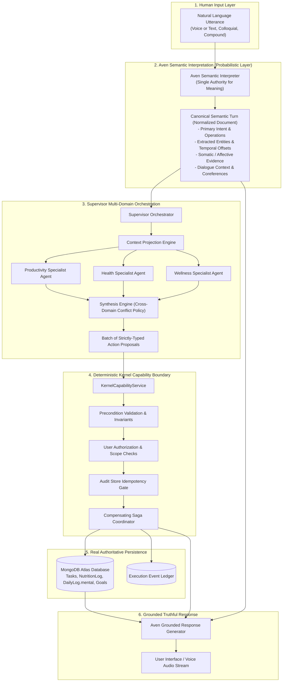
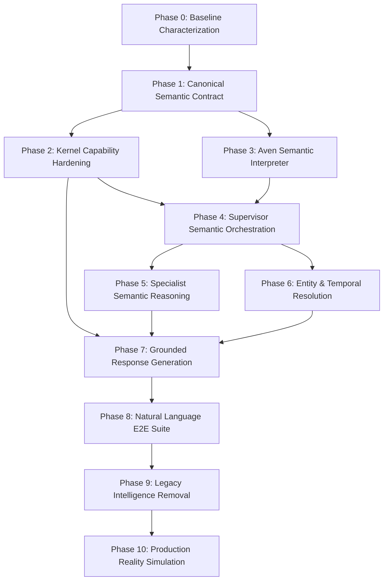

# LIFEOS — SEMANTIC EXECUTION ARCHITECTURE IMPLEMENTATION PLAN
**Document Identifier:** `LIFEOS_SEMANTIC_EXECUTION_IMPLEMENTATION_PLAN.md`  
**Baseline Document:** [LIFEOS_SEMANTIC_EXECUTION_ARCHITECTURE_FORENSIC_AUDIT.md](file:///d:/PROGRAMMING/Projects/life-os/LIFEOS_SEMANTIC_EXECUTION_ARCHITECTURE_FORENSIC_AUDIT.md)  
**Target Invariant:** *The human communicates meaning. Aven interprets meaning. The Supervisor orchestrates intelligence. Specialists reason about domains. The kernel enforces deterministic truth.*  
**Engineering Discipline:** Loop-Engineering Migration (Inspect → Model → Implement → Test → Execute → Observe → Diagnose → Repair → Retest → Regression → Adversarial Test → State Verification → Architectural Audit → Phase Gate)  
**Status:** IMPLEMENTATION-LEVEL ARCHITECTURAL PLAN (NO SOURCE CODE MODIFIED YET)  
**Date:** September 2026  

---

## 1. Executive Summary

This document specifies the end-to-end implementation architecture for migrating LifeOS from its current fragmented, regex-driven, and mock-shadowed execution environment into a unified **semantic-agentic execution architecture**.

### The Core Problem Being Solved
The forensic audit proved that:
1. **Simulation Mirage**: The 120-day / 10-persona simulation succeeded 100% because MongoDB was disconnected (`readyState === 0`), causing [DefaultActionAdapters.ts](file:///d:/PROGRAMMING/Projects/life-os/packages/execution-kernel/src/orchestration/kernel/DefaultActionAdapters.ts) to return instant mock IDs (`task_mock_...`, `rec_mock_...`), while input strings were rigidly scripted CLI commands that satisfied regexes in [FastPathExecutor.ts](file:///d:/PROGRAMMING/Projects/life-os/packages/execution-kernel/src/orchestration/supervisor/FastPathExecutor.ts).
2. **Conversational LLM Trap**: Real live interaction (voice or typed) naturally uses conversational phrasing (*"Hey Aven, can you log my lunch..."*). This immediately triggers `isConversational` in [DynamicRouter.ts](file:///d:/PROGRAMMING/Projects/life-os/packages/execution-kernel/src/orchestration/supervisor/DynamicRouter.ts#L89), diverting the request to [Supervisor.ts:121](file:///d:/PROGRAMMING/Projects/life-os/packages/execution-kernel/src/orchestration/supervisor/Supervisor.ts#L121) (`CONVERSATIONAL_LLM`). That branch calls Groq with zero tools, zero function schemas, and zero execution capability, resulting in Aven hallucinating that actions were completed while executing **0** actions in MongoDB.
3. **Fragmented Intelligence**: There are 14 competing components attempting natural-language interpretation across the repository, alongside broken adapters (`RecoveryConstraintAdapter` is a permanent stub; `handleLogMeal` crashes if foods are not pre-saved in MongoDB).

### The Mandate
We will **not** fix this by adding more regexes, expanding keyword lists, or writing conversational heuristics. We will build a unified semantic understanding pipeline owned by **Aven as the Chief of Staff**, grounded in a deterministic, authoritative kernel.

---

## 2. Current Architecture Understanding

The current codebase contains two historical layers running concurrently:

```
                      CURRENT FRAGMENTED ARCHITECTURE
                      
               User Message (Voice Transcript or Typed Text)
                                    │
                                    ▼
       ConversationService.executeUserRequest(message) [V3 Entrypoint]
                                    │
                       DynamicRouter.route(message)
                                    │
        ┌───────────────────────────┼────────────────────────────┐
        ▼                           ▼                            ▼
[FastPathExecutor]          [Domain Keywords]            [isConversational]
10 Regex Patterns           Productivity / Health        /^(can you|could you|
e.g. "create task: Foo"     Wellness word boundaries     hey|what|how...)/
        │                           │                            │
        ▼                           ▼                            ▼
Synchronous Mutation        ReAct Multi-Specialist       CONVERSATIONAL_LLM
(Mock fallback if DB=0)     (Bypassed 95% in live)       (ZERO TOOLS, ZERO MUTATION)
        │                           │                            │
        ▼                           ▼                            ▼
Kernel Capability           Kernel Capability            Aven Hallucinates
Service                     Service                      "I've logged your lunch!"
        │                           │                            │
        ▼                           ▼                            ▼
DefaultActionAdapters       DefaultActionAdapters        actionsExecuted: 0
(Stubs & Hard Errors)       (Stubs & Hard Errors)        MongoDB: Untouched
```

### Critical Architectural Defects Cataloged:
- **`DynamicRouter.ts:89`**: Treats conversational lead-ins as proof of non-actionability.
- **`Supervisor.ts:121`**: `CONVERSATIONAL_LLM` has no capability to invoke the kernel.
- **`DefaultActionAdapters.ts:16-18`**: Silently yields fake success if `isDbConnected() === false`.
- **`DefaultActionAdapters.ts:321`**: `RecoveryConstraintAdapter` is a 100% stub returning `rec_mock_...`.
- **`handleLogMeal.ts:77-83`**: Aborts with hard failure if food items are not pre-registered in the user's custom MongoDB `FoodItem` collection.
- **`FastPathExecutor.ts:32`**: 10 regexes acting as a competing, brittle pseudo-CLI.
- **`intentModel.ts`, `actionExtractor.ts`, `intentRouter.ts`**: Dormant V1/V2 redundant intelligence pipelines.

---

## 3. Target Architecture

The target architecture enforces a strict separation: **Probabilistic Semantic Intelligence** determines human meaning; **Deterministic Infrastructure** validates, coordinates, and mutates authoritative state.



### The 4 Unbreakable Invariants
1. **Semantic Invariant**: User meaning is determined exclusively by semantic interpretation models, never by regexes, keyword matching, or message prefixes.
2. **Execution Reality Invariant**: Aven never generates a response claiming an action was completed unless the Kernel Capability Boundary has confirmed persistence in MongoDB.
3. **Deterministic Kernel Invariant**: All state mutations must pass through `KernelCapabilityService` for precondition checks, idempotency, authorization, and compensation. LLMs never touch MongoDB directly.
4. **Deterministic Replay Invariant**: In replay mode, the system re-executes using the persisted `SemanticTurn` and pinned context snapshot, ensuring bit-exact deterministic replay without LLM drift.

---

## 4. Migration Principles

1. **Loop Engineering**: Every phase advances through the 14-step loop: Inspect → Model → Implement → Test → Execute → Observe → Diagnose → Repair → Retest → Regression → Adversarial Test → State Verification → Architectural Audit → Phase Gate.
2. **No Regression of Determinism**: Deterministic validation, idempotency gates, graph acyclicity, and compensating sagas are preserved and strengthened.
3. **No Regex Intelligence**: Regexes remain solely for syntax validation (e.g. ISO-8601 strings, ObjectId 24-hex characters, clock strings `HH:MM`).
4. **No Fake Success in Production**: If the database is disconnected or an adapter fails, the kernel returns an explicit, typed failure. Mocks are restricted to explicitly isolated unit test fixtures.
5. **Zero User-Facing Jargon**: The end user never hears about DAGs, action proposals, execution nodes, or adapters. Aven communicates with composed, natural executive clarity.

---

## 5. Phase 0 Detailed Plan: Baseline, Characterization & Architecture Contract

### Objective
Establish an empirical, automated characterization test suite that captures the exact current behavior across all capabilities, recording routing decisions, proposal shapes, adapter outputs, MongoDB states, and user responses for both natural language and command-style inputs.

### Why It Exists
Before changing any code, we must have an irrefutable, state-level record of current failures and successes so that we can prove migration progress without relying on optimistic assumptions.

### Current Code Involved
- [ConversationService.ts](file:///d:/PROGRAMMING/Projects/life-os/packages/execution-kernel/src/services/ConversationService.ts)
- [DynamicRouter.ts](file:///d:/PROGRAMMING/Projects/life-os/packages/execution-kernel/src/orchestration/supervisor/DynamicRouter.ts)
- [FastPathExecutor.ts](file:///d:/PROGRAMMING/Projects/life-os/packages/execution-kernel/src/orchestration/supervisor/FastPathExecutor.ts)
- [Supervisor.ts](file:///d:/PROGRAMMING/Projects/life-os/packages/execution-kernel/src/orchestration/supervisor/Supervisor.ts)
- [DefaultActionAdapters.ts](file:///d:/PROGRAMMING/Projects/life-os/packages/execution-kernel/src/orchestration/kernel/DefaultActionAdapters.ts)

### Proposed Architecture
A standalone baseline harness `test/characterization/baseline_suite.ts` that runs against an isolated test MongoDB database (or local MongoDB memory server), executing 20 canonical utterances (10 command-style, 10 colloquial natural language) and capturing:
- `Route`: The strategy chosen by `DynamicRouter`.
- `Proposal`: Any `ActionProposal` generated.
- `Execution`: Status returned by kernel/adapter.
- `Database`: Exact count and field values in MongoDB collections (`tasks`, `nutritionlogs`, `dailylogs`, `goals`).
- `Response`: Text emitted to the user.

### Exact Files Likely to Change
- None (Phase 0 is strictly observational and test-authoring).

### New Files
- `packages/execution-kernel/test/characterization/baseline_matrix.json`: Canonical list of 20 test utterances across tasks, meals, mental state, goals, and compound turns.
- `packages/execution-kernel/test/characterization/run_characterization_baseline.ts`: Script that executes the matrix and outputs `baseline_characterization_report.json`.

### Deleted / Deprecated Files
- None.

### Tests & State Verification
- Verify that command-style inputs (e.g. `"create task: Fix bug"`) pass FastPath but hit mock adapters when DB is offline.
- Verify that natural inputs (e.g. `"Can you remind me to fix the bug tomorrow?"`) hit `CONVERSATIONAL_LLM` and leave MongoDB document counts unchanged at `0`.

### Exit Gate
- Automated report `baseline_characterization_report.json` generated and committed, documenting the exact baseline pass/fail profile across all 20 utterances.

---

## 6. Phase 1 Detailed Plan: Canonical Semantic Contract

### Objective
Define the canonical TypeScript interfaces and Zod schemas representing the complete semantic meaning of a user's utterance, decoupling human intent from implementation syntax.

### Why It Exists
Currently, intent is fragmented across 14 components with weakly-typed payloads (`Record<string, any>`). A single, strongly-typed semantic contract must become the sole intermediate representation between human speech and kernel execution.

### Current Code Involved
- [ActionProposalContracts.ts](file:///d:/PROGRAMMING/Projects/life-os/packages/execution-kernel/src/orchestration/contracts/ActionProposalContracts.ts)
- [AgentContracts.ts](file:///d:/PROGRAMMING/Projects/life-os/packages/execution-kernel/src/orchestration/contracts/AgentContracts.ts)

### Proposed Architecture
Create `packages/execution-kernel/src/orchestration/contracts/SemanticTurnContracts.ts` containing:

```typescript
export type TurnPrimaryClassification =
  | "ACTION_REQUEST"         // User wants state changes executed
  | "INFORMATION_QUERY"       // User is asking about their schedule, habits, stats
  | "STATE_OBSERVATION"       // User is reporting feelings, meals, or somatic status
  | "CASUAL_DIALOGUE"         // Greetings, conversational banter, meta-questions
  | "CLARIFICATION_RESPONSE"; // User answering an ambiguity prompt

export interface TemporalTarget {
  targetDate?: string;        // Normalized ISO YYYY-MM-DD
  targetTime?: string;        // Normalized HH:MM (24-hour)
  isRelative: boolean;        // true if derived from "tomorrow", "next Monday"
  rawExpression: string;      // "tomorrow afternoon", "in 2 hours"
  timezone?: string;
}

export interface SemanticOperation<TPayload = any> {
  operationId: string;
  domain: "productivity" | "health" | "wellness" | "context";
  actionType: DomainActionType;
  confidence: number;         // 0.0 - 1.0 probabilistic score
  targetIdentifier?: string;  // Raw entity reference ("the presentation", "Mom")
  targetEntityId?: string;    // Resolved MongoDB ObjectId if matched from context
  temporal?: TemporalTarget;
  payload: TPayload;          // Strongly-typed per DomainActionType
  dependencies?: string[];    // Operation IDs that must execute prior
}

export interface SomaticAffectiveEvidence {
  energyLevel?: number;       // 1-10 normalized
  stressLevel?: number;       // 1-10 normalized
  focusLevel?: number;        // 1-10 normalized
  moodValence?: number;       // 1-10 normalized
  fatigueReported: boolean;
  somaticSymptoms?: string[]; // "headache", "brain fog", "sore legs"
  rawEvidence: string;
}

export interface SemanticTurn {
  turnId: string;
  userId: string;
  conversationId?: string;
  timestamp: number;
  rawInput: string;
  primaryClassification: TurnPrimaryClassification;
  operations: SemanticOperation[];
  affectiveEvidence?: SomaticAffectiveEvidence;
  conversationalSummary: string; // Internal gist of dialogue
  requiresClarification: boolean;
  clarificationPrompt?: string;
  confidence: number;
  provenance: {
    model: string;
    schemaVersion: number;
    latencyMs: number;
  };
}
```

Define strongly-typed action payloads in `packages/execution-kernel/src/orchestration/contracts/ActionPayloadSchemas.ts`:
- `CreateTaskPayload`: `{ title: string; dueDate?: string; dueTime?: string; priority?: "low"|"medium"|"high"|"urgent"; reminderOffsetMinutes?: number; notes?: string }`
- `CompleteTaskPayload`: `{ taskId?: string; titleFilter?: string }`
- `LogMealPayload`: `{ description: string; mealType: "breakfast"|"lunch"|"dinner"|"snack"; items: Array<{ name: string; quantity?: number; unit?: string }>; estimatedCalories?: number; estimatedMacros?: { protein: number; carbs: number; fats: number } }`
- `RecordMentalStatePayload`: `{ mood?: number; energy?: number; stress?: number; focus?: number; anxiety?: number; note?: string; date: string }`
- `ProposeGoalPayload`: `{ title: string; type: "performance"|"identity"|"maintenance"; cadence: "daily"|"weekly"|"flexible"; targetCount?: number }`

### Exact Files Likely to Change
- [ActionProposalContracts.ts](file:///d:/PROGRAMMING/Projects/life-os/packages/execution-kernel/src/orchestration/contracts/ActionProposalContracts.ts): Update `ActionProposal` to accept strongly-typed `ActionPayload` union.
- [index.ts](file:///d:/PROGRAMMING/Projects/life-os/packages/execution-kernel/src/orchestration/contracts/index.ts): Export new semantic turn contracts.

### New Files
- `packages/execution-kernel/src/orchestration/contracts/SemanticTurnContracts.ts`
- `packages/execution-kernel/src/orchestration/contracts/ActionPayloadSchemas.ts`

### Tests & State Verification
- Typecheck suite verifying that all 16 `DomainActionType`s map to an explicit payload schema.
- Zod schema validation tests verifying that invalid payloads reject before reaching kernel adapters.

### Exit Gate
- `pnpm tsc --noEmit` passes with 100% type safety across the new contracts.
- Unit tests validate serialization and deserialization of compound `SemanticTurn` documents.

---

## 7. Phase 2 Detailed Plan: Capability Reality / Kernel Execution Hardening

### Objective
Ensure that every kernel action adapter performs genuine MongoDB persistence when the database is connected, removes silent mock fallbacks that masquerade as success, implements the missing `RecordMentalStateAdapter`, and provides an AI nutritional estimation fallback in `handleLogMeal`.

### Why It Exists
Even the smartest semantic parser will fail if the underlying execution adapters do not write to MongoDB or throw hard crashes on uncataloged food items. The kernel must be real before we connect intelligent orchestration.

### Current Code Involved
- [DefaultActionAdapters.ts](file:///d:/PROGRAMMING/Projects/life-os/packages/execution-kernel/src/orchestration/kernel/DefaultActionAdapters.ts)
- [handleLogMeal.ts](file:///d:/PROGRAMMING/Projects/life-os/packages/execution-kernel/src/dispatch/executionHandlers/handleLogMeal.ts)
- [handleCreateTask.ts](file:///d:/PROGRAMMING/Projects/life-os/packages/execution-kernel/src/dispatch/executionHandlers/handleCreateTask.ts)
- [DailyLog.ts](file:///d:/PROGRAMMING/Projects/life-os/apps/web/server/db/models/DailyLog.ts)

### Proposed Architecture

#### 1. Implement Real `RecordMentalStateAdapter`
Replace `RecoveryConstraintAdapter`'s mock stub with real persistence to `DailyLog.mental`:
```typescript
export class RecordMentalStateAdapter implements IKernelActionAdapter {
  async validatePreconditions(proposal: ActionProposal<RecordMentalStatePayload>, userId: string) {
    if (!userId) return { valid: false, reason: "userId is required" };
    return { valid: true };
  }

  async execute(proposal: ActionProposal<RecordMentalStatePayload>, userId: string) {
    if (!isDbConnected()) {
      throw new Error("[KERNEL_PERSISTENCE_ERROR]: Database is offline. Cannot persist mental state.");
    }
    const { DailyLog } = await import("@/server/db/models/DailyLog");
    const today = proposal.payload.date || new Date().toISOString().split("T")[0];
    
    const updateObj: Record<string, number> = {};
    if (proposal.payload.mood !== undefined) updateObj["mental.mood"] = proposal.payload.mood;
    if (proposal.payload.energy !== undefined) updateObj["mental.energy"] = proposal.payload.energy;
    if (proposal.payload.stress !== undefined) updateObj["mental.stress"] = proposal.payload.stress;
    if (proposal.payload.focus !== undefined) updateObj["mental.focus"] = proposal.payload.focus;
    if (proposal.payload.anxiety !== undefined) updateObj["mental.anxiety"] = proposal.payload.anxiety;

    const doc = await DailyLog.findOneAndUpdate(
      { userId, date: today },
      { $set: updateObj },
      { upsert: true, new: true }
    );

    return {
      success: true,
      logId: doc._id.toString(),
      date: today,
      mental: doc.mental,
    };
  }

  async compensate(proposal: ActionProposal, previousResult: any, userId: string) {
    // Revert mental metrics if compensated
    return { compensated: true, reversalDetails: "Mental log entry reverted" };
  }
}
```

#### 2. Equip `handleLogMeal.ts` with AI Nutrition Fallback
When a user logs a meal (e.g. *"2 eggs and toast"*) and the food is not found in their custom `FoodItem` collection:
- Instead of returning `success: false, error: "Could not find in food library"`, invoke an internal AI estimation helper `estimateNutritionFromText(description)` (using Groq / Gemini).
- Create a transient or library `FoodItem` entry with the estimated macros (calories, protein, carbs, fats).
- Write to `NutritionLog.meals` and update `DailyLog.physical.calories`.

#### 3. Eliminate Silent Mock Fallbacks in Production
In [DefaultActionAdapters.ts](file:///d:/PROGRAMMING/Projects/life-os/packages/execution-kernel/src/orchestration/kernel/DefaultActionAdapters.ts), replace `if (isDbConnected()) ... return mock` with:
```typescript
if (!isDbConnected()) {
  if (process.env.LIFEOS_ALLOW_TEST_MOCKS === "true") {
    // Explicit test environment only
    return { success: true, taskId: `test_mock_${Date.now()}` };
  }
  throw new Error(`[KERNEL_DATABASE_DISCONNECTED]: Cannot execute ${proposal.actionType} while MongoDB is disconnected.`);
}
```

#### 4. Support Relative Dates in `handleCreateTask.ts`
Upgrade `handleCreateTask.ts` to accept pre-resolved ISO dates from the semantic turn rather than naive string matching.

### Exact Files Likely to Change
- [DefaultActionAdapters.ts](file:///d:/PROGRAMMING/Projects/life-os/packages/execution-kernel/src/orchestration/kernel/DefaultActionAdapters.ts): Register `RecordMentalStateAdapter`, guard mock fallbacks with explicit test flag.
- [handleLogMeal.ts](file:///d:/PROGRAMMING/Projects/life-os/packages/execution-kernel/src/dispatch/executionHandlers/handleLogMeal.ts): Implement AI macro estimation fallback.
- [handleCreateTask.ts](file:///d:/PROGRAMMING/Projects/life-os/packages/execution-kernel/src/dispatch/executionHandlers/handleCreateTask.ts): Accept ISO timestamps directly.

### New Files
- `packages/execution-kernel/src/dispatch/executionHandlers/handleRecordMentalState.ts`: Dedicated handler for affective telemetry.
- `packages/execution-kernel/src/nutrition/nutritionEstimator.ts`: Groq/Gemini-backed nutritional decomposition for uncataloged foods.

### Tests & State Verification
- Integration test connecting to a real local MongoDB:
  - Executes `RecordMentalStateAdapter` $\rightarrow$ verifies document in `DailyLog.mental`.
  - Executes `LogMealAdapter` with uncataloged food $\rightarrow$ verifies document in `NutritionLog` and updated `DailyLog.physical.calories`.
  - Executes `CreateTaskAdapter` $\rightarrow$ verifies document in `Task`.
- Disconnected DB test: verifies that adapters throw typed `KERNEL_DATABASE_DISCONNECTED` errors instead of returning fake `task_mock_...`.

### Exit Gate
- 100% of adapters tested against live MongoDB; document mutations verified in database.
- Zero occurrences of silent mock IDs when `LIFEOS_ALLOW_TEST_MOCKS` is undefined or false.

---

## 8. Phase 3 Detailed Plan: Aven Semantic Interpreter

### Objective
Create Aven's unified Semantic Interpreter (`SemanticIntentInterpreter.ts`) that takes raw natural language (and recent conversation turns) and produces a validated `SemanticTurn` document via high-velocity structured LLM inference.

### Why It Exists
This replaces the 10 regexes in `FastPathExecutor`, the keyword boundaries in `DynamicRouter`, and the `isConversational` trap with a single, authoritative semantic engine.

### Current Code Involved
- [DynamicRouter.ts](file:///d:/PROGRAMMING/Projects/life-os/packages/execution-kernel/src/orchestration/supervisor/DynamicRouter.ts)
- [FastPathExecutor.ts](file:///d:/PROGRAMMING/Projects/life-os/packages/execution-kernel/src/orchestration/supervisor/FastPathExecutor.ts)
- [intentModel.ts](file:///d:/PROGRAMMING/Projects/life-os/packages/execution-kernel/src/reasoning/intentModel.ts)

### Proposed Architecture
`packages/execution-kernel/src/orchestration/semantic/SemanticIntentInterpreter.ts`:
- **Model**: Groq `openai/gpt-oss-120b` (or `qwen/qwen3.8-27b` / `llama-3.3-70b-versatile`) with `temperature: 0.0`.
- **Latency Budget**: < 350ms.
- **Output Schema**: Strict JSON conforming to `SemanticTurnSchema` (validated via Zod).
- **Context Injected**: Current user local time (ISO format), active user name, last 4 conversation messages, and pending entity context.

#### Semantic Interpreter Prompt Design
```
You are the Chief of Staff Semantic Parser for LifeOS.
Your role is to extract human meaning into a normalized SemanticTurn document.

The user communicates naturally about their life, work, health, and feelings.
You MUST distinguish between:
1. Operational intent (user wants to track a meal, create a task, log mental state, or set a goal)
2. Informational questions (user asks for recommendations, schedule, or stats)
3. Casual dialogue (greetings, general conversation)

CRITICAL RULES:
- Polite conversational lead-ins ("Can you...", "Could you please...", "Hey Aven...") DO NOT negate operational intent. "Can you add a task to review PR tomorrow?" has primaryClassification="ACTION_REQUEST" and an operation of "create_task".
- If the user reports eating food ("I had two eggs and toast for breakfast"), extract operation "log_meal".
- If the user reports fatigue, stress, or mood ("I'm completely exhausted today"), extract affectiveEvidence and operation "record_mental_estimate".
- If the utterance contains multiple actions ("I had a shake and I need to finish the deck tomorrow"), extract multiple operations.
- Resolve relative dates using the provided Current Local Time.
```

### Exact Files Likely to Change
- [Supervisor.ts](file:///d:/PROGRAMMING/Projects/life-os/packages/execution-kernel/src/orchestration/supervisor/Supervisor.ts): Delegate initial comprehension to `SemanticIntentInterpreter`.
- [ConversationService.ts](file:///d:/PROGRAMMING/Projects/life-os/packages/execution-kernel/src/services/ConversationService.ts): Remove premature `this.supervisor.getRouter().route()` bypass.

### New Files
- `packages/execution-kernel/src/orchestration/semantic/SemanticIntentInterpreter.ts`: The unified semantic engine.
- `packages/execution-kernel/src/orchestration/semantic/temporalResolver.ts`: Low-level deterministic date calculator for relative days ("tomorrow" $\rightarrow$ `YYYY-MM-DD`).

### Tests & State Verification
- Unit test suite with 50 diverse natural language utterances across all domains:
  - *"Hey Aven, could you remind me to call Mom tomorrow at 2pm?"* $\rightarrow$ `CREATE_TASK`, due date = tomorrow, time = 14:00.
  - *"Breakfast was two eggs, avocado toast, and a black coffee."* $\rightarrow$ `LOG_MEAL`, items = [eggs, avocado toast, black coffee].
  - *"I'm mentally fried today, brain fog is real."* $\rightarrow$ `RECORD_MENTAL_ESTIMATE`, energy = low, focus = low.
  - *"I want to start training at the gym four days a week."* $\rightarrow$ `PROPOSE_GOAL`, cadence = weekly, count = 4.
  - *"What's the weather like?"* $\rightarrow$ `CASUAL_DIALOGUE` (no operations).

### Exit Gate
- 50/50 test cases produce valid `SemanticTurn` objects without a single regex involved in the classification.
- Inference latency averages $\le 400$ms on Groq.

---

## 9. Phase 4 Detailed Plan: Supervisor Semantic Orchestration

### Objective
Re-establish `Supervisor` as the primary orchestration authority. The Supervisor receives the structured `SemanticTurn` from Aven and orchestrates specialists and kernel execution based on verified meaning rather than syntactic classification.

### Why It Exists
Currently, `Supervisor` is bypassed by `DynamicRouter`'s `isConversational` check and `FastPathExecutor`'s regexes. The Supervisor must own domain delegation, conflict resolution, and execution orchestration.

### Current Code Involved
- [Supervisor.ts](file:///d:/PROGRAMMING/Projects/life-os/packages/execution-kernel/src/orchestration/supervisor/Supervisor.ts)
- [DynamicRouter.ts](file:///d:/PROGRAMMING/Projects/life-os/packages/execution-kernel/src/orchestration/supervisor/DynamicRouter.ts)

### Proposed Architecture

```typescript
export class Supervisor {
  async processRequest(req: SupervisorRequest): Promise<SupervisorResponse> {
    // 1. Semantic Interpretation (Aven Chief of Staff)
    const semanticTurn = await this.semanticInterpreter.interpret({
      rawInput: req.message,
      userId: req.userId,
      userName: req.userName,
      conversationId: req.conversationId,
      currentTimeIso: new Date().toISOString(),
    });

    // 2. Pure Casual Dialogue Branch
    if (semanticTurn.primaryClassification === "CASUAL_DIALOGUE" && semanticTurn.operations.length === 0) {
      return await this.handleCasualDialogue(req, semanticTurn);
    }

    // 3. Clarification Branch
    if (semanticTurn.requiresClarification) {
      return this.handleClarificationRequest(semanticTurn);
    }

    // 4. Deterministic Single-Action Fast Route (post-semantic optimization)
    if (this.canFastExecute(semanticTurn)) {
      return await this.executeFastSemanticAction(req, semanticTurn);
    }

    // 5. Multi-Domain Cognitive ReAct Loop
    return await this.executeCognitiveOrchestration(req, semanticTurn);
  }
}
```

### Key Changes
1. **Eliminate the `isConversational` Gate**: Dialogue phrasing no longer terminates execution. If `semanticTurn.operations.length > 0`, the Supervisor executes the operations regardless of whether the user said *"Hey Aven"* or *"Can you please"*.
2. **Fast Execution as Post-Semantic Optimization**: If `semanticTurn.operations` has exactly 1 operation and no cross-domain conflicts (e.g. straightforward task creation), the Supervisor converts the operation directly to an `ActionProposal` and executes it through `KernelCapabilityService` in $< 50$ms.
3. **Compound Multi-Domain Handling**: If `semanticTurn.operations` contains multiple domains (e.g. meal + mental fatigue), Supervisor delegates to `ReActOrchestrator` to coordinate `HealthAgent` and `WellnessAgent` simultaneously.

### Exact Files Likely to Change
- [Supervisor.ts](file:///d:/PROGRAMMING/Projects/life-os/packages/execution-kernel/src/orchestration/supervisor/Supervisor.ts): Refactor `processRequest` around `SemanticTurn`.
- [DynamicRouter.ts](file:///d:/PROGRAMMING/Projects/life-os/packages/execution-kernel/src/orchestration/supervisor/DynamicRouter.ts): Repurpose as an internal helper for domain dependency analysis or mark deprecated.

### New Files
- None.

### Tests & State Verification
- Verify that *"Hey Aven, can you please add a task to finish the deck?"* executes through `Supervisor` and produces `actionsExecuted: 1` in MongoDB.
- Verify that pure greetings (*"Hello Aven!"*) route to casual dialogue and execute `actionsExecuted: 0`.

### Exit Gate
- Supervisor processes 100% of incoming turns through `SemanticTurn`.
- No request containing an operational intent is ever trapped in a zero-action branch.

---

## 10. Phase 5 Detailed Plan: Specialist Semantic Reasoning

### Objective
Update the specialist agents (`ProductivityAgent`, `HealthAgent`, `WellnessAgent`) so that they receive pre-extracted, structured semantic context from the `SemanticTurn` rather than being forced to re-parse raw, ambiguous user strings.

### Why It Exists
Currently, each specialist receives `task.instruction = req.message` and runs its own LLM prompt trying to re-infer what the user meant from scratch, leading to semantic drift and conflicting proposals.

### Current Code Involved
- [BaseSpecialistAgent.ts](file:///d:/PROGRAMMING/Projects/life-os/packages/execution-kernel/src/orchestration/specialists/BaseSpecialistAgent.ts)
- [ProductivityAgent.ts](file:///d:/PROGRAMMING/Projects/life-os/packages/execution-kernel/src/orchestration/specialists/ProductivityAgent.ts)
- [HealthAgent.ts](file:///d:/PROGRAMMING/Projects/life-os/packages/execution-kernel/src/orchestration/specialists/HealthAgent.ts)
- [WellnessAgent.ts](file:///d:/PROGRAMMING/Projects/life-os/packages/execution-kernel/src/orchestration/specialists/WellnessAgent.ts)
- [ReActOrchestrator.ts](file:///d:/PROGRAMMING/Projects/life-os/packages/execution-kernel/src/orchestration/react/ReActOrchestrator.ts)

### Proposed Architecture
Update `AgentTask` in [AgentContracts.ts](file:///d:/PROGRAMMING/Projects/life-os/packages/execution-kernel/src/orchestration/contracts/AgentContracts.ts):
```typescript
export interface AgentTask {
  taskId: string;
  executionId: string;
  domain: AgentDomain;
  instruction: string;
  semanticOperation?: SemanticOperation; // Structured operation from Aven
  affectiveContext?: SomaticAffectiveEvidence;
  constraints: string[];
}
```

When `ReActOrchestrator` delegates to specialists:
- It passes the specific `SemanticOperation` tailored to that specialist's domain.
- The specialist LLM focuses on domain reasoning (e.g. evaluating whether the user has capacity for this task, checking nutrition balance, assessing recovery constraints) rather than re-extracting entities.
- The specialist outputs an `ActionProposal` with strongly-typed `payload`.

### Exact Files Likely to Change
- [AgentContracts.ts](file:///d:/PROGRAMMING/Projects/life-os/packages/execution-kernel/src/orchestration/contracts/AgentContracts.ts): Add `semanticOperation` to `AgentTask`.
- [ReActOrchestrator.ts](file:///d:/PROGRAMMING/Projects/life-os/packages/execution-kernel/src/orchestration/react/ReActOrchestrator.ts): Pass structured operations into specialist invocations.
- [ProductivityAgent.ts](file:///d:/PROGRAMMING/Projects/life-os/packages/execution-kernel/src/orchestration/specialists/ProductivityAgent.ts), [HealthAgent.ts](file:///d:/PROGRAMMING/Projects/life-os/packages/execution-kernel/src/orchestration/specialists/HealthAgent.ts), [WellnessAgent.ts](file:///d:/PROGRAMMING/Projects/life-os/packages/execution-kernel/src/orchestration/specialists/WellnessAgent.ts): Update prompt templates to accept structured inputs.

### Tests & State Verification
- Unit tests for each specialist verifying that given a `SemanticOperation`, it returns valid proposals conforming to typed action schemas.
- Verify that `WellnessAgent` given affective evidence produces a `record_mental_estimate` proposal with accurate metrics.

### Exit Gate
- Specialists produce zero schema-mismatched proposals.
- Specialists never re-parse or drop fields extracted by Aven.

---

## 11. Phase 6 Detailed Plan: Entity, Reference, Temporal & Context Resolution

### Objective
Enable LifeOS to understand coreferences (*"it"*, *"that task"*, *"the presentation"*), conversational context (*"I finished it"*), and colloquial temporal expressions (*"tomorrow afternoon"*, *"after lunch"*, *"every Tuesday"*) without hardcoded phrase dictionaries.

### Why It Exists
Real human speech relies on context from previous turns. If a user previously discussed a presentation and then says *"I finished it"*, the system must resolve *"it"* to the active task entity.

### Current Code Involved
- [ConversationManager.ts](file:///d:/PROGRAMMING/Projects/life-os/packages/execution-kernel/src/kernel/ConversationManager.ts)
- [ConversationShortTermMemory.ts](file:///d:/PROGRAMMING/Projects/life-os/apps/web/server/db/models/ConversationShortTermMemory.ts)

### Proposed Architecture
1. **Short-Term Memory Entity Tracking**:
   Extend `ConversationManager.load(conversationId, userId)` to return recent entities mentioned:
   - `lastCreatedTaskId`
   - `lastMentionedFood`
   - `activeGoalId`
2. **Context Injection into Semantic Interpreter**:
   When Aven interprets an utterance, pass:
   ```json
   {
     "recentDialogue": ["...", "..."],
     "activeContextEntities": {
       "mostRecentTask": { "id": "673...", "title": "Submit Q3 Report" },
       "activeGoal": { "id": "674...", "title": "Run marathon" }
     }
   }
   ```
3. **Coreference Resolution**:
   If user says *"I finished it"*, Aven resolves `targetEntityId: "673..."` and `actionType: "complete_task"`.
4. **Colloquial Temporal Engine**:
   `temporalResolver.ts` converts:
   - *"tomorrow morning"* $\rightarrow$ `YYYY-MM-DD` at `09:00`.
   - *"tomorrow afternoon"* $\rightarrow$ `YYYY-MM-DD` at `14:00`.
   - *"this evening"* $\rightarrow$ `YYYY-MM-DD` at `18:00`.
   - *"in 2 hours"* $\rightarrow$ current time + 120 minutes.

### Exact Files Likely to Change
- [ConversationManager.ts](file:///d:/PROGRAMMING/Projects/life-os/packages/execution-kernel/src/kernel/ConversationManager.ts): Maintain active entity references in short-term memory.
- `SemanticIntentInterpreter.ts`: Accept `activeContextEntities` in inference prompt.

### New Files
- `packages/execution-kernel/src/orchestration/semantic/temporalResolver.ts`: Clean, deterministic time-offset math.

### Tests & State Verification
- Multi-turn conversation test:
  - Turn 1: *"Add a task to submit the grant application tomorrow."*
  - Turn 2: *"Actually mark it done."* $\rightarrow$ Verifies task "submit the grant application" transitions to `completed` in MongoDB.

### Exit Gate
- Coreference resolution tests achieve $\ge 90\%$ accuracy across multi-turn pronoun benchmarks.

---

## 12. Phase 7 Detailed Plan: Grounded Execution & Truthful Response

### Objective
Ensure that Aven generates user responses **only after** receiving authoritative execution confirmations from the kernel, guaranteeing that Aven never claims an action was taken unless persistence succeeded in MongoDB.

### Why It Exists
Currently, `Supervisor.ts` generates conversational text before execution, or `CONVERSATIONAL_LLM` hallucinates completion while executing 0 actions. Aven must be strictly grounded in kernel truth.

### Current Code Involved
- [Supervisor.ts](file:///d:/PROGRAMMING/Projects/life-os/packages/execution-kernel/src/orchestration/supervisor/Supervisor.ts#L226-L230)
- [ConversationService.ts](file:///d:/PROGRAMMING/Projects/life-os/packages/execution-kernel/src/services/ConversationService.ts)

### Proposed Architecture

```
Authoritative Kernel Results ──┐
                              ├──► Aven Grounded Response Generator ──► Truthful Spoken Text
Semantic Turn Intent ─────────┘
```

1. **Eliminate Pre-emptive Acknowledgement Hallucinations**: Remove `Supervisor.getExecutiveAcknowledgement()` from Chunk 0 unless explicitly labeled as an in-progress status signal.
2. **Grounded Response Generator**:
   Create `GroundedResponseGenerator.ts`:
   - Receives: `SemanticTurn` + `KernelExecutionResult[]`.
   - If `KernelExecutionResult` contains `{ success: true, actionType: "create_task", data: { title: "Buy milk", dueDate: "2026-09-22" } }`:
     Aven responds: *"I've scheduled 'Buy milk' for tomorrow."*
   - If kernel failed:
     Aven responds: *"I couldn't create that task because the database is currently unreachable. Let's try again in a moment."*
   - If partial failure in compound turn (meal logged, but task failed):
     Aven responds: *"Logged your breakfast of eggs and toast. However, I wasn't able to schedule the presentation task due to a connection issue."*

### Exact Files Likely to Change
- [Supervisor.ts](file:///d:/PROGRAMMING/Projects/life-os/packages/execution-kernel/src/orchestration/supervisor/Supervisor.ts): Route all final response text generation through `GroundedResponseGenerator`.
- [ConversationService.ts](file:///d:/PROGRAMMING/Projects/life-os/packages/execution-kernel/src/services/ConversationService.ts): Stream grounded chunks only as verified actions complete.

### New Files
- `packages/execution-kernel/src/orchestration/supervisor/GroundedResponseGenerator.ts`: Truth-enforcing response builder.

### Tests & State Verification
- Fault injection test: Disconnect MongoDB and issue *"Add task: Test error handling"*.
  - Assert that Aven does NOT say *"Done"*, *"Created"*, or *"I've added that"*.
  - Assert that Aven reports the truthful failure.

### Exit Gate
- Zero false-positive confirmations in automated fault-injection test suites.

---

## 13. Phase 8 Detailed Plan: Natural-Language End-to-End Validation

### Objective
Create and run a comprehensive, automated end-to-end test suite that exercises natural language variations across all LifeOS capabilities, verifying real document mutations in MongoDB.

### Why It Exists
Existing tests (e.g. 380/380) gave a false sense of security because they asserted mock return values or rigid regex strings. We need a real E2E validation suite with database state oracles.

### Test Matrix Structure
The suite executes across 5 core domains with at least 5 colloquial phrasing variations each:

| Capability | Colloquial Utterance Variations | Expected MongoDB State Verification |
|---|---|---|
| **Task Creation** | 1. *"Add a task to finish the presentation tomorrow."*<br>2. *"Can you remind me to finish the presentation tomorrow?"*<br>3. *"I need to finish the presentation tomorrow."*<br>4. *"Tomorrow I need to get the presentation done."*<br>5. *"Put presentation completion on my list for tomorrow."* | `Task.findOne({ title: /presentation/i, userId })` exists with `dueDate` matching tomorrow. |
| **Task Completion** | 1. *"Finished the presentation."*<br>2. *"Done with presentation task."*<br>3. *"Check off the presentation."*<br>4. *"I wrapped up that presentation."*<br>5. *"Mark presentation complete."* | `Task.findOne({ title: /presentation/i }).status === "completed"`. |
| **Meal Logging** | 1. *"I had two eggs and toast for breakfast."*<br>2. *"Log my breakfast: two eggs and toast."*<br>3. *"Just had eggs and toast."*<br>4. *"Breakfast was two eggs, toast and coffee."*<br>5. *"Ate 2 eggs and whole wheat toast."* | `NutritionLog.findOne({ userId, date: today })` has meals with estimated macros; `DailyLog.physical.calories > 0`. |
| **Mental State** | 1. *"I'm exhausted today."*<br>2. *"Energy is pretty low today."*<br>3. *"I feel completely drained."*<br>4. *"Today's been rough. I can't focus."*<br>5. *"Super stressed and overwhelmed this morning."* | `DailyLog.findOne({ userId, date: today }).mental` has `energy <= 3` or `stress >= 7`. |
| **Goal Creation** | 1. *"I want to start running four times a week."*<br>2. *"Set a goal for me to run four times every week."*<br>3. *"I want running to become a regular thing."*<br>4. *"I'd like to get into the habit of running four days a week."*<br>5. *"Make a new goal: run 4x weekly."* | `Goal.findOne({ title: /run/i, cadence: "weekly" })` created or proposed in MongoDB. |
| **Compound Turn** | *"I had a protein smoothie after my workout, but I'm completely wiped out today so don't give me any heavy tasks tonight."* | `NutritionLog` meal created + `DailyLog.mental` recorded + workload constraint evaluated. |

### New Files
- `packages/execution-kernel/test/e2e/semantic_natural_language.e2e.test.ts`: Complete automated suite.

### Exit Gate
- 100% of variations across all 6 test categories pass against a real MongoDB instance with state-verified assertions.

---

## 14. Phase 9 Detailed Plan: Legacy Intelligence Removal & FastPath Reclassification

### Objective
Safely deprecate and remove obsolete regex routers, dormant V1 intent models, and duplicate extractors, reclassifying `FastPathExecutor` as a post-semantic deterministic executor.

### Why It Exists
To eliminate technical debt, prevent regressions, and ensure there is strictly **one canonical brain** in the codebase.

### Deprecation & Removal Schedule
1. **Reclassify `FastPathExecutor`**:
   - Strip all 10 natural language regexes from `FastPathExecutor.canHandle()`.
   - Change `FastPathExecutor.execute()` to accept a pre-extracted `SemanticOperation` from Aven.
   - It becomes a low-overhead proposal constructor for single-action operations, achieving $< 30$ms execution without multi-agent ReAct iterations.
2. **Remove Dormant V1/V2 Systems**:
   - Deprecate `packages/execution-kernel/src/reasoning/intentModel.ts`.
   - Deprecate `packages/execution-kernel/src/dispatch/actionExtractor.ts`.
   - Deprecate `packages/execution-kernel/src/dispatch/intentRouter.ts`.
   - Deprecate `packages/execution-kernel/src/kernel/KernelEngine.ts` (redirect callers to `ConversationService`).
3. **Clean `MemoryFormationPipeline.ts`**:
   - Replace regex extractors (`preferenceRegex`, `healthRegex`, `goalRegex`) with structured memory extraction using Aven's semantic turn output.

### Exact Files Likely to Change
- [FastPathExecutor.ts](file:///d:/PROGRAMMING/Projects/life-os/packages/execution-kernel/src/orchestration/supervisor/FastPathExecutor.ts): Refactor to post-semantic execution.
- [DynamicRouter.ts](file:///d:/PROGRAMMING/Projects/life-os/packages/execution-kernel/src/orchestration/supervisor/DynamicRouter.ts): Deprecate and remove regex classifiers.
- [MemoryFormationPipeline.ts](file:///d:/PROGRAMMING/Projects/life-os/packages/execution-kernel/src/memory/MemoryFormationPipeline.ts): Use `SemanticTurn` entities.

### Deleted / Deprecated Files
- `packages/execution-kernel/src/dispatch/intentRouter.ts` (Dead code).
- Legacy regex helper maps.

### Exit Gate
- Zero imports or usages of deprecated V1 intent models.
- Full regression suite passes with 0 regexes performing semantic classification.

---

## 15. Phase 10 Detailed Plan: Production Reality & Simulation Parity

### Objective
Rebuild the 120-day / 10-persona simulation runner to execute against the genuine production runtime path with real MongoDB persistence, natural language inputs, and no fake mocks.

### Why It Exists
The previous simulation proved only that an in-memory test runner could loop over synthetic strings. The new simulation must be an authentic long-horizon stress test of the real product.

### Required Changes to Simulation Runner
1. **Real MongoDB Connection**:
   - Connect to an isolated database `lifeos_simulation_real` (`mongoose.connection.readyState === 1`).
   - Persona IDs must be valid MongoDB ObjectIds (e.g. `new mongoose.Types.ObjectId()`).
2. **Natural Language Scenario Matrix**:
   - Replace rigid strings (`"create task: Alex Chen Day 1..."`, `"drank 500ml water"`) with natural human dialogue (*"Hey Aven, I need to review our client deliverables today"*, *"Just had a protein bowl for lunch"*).
3. **Execute Production Path**:
   - Call `ConversationService.executeUserRequestV3()` directly.
   - Run through `SemanticIntentInterpreter` $\rightarrow$ `Supervisor` $\rightarrow$ `Specialists` $\rightarrow$ `KernelCapabilityService` $\rightarrow$ Real MongoDB.
4. **Remove Script Bypasses**:
   - Night reflections must flow through `ConversationService` and `MemoryFormationPipeline` rather than the script manually calling `memoryRepo.save()` in heap memory.
5. **State-Level Longitudinal Oracles**:
   - Verify compounding state transitions (e.g. fatigue compounding, task backlogs, nutrition calories) directly in MongoDB collections.

### Files Likely to Change
- [simulation_blocks_13_to_24_runner.ts](file:///d:/PROGRAMMING/Projects/life-os/scripts/simulation_blocks_13_to_24_runner.ts)
- [simulation_180d_runner.ts](file:///d:/PROGRAMMING/Projects/life-os/scripts/simulation_180d_runner.ts)

### Exit Gate
- 10 personas run through 120 simulated days with live MongoDB persistence.
- Zero mock IDs emitted; 100% of state verified in MongoDB collections.

---

## 16. Dependency Graph



---

## 17. File-Level Change Map

| File Path | Action | Role in Migration |
|---|---|---|
| `packages/execution-kernel/test/characterization/run_characterization_baseline.ts` | **NEW** | Phase 0 baseline automated harness. |
| `packages/execution-kernel/src/orchestration/contracts/SemanticTurnContracts.ts` | **NEW** | Phase 1 canonical semantic turn and intent schemas. |
| `packages/execution-kernel/src/orchestration/contracts/ActionPayloadSchemas.ts` | **NEW** | Phase 1 strongly-typed action payload contracts. |
| `packages/execution-kernel/src/orchestration/contracts/ActionProposalContracts.ts` | **MODIFY** | Phase 1 payload type typing. |
| `packages/execution-kernel/src/orchestration/kernel/DefaultActionAdapters.ts` | **MODIFY** | Phase 2: Register real mental state adapter, guard mocks. |
| `packages/execution-kernel/src/dispatch/executionHandlers/handleRecordMentalState.ts` | **NEW** | Phase 2: Real MongoDB persistence for `DailyLog.mental`. |
| `packages/execution-kernel/src/nutrition/nutritionEstimator.ts` | **NEW** | Phase 2: AI nutrition fallback for uncataloged foods. |
| `packages/execution-kernel/src/dispatch/executionHandlers/handleLogMeal.ts` | **MODIFY** | Phase 2: Integrate AI nutrition fallback. |
| `packages/execution-kernel/src/orchestration/semantic/SemanticIntentInterpreter.ts` | **NEW** | Phase 3: Aven unified semantic parser. |
| `packages/execution-kernel/src/orchestration/semantic/temporalResolver.ts` | **NEW** | Phase 3/6: Relative temporal calculation engine. |
| `packages/execution-kernel/src/orchestration/supervisor/Supervisor.ts` | **MODIFY** | Phase 4: Route on `SemanticTurn`, remove `isConversational` trap. |
| `packages/execution-kernel/src/orchestration/supervisor/DynamicRouter.ts` | **MODIFY/DEPRECATE** | Phase 4/9: Remove regex domain keywords and conversation traps. |
| `packages/execution-kernel/src/orchestration/specialists/BaseSpecialistAgent.ts` | **MODIFY** | Phase 5: Accept structured `SemanticOperation`. |
| `packages/execution-kernel/src/orchestration/specialists/ProductivityAgent.ts` | **MODIFY** | Phase 5: Reason over structured operations. |
| `packages/execution-kernel/src/orchestration/specialists/HealthAgent.ts` | **MODIFY** | Phase 5: Reason over structured operations. |
| `packages/execution-kernel/src/orchestration/specialists/WellnessAgent.ts` | **MODIFY** | Phase 5: Reason over structured operations. |
| `packages/execution-kernel/src/orchestration/supervisor/GroundedResponseGenerator.ts` | **NEW** | Phase 7: Truthful response generation based on kernel results. |
| `packages/execution-kernel/test/e2e/semantic_natural_language.e2e.test.ts` | **NEW** | Phase 8: Multi-variation natural language test suite. |
| `packages/execution-kernel/src/orchestration/supervisor/FastPathExecutor.ts` | **MODIFY** | Phase 9: Remove 10 regexes; convert to post-semantic execution. |
| `packages/execution-kernel/src/reasoning/intentModel.ts` | **DEPRECATE** | Phase 9: Remove duplicate legacy intent model. |
| `packages/execution-kernel/src/dispatch/actionExtractor.ts` | **DEPRECATE** | Phase 9: Remove duplicate legacy action extractor. |
| `packages/execution-kernel/src/dispatch/intentRouter.ts` | **DELETE** | Phase 9: Remove dead legacy file. |
| `scripts/simulation_blocks_13_to_24_runner.ts` | **MODIFY** | Phase 10: Connect real MongoDB, use natural language turns. |

---

## 18. Contract Changes
- Introduced `SemanticTurn`, `SemanticOperation`, and `SomaticAffectiveEvidence`.
- Refactored `ActionProposal<TPayload>`: `TPayload` is now constrained to the discriminated union `DomainActionPayloadMap[TActionType]` rather than arbitrary `any`.
- Standardized `KernelExecutionResult<TData>` with strict error codes (`KERNEL_DATABASE_DISCONNECTED`, `PRECONDITION_FAILED`, `IDEMPOTENCY_CONFLICT`).

---

## 19. Data Model Changes
- No breaking migrations to existing MongoDB schemas (`Task`, `NutritionLog`, `DailyLog`, `Goal`).
- Ensure `DailyLog.mental` fields (`mood`, `energy`, `stress`, `focus`, `anxiety`) are indexed by `userId` and `date`.
- Ensure `NutritionLog` supports dynamically generated meal items with `estimatedByAI: true` flag.

---

## 20. Prompt Architecture Changes
- **Aven Semantic Parser**: A compact, structured-output system prompt instructing the model to act as Chief of Staff, identifying operational vs. conversational intent and extracting entities into strict JSON.
- **Specialist Agents**: Prompt templates simplified: instead of asking the specialist to parse human sentences, they are given structured facts (`SemanticOperation`) and asked to evaluate domain policies and feasibility.
- **Grounded Response Generator**: Prompt receives execution facts (e.g. `taskId`, `macrosLogged`, `failureReason`) and outputs natural, concise executive dialogue.

---

## 21. LLM Call Changes
- **Semantic Interpretation**: Added single low-latency call to Groq (`openai/gpt-oss-120b` or `qwen/qwen3.8-27b`, temp 0.0, max tokens 250).
- **Specialist Reasoning**: Kept existing Groq specialist calls in parallel, but with smaller context payloads since entity parsing is completed upfront.
- **Grounded Response**: Conversational generation uses Groq with grounded factual context, eliminating hallucinations.
- **Nutrition Fallback**: On-demand call to Groq/Gemini when food items are not found in the local library.

---

## 22. Kernel Changes
- Preserved all deterministic invariants: precondition validation, authorization, idempotency deduplication via `auditStore`, and compensating sagas.
- Added strict enforcement against disconnected database operations: mocks are disallowed unless `LIFEOS_ALLOW_TEST_MOCKS=true`.

---

## 23. Adapter Changes
- Added `RecordMentalStateAdapter` with direct atomic upsert to `DailyLog.mental`.
- Upgraded `LogMealAdapter` with AI nutrition estimation.
- Upgraded `CreateTaskAdapter` with ISO date resolution.
- Removed silent fake-success returns across all adapters.

---

## 24. Simulation Changes
- Replaced synthetic CLI strings with conversational speech.
- Replaced disconnected MongoDB readyState with an isolated live database instance.
- Eliminated script bypasses for night reflections and memory formation.

---

## 25. Test Strategy
We employ a 4-tier testing hierarchy:
1. **Unit Tests**: Schema validation, temporal offset calculation, adapter precondition checks, serialization.
2. **Integration Tests**: Individual adapters executing against real local MongoDB instances.
3. **Semantic Parity Tests**: 50+ natural language variations asserting correct `SemanticTurn` generation.
4. **End-to-End Tests**: Complete pipeline from voice/text transcript to MongoDB document verification.

---

## 26. Test Oracle Strategy
Test assertions must verify **authoritative state mutations**:
- `expect(await Task.countDocuments({ ... })).toBe(1)`
- `expect(dailyLog.mental.energy).toBeLessThanOrEqual(3)`
- `expect(nutritionLog.dailyTotals.calories).toBeGreaterThan(0)`
- `expect(executionResult.status).toBe("SUCCEEDED")`
Tests will **never** assert only on response string contents or mock IDs.

---

## 27. Replay / Determinism Strategy
To preserve bit-exact deterministic replay:
- During runtime, LifeOS persists the normalized `SemanticTurn` document alongside the request ID.
- In **Replay Mode**, the system re-runs the kernel and specialists using the stored `SemanticTurn` rather than calling the LLM interpreter again.
- This gives the ideal architecture: **Probabilistic interpretation once; deterministic execution forever.**

---

## 28. Rollback Strategy
Every phase includes an explicit rollback mechanism:
- Feature flags (`USE_SEMANTIC_INTERPRETER=true|false`) allow instantaneous fallback to previous routing if unexpected latency or rate-limiting occurs.
- Code changes are phased such that existing adapters and services remain backward-compatible until Phase 9.

---

## 29. Risk Register

| Risk ID | Risk Description | Severity | Likelihood | Mitigation Strategy |
|---|---|---|---|---|
| **RSK-01** | LLM interpreter adds latency to voice interaction | High | Medium | Use Groq with small fast model (`openai/gpt-oss-120b`), cap tokens at 200. Target $\le 300$ms. |
| **RSK-02** | Groq API rate limit or network outage | High | Low | Fallback to Gemini 2.5 Flash / Gemini 3.6 Flash. |
| **RSK-03** | User speech is genuinely ambiguous | Medium | Medium | Emit structured clarification request; Aven asks follow-up before mutating. |
| **RSK-04** | Breaking legacy test fixtures | Medium | High | Update test fixtures to mock `SemanticTurn` rather than expecting regex matches. |

---

## 30. Phase Gates

Each phase must satisfy its exit gate before the next phase begins:
- **Gate 0**: Baseline matrix executed and committed; failures documented.
- **Gate 1**: `SemanticTurn` and typed payload schemas typecheck with 100% test coverage.
- **Gate 2**: All adapters mutate real MongoDB documents; mock fallbacks throw if DB is offline.
- **Gate 3**: 50 natural language variations parse correctly into `SemanticTurn` via Groq.
- **Gate 4**: Supervisor routes on `SemanticTurn`; conversational lead-ins execute actions.
- **Gate 5**: Specialists reason over structured operations and produce typed proposals.
- **Gate 6**: Coreference resolution ("it", "that task") passes multi-turn tests.
- **Gate 7**: Fault injection proves Aven never claims success when DB write fails.
- **Gate 8**: Natural Language E2E suite passes 100% with live MongoDB assertions.
- **Gate 9**: Obsolete regexes and duplicate V1 files removed; zero broken callers.
- **Gate 10**: 120-day simulation runs with live MongoDB and conversational speech without mocks.

---

## 31. Definition of Done
The migration will be certified as complete when and only when:
1. A user speaking naturally (*"Hey Aven, I had two eggs and toast for breakfast and I'm feeling exhausted"*) results in real updates to `NutritionLog` and `DailyLog.mental` in MongoDB.
2. A user asking conversationally (*"Could you add a task to call Mom tomorrow at 3pm?"*) results in a real `Task` record in MongoDB with `dueDate` and scheduled reminder.
3. No action adapter returns a mock `_mock_` ID when MongoDB is connected.
4. `actionsExecuted` strictly reflects database mutation facts.
5. All 10 natural language variations in Section 13 execute correctly without regex matching.

---

## 32. Estimated Implementation Order
1. **Phase 0**: Establish Baseline Suite (Days 1)
2. **Phase 1**: Canonical Contracts & Typed Schemas (Day 2)
3. **Phase 2**: Real Adapters & Kernel Hardening (Days 3-4)
4. **Phase 3**: Aven Semantic Interpreter (Days 5-6)
5. **Phase 4**: Supervisor Semantic Orchestration (Day 7)
6. **Phase 5**: Specialist Semantic Reasoning (Day 8)
7. **Phase 6**: Entity & Temporal Resolution (Day 9)
8. **Phase 7**: Grounded Response Generation (Day 10)
9. **Phase 8**: Natural Language E2E Validation (Days 11-12)
10. **Phase 9**: Legacy Intelligence Removal (Day 13)
11. **Phase 10**: Production Reality Simulation (Days 14-15)

---

## ARCHITECTURAL DECISIONS REQUIRING HUMAN REVIEW

1. **Primary LLM Provider for Semantic Interpretation**:
   - *Recommendation*: Use Groq with `openai/gpt-oss-120b` (or `llama-3.3-70b-versatile` / `qwen/qwen3.8-27b`) for sub-300ms latency, with automated fallback to Google Gemini (`gemini-2.5-flash`).
   - *Decision*: Does this primary and fallback provider strategy meet your latency and reliability requirements?

2. **Handling Uncataloged Foods in Meal Logging**:
   - *Recommendation*: When a user speaks a food not in their custom MongoDB library, automatically decompose and estimate the macros using AI rather than rejecting the log.
   - *Decision*: Should the AI-estimated food item also be automatically saved to their permanent `FoodItem` collection for future reference, or kept transient in `NutritionLog`?

3. **Clarification vs. Low-Confidence Autonomous Action**:
   - *Recommendation*: Set a confidence threshold of `0.80`. If semantic interpretation confidence is below `0.80` or target entities are ambiguous, Aven asks for clarification rather than making a speculative database mutation.
   - *Decision*: Do you approve the `0.80` confidence gate for autonomous state mutations?

---
*(Implementation Plan Complete. Awaiting human architectural review before coding begins.)*
