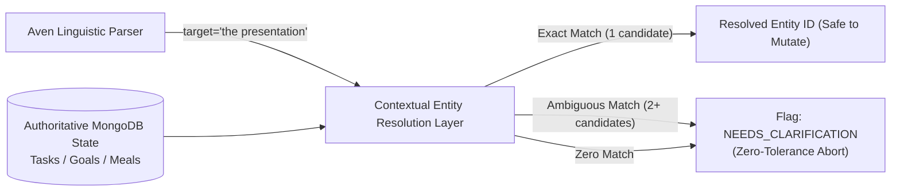

# LIFEOS — SEMANTIC EXECUTION ARCHITECTURE IMPLEMENTATION PLAN (V2)
**Document Identifier:** `LIFEOS_SEMANTIC_EXECUTION_IMPLEMENTATION_PLAN_V2.md`  
**Supersedes:** `LIFEOS_SEMANTIC_EXECUTION_IMPLEMENTATION_PLAN.md` (V1)  
**Baseline Document:** [LIFEOS_SEMANTIC_EXECUTION_ARCHITECTURE_FORENSIC_AUDIT.md](file:///d:/PROGRAMMING/Projects/life-os/LIFEOS_SEMANTIC_EXECUTION_ARCHITECTURE_FORENSIC_AUDIT.md)  
**Target Invariant:** *The human communicates meaning. Aven interprets meaning. The Supervisor orchestrates intelligence. Specialists reason about domains. Context layer resolves authoritative references. The kernel enforces deterministic truth. MongoDB/event ledger represents authoritative reality.*  
**Engineering Discipline:** Loop-Engineering Migration (Inspect → Model → Implement → Test → Execute → Observe → Diagnose → Repair → Retest → Regression → Adversarial Test → State Verification → Architectural Audit → Phase Gate)  
**Status:** REVISED ARCHITECTURAL PLAN (V2) — STRICTLY NON-MODIFYING / AWAITING HUMAN REVIEW  
**Date:** September 2026  

---

## 1. Executive Summary & V2 Architectural Corrections

Following the detailed human architectural review of V1, this V2 specification eliminates every identified architectural weakness that risked recreating brittle heuristics, probabilistic execution gates, or hidden semantic bifurcations.

### The 12 Mandatory Architectural Corrections in V2:
1. **Elimination of the 0.80 LLM Confidence Gate**: Replaced arbitrary numerical confidence gating with an **Explicit Deterministic Policy Gate** (schema validity, required entity completeness, reference disambiguation, risk classification, kernel preconditions, authorization, idempotency).
2. **Replay-Hardened Canonical Semantic Turn**: Expanded `SemanticTurn` to store complete provenance (model, prompt hash, schema version, context snapshot hash, normalized timezone, operations, ambiguity state, dependencies) enabling **100% deterministic replay without invoking LLMs**.
3. **Decoupling Semantic Entity Identification from Persistence**: Aven extracts semantic entity references (*"the presentation"*, *"it"*); an authoritative **Contextual Entity Resolution Layer** resolves them against MongoDB state; and the Kernel validates target existence before mutation.
4. **Deterministic Policy-Driven Temporal Resolution**: Replaced arbitrary hardcoded clock assumptions with an explicit, user-configurable temporal policy engine and formal clarification triggers for ambiguous timeframes.
5. **Strict Exclusion of AI from the Deterministic Kernel**: AI-based nutrition decomposition and enrichment are situated strictly in the domain intelligence layer *before* reaching `KernelCapabilityService`. The Kernel remains 100% deterministic and schema-enforced.
6. **Strict Demarcation of Specialist Responsibility**: Specialists are forbidden from re-interpreting raw natural language. Aven owns linguistic meaning; Specialists own domain reasoning, constraints, capacity feasibility, and action proposal generation.
7. **Authoritative Execution Truth Model**: The response generator is forbidden from inventing or hallucinating success. Responses are strictly grounded in typed `KernelExecutionResult` states (`SUCCEEDED`, `FAILED`, `PARTIALLY_SUCCEEDED`, `REJECTED`, `NEEDS_CLARIFICATION`, `COMPENSATED`, `MANUAL_REVIEW_REQUIRED`).
8. **Shift-Left Production-Path Parity**: Real MongoDB persistence and end-to-end execution paths are validated starting from Phase 0 and Phase 2, rather than waiting for Phase 10.
9. **Zero-Tolerance Coreference Safety**: Replaced the generic 90% coreference metric with operation-specific safety: if multiple candidate entities exist or an entity is ambiguous, mutation is strictly forbidden and clarification is mandatory.
10. **Repository-Wide Intelligence Ownership Audit**: Formally cataloged every occurrence of competing intelligence (regexes, keyword arrays, legacy models, hidden prompts) to ensure Aven is the single semantic authority.
11. **Post-Semantic Fast-Path Reclassification**: FastPath is stripped of all natural language regexes and reclassified purely as a post-semantic execution optimization for single, unambiguous operations.
12. **First-Class Compound Turn Architecture**: Multi-intent utterances (*"I had a protein shake, I'm exhausted, and remind me to finish the deck tomorrow"*) are modeled as first-class directed acyclic operations with explicit dependency ordering and partial-failure handling.

---

## 2. Final Intelligence Ownership Map

To ensure there are **zero duplicate brains** in the repository, architectural ownership is formally bound to distinct components:

| Responsibility | Authoritative Owner | Forbidden Behaviors | Current Offending Components (To Eliminate) |
|---|---|---|---|
| **Human Meaning & Linguistic Parsing** | **Aven Semantic Interpreter** | Regex matching, keyword lists, prefix matching, CLI-style command templates. | `DynamicRouter.ts:89`, `FastPathExecutor.ts:32`, `intentModel.ts`, `actionExtractor.ts` |
| **Cognitive Orchestration** | **Supervisor** | Direct MongoDB mutations, bypassing kernel, ungrounded conversational hallucinations. | `Supervisor.ts:121` (`CONVERSATIONAL_LLM` dead branch) |
| **Domain Reasoning & Feasibility** | **Specialist Agents** (`Productivity`, `Health`, `Wellness`) | Re-inferring user intent from raw text, executing database writes directly. | Specialists receiving raw `task.instruction` without structured semantic operations. |
| **Contextual Entity Resolution** | **Context & Entity Resolution Layer** | Guessing ambiguous targets, silent fallback to wrong entities, direct schema mutations. | Brittle regex string matching in `OutcomeVerifier.ts` and `handleCreateTask.ts`. |
| **Temporal Policy Interpretation** | **Temporal Policy Engine** | Arbitrary hardcoded clock times without policy; failure to clarify ambiguous horizons. | Hardcoded `today`/`tomorrow` string replacement in `handleCreateTask.ts:11-20`. |
| **Deterministic Validation & Invariants** | **KernelCapabilityService** | Invoking probabilistic LLMs, silent mock fallbacks, unvalidated payload execution. | `DefaultActionAdapters.ts:16-18` (`isDbConnected() === false` mock return). |
| **Authoritative State Mutation** | **Kernel Action Adapters (Real MongoDB)** | Returning fake success (`task_mock_...`, `rec_mock_...`), in-memory-only bypasses. | `RecoveryConstraintAdapter` in `DefaultActionAdapters.ts:321`. |
| **Truthful Communication** | **Grounded Response Generator** | Claiming an action succeeded when kernel reported `FAILED` or when 0 actions executed. | `Supervisor.ts:171` prose generation without execution confirmation. |
| **Deterministic Replay** | **Kernel Replay Engine** | Re-invoking LLM semantic parsers or specialist prompts during replay. | N/A (New subsystem). |

---

## 3. Canonical Semantic Turn Contract (`SemanticTurn`)

The `SemanticTurn` contract is the sole intermediate representation between probabilistic natural language and deterministic execution. It contains all metadata required for **bit-exact deterministic replay without re-invoking LLMs**:

```typescript
export type TurnPrimaryClassification =
  | "ACTION_REQUEST"         // User desires state mutation (task, meal, mental, goal)
  | "INFORMATION_QUERY"       // User asks about status, metrics, past logs, or schedule
  | "STATE_OBSERVATION"       // Somatic, affective, or dietary report without explicit command
  | "CASUAL_DIALOGUE"         // Greetings, meta-dialogue, conversational banter
  | "CLARIFICATION_RESPONSE"  // User answering an outstanding system clarification prompt
  | "CANCEL_OR_DISMISS";     // User retracting, cancelling, or dismissing a prior turn

export type AmbiguityStatus =
  | "UNAMBIGUOUS"             // All operations, entities, and temporal targets are explicit
  | "OPERATION_AMBIGUOUS"     // Unclear what action is requested
  | "ENTITY_AMBIGUOUS"        // Multiple candidate entities match
  | "TEMPORAL_AMBIGUOUS"      // Timeframe is broad or underspecified ("sometime", "later")
  | "CONFLICTING_INTENTS";    // Contradictory requests within the same turn

export interface EntityReference {
  referenceId: string;
  rawExpression: string;      // "the presentation", "it", "my meeting with Alex"
  entityType: "task" | "goal" | "meal" | "workout" | "schedule_block";
  resolutionStrategy: "EXPLICIT_ID" | "EXACT_TITLE" | "CONTEXTUAL_RECENT" | "AMBIGUOUS_CANDIDATES" | "UNRESOLVED";
  candidateIds?: string[];    // Populated if multiple entities match
  resolvedEntityId?: string;  // Populated ONLY by Contextual Entity Resolution Layer
}

export interface TemporalExpression {
  rawExpression: string;      // "tomorrow afternoon", "next Monday at 3pm", "after lunch"
  type: "POINT_IN_TIME" | "DATE_ONLY" | "RELATIVE_OFFSET" | "TIME_OF_DAY_RANGE" | "RECURRING";
  parsedAnchor?: string;      // Base ISO date string YYYY-MM-DD
  resolvedDate?: string;      // Computed ISO date YYYY-MM-DD
  resolvedTime?: string;      // Computed 24-hour time HH:MM
  timezone: string;           // e.g. "America/New_York" or "Asia/Kolkata"
  isAmbiguous: boolean;       // true if "afternoon" has multiple interpretations without policy
}

export interface SemanticOperation<TPayload = any> {
  operationId: string;
  domain: "productivity" | "health" | "wellness" | "context";
  actionType: DomainActionType;
  riskClass: "READ_ONLY" | "LOW_REVERSIBLE" | "MEDIUM_COMPENSABLE" | "HIGH_IRREVERSIBLE";
  targetReference?: EntityReference;
  temporal?: TemporalExpression;
  payload: TPayload;          // Strongly-typed payload
  dependencies: string[];     // IDs of prior operations that must succeed first
  executionEligibility: "READY" | "BLOCKED_BY_DEPENDENCY" | "REQUIRES_CLARIFICATION";
}

export interface SomaticAffectiveEvidence {
  energy?: { value: number; confidence: number }; // 1-10 scale
  stress?: { value: number; confidence: number }; // 1-10 scale
  mood?: { value: number; confidence: number };   // 1-10 scale
  focus?: { value: number; confidence: number };  // 1-10 scale
  reportedFatigue: boolean;
  somaticSymptoms: string[];  // e.g. ["headache", "brain fog"]
  rawVerbatim: string;
}

export interface SemanticTurn {
  // Provenance & Replay Boundary
  turnId: string;
  schemaVersion: number;      // e.g. 2
  userId: string;
  conversationId: string;
  timestamp: number;
  rawInput: string;
  normalizedTimezone: string;
  
  // LLM Provenance (Persisted for Replay Audit)
  provenance: {
    interpreterProvider: "groq" | "gemini" | "openai";
    modelIdentifier: string;  // e.g. "openai/gpt-oss-120b"
    promptVersionHash: string;// SHA-256 hash of system prompt
    contextSnapshotId: string;// ID of active context snapshot
    contextSnapshotHash: string; // SHA-256 of context at interpretation time
    inferenceDurationMs: number;
  };

  // Semantic Output
  primaryClassification: TurnPrimaryClassification;
  ambiguityStatus: AmbiguityStatus;
  operations: SemanticOperation[];
  affectiveEvidence?: SomaticAffectiveEvidence;
  conversationalSummary: string; // Factual gist for dialogue history
  clarification?: {
    required: boolean;
    reason?: string;
    questionToUser?: string;
    options?: string[];
  };
}
```

---

## 4. Final Action Proposal & Kernel Contracts

### 4.1 Strongly-Typed Action Payloads (`ActionPayloadSchemas.ts`)
No action proposal may utilize untyped `any` or unconstrained `Record<string, any>`:

```typescript
export interface CreateTaskPayload {
  title: string;
  dueDate?: string;           // ISO YYYY-MM-DD
  dueTime?: string;           // HH:MM
  priority?: "low" | "medium" | "high" | "urgent";
  reminderOffsetMinutes?: number;
  notes?: string;
}

export interface CompleteTaskPayload {
  taskId: string;             // Must be authoritative MongoDB ObjectId
  resolvedTitle: string;
}

export interface UpdateTaskPayload {
  taskId: string;
  status?: "pending" | "in_progress" | "completed" | "cancelled";
  dueDate?: string;
  dueTime?: string;
  priority?: "low" | "medium" | "high" | "urgent";
}

export interface LogMealPayload {
  description: string;
  mealType: "breakfast" | "lunch" | "dinner" | "snack";
  date: string;               // ISO YYYY-MM-DD
  items: Array<{
    name: string;
    quantity?: number;
    unit?: string;
    calories: number;
    protein: number;
    carbs: number;
    fats: number;
  }>;
  totalCalories: number;
  enrichmentSource: "user_food_library" | "ai_nutrition_estimator" | "manual_user_entry";
}

export interface RecordMentalStatePayload {
  date: string;               // ISO YYYY-MM-DD
  mood?: number;              // 1-10
  energy?: number;            // 1-10
  stress?: number;            // 1-10
  focus?: number;             // 1-10
  anxiety?: number;           // 1-10
  verbatimEvidence?: string;
}

export interface ProposeGoalPayload {
  title: string;
  type: "performance" | "identity" | "maintenance";
  cadence: "daily" | "weekly" | "flexible";
  targetCount?: number;
}
```

### 4.2 ActionProposal Contract
```typescript
export interface ActionProposal<TPayload = any> {
  id: string;                 // act_...
  operationId: string;        // Links back to SemanticOperation.operationId
  domain: "productivity" | "health" | "wellness" | "context";
  actionType: DomainActionType;
  targetEntityId?: string;    // Authoritatively resolved entity ID
  payload: TPayload;
  preconditions: ActionPreconditions;
  rationale: string;
  reversibility: "atomic_single_doc" | "reversible_with_compensation" | "irreversible_external";
  idempotencyKey: string;     // Deterministically derived hash
}
```

### 4.3 Authoritative KernelExecutionResult Contract
```typescript
export type ActionExecutionStatus =
  | "SUCCEEDED"               // Confirmed written to MongoDB
  | "FAILED"                  // Execution threw an error; state unchanged
  | "PARTIALLY_SUCCEEDED"     // Some operations in a compound batch passed, some failed
  | "REJECTED"                // Precondition validation, authorization, or invariants failed
  | "NEEDS_CLARIFICATION"     // Ambiguous entity or temporal reference prevented safe execution
  | "COMPENSATING"            // In-flight rollback active
  | "COMPENSATED"             // Rollback successfully reverted prior steps
  | "MANUAL_REVIEW_REQUIRED"; // Partial compensation failed; flagged for review

export interface KernelExecutionResult<TData = any> {
  actionId: string;
  operationId: string;
  idempotencyKey: string;
  actionType: DomainActionType;
  status: ActionExecutionStatus;
  success: boolean;
  data?: TData;               // Persisted document snapshot (e.g. created taskId)
  error?: {
    code: string;             // e.g. "PRECONDITION_FAILED", "DB_DISCONNECTED"
    message: string;
    retryable: boolean;
  };
  targetEntityId?: string;
  timestamp: number;
  compensated?: boolean;
}
```

---

## 5. Contextual Entity Resolution Layer

Authoritative entity resolution is decoupled from linguistic parsing:



### Resolution Rules:
1. **Unambiguous Match (Single Candidate)**:
   - If user says *"I finished the presentation"* and active tasks contain exactly one pending task matching `presentation`, resolve `targetEntityId = task._id`. Proceed to kernel.
2. **Ambiguous Match (Multiple Candidates)**:
   - If active tasks contain *"Prepare presentation for Board"* and *"Review pitch presentation"*, the resolution layer produces `status: "NEEDS_CLARIFICATION"`. The kernel **strictly forbids mutation**, and Aven prompts the user: *"Which presentation did you finish: the Board presentation or the pitch presentation?"*
3. **No Match (Unresolved)**:
   - If no task matches *"the presentation"*, the layer flags `status: "UNRESOLVED"`. Aven asks: *"I couldn't find an open task for 'the presentation'. Would you like me to create and complete it, or check off a different task?"*
4. **Wrong-Entity Safety Invariant**:
   - Under no circumstances may the system arbitrarily pick the first array element or highest fuzzy score when candidates are ambiguous.

---

## 6. Deterministic Policy-Driven Temporal Resolution

The temporal engine resolves natural language temporal targets according to deterministic system policies rather than hardcoded heuristics:

### Policy Configuration Schema (`TemporalPolicy.ts`):
```typescript
export interface TemporalPolicy {
  defaultTimezone: string;
  dayStartHour: number;        // e.g. 6 (06:00)
  morningStartHour: number;    // e.g. 9 (09:00)
  afternoonStartHour: number;  // e.g. 13 (13:00)
  eveningStartHour: number;    // e.g. 17 (17:00)
  nightStartHour: number;      // e.g. 21 (21:00)
  defaultReminderOffsetMinutes: number; // e.g. 15
  requireClarificationForVagueTime: boolean; // true for "sometime"
}
```

### Deterministic Resolution Engine:
- **Relative Dates**: Given local anchor time `2026-09-21T18:00:00`, *"tomorrow"* resolves strictly to `2026-09-22`.
- **Relative Time Expressions**:
  - *"tomorrow afternoon"* $\longrightarrow$ Sets `resolvedDate = 2026-09-22`, `resolvedTime = policy.afternoonStartHour:00` (13:00), flagged with `isAmbiguous: false` under policy.
  - *"sometime next week"* $\longrightarrow$ Sets `isAmbiguous: true`. Triggers clarification or schedules for Monday morning default per policy.
  - *"in 2 hours"* $\longrightarrow$ `anchorTimestamp + 7200000`.

---

## 7. Decoupled AI Nutrition Enrichment

In accordance with the directive **Keep AI Out of the Deterministic Kernel**, AI nutrition estimation occurs strictly in the pre-kernel domain intelligence layer:

```
[Aven Semantic Parser]
       │
       ▼
Extracts SemanticOperation:
actionType: "log_meal"
description: "2 eggs and toast"
items: [{ name: "egg", quantity: 2 }, { name: "toast", quantity: 1 }]
       │
       ▼
[Health Domain Intelligence: NutritionEnricher]
       │  - Checks user's personal FoodItem library
       │  - If uncataloged: invokes Groq/Gemini Nutrition Estimator
       │  - Computes exact macros: 240 kcal, 14g P, 22g C, 11g F
       ▼
Constructs Validated Structured ActionProposal:
payload: {
  description: "2 eggs and toast",
  mealType: "breakfast",
  totalCalories: 240,
  items: [ ...with macros... ],
  enrichmentSource: "ai_nutrition_estimator"
}
       │
       ▼
[KernelCapabilityService Boundary]
(100% Deterministic: No LLM calls, validates schema, writes to NutritionLog & DailyLog)
```

---

## 8. Multi-Intent Compound Turn Architecture

Compound turns are modeled as directed graphs of operations:

```
User: "I had a protein shake after the gym, I'm exhausted, and remind me to finish the deck tomorrow."
                                │
                                ▼
                       [Aven Semantic Turn]
                                │
        ┌───────────────────────┼────────────────────────┐
        ▼                       ▼                        ▼
Operation 1:            Operation 2:             Operation 3:
domain: health          domain: wellness         domain: productivity
actionType: log_meal    actionType: record_mental actionType: create_task
payload: protein shake  payload: energy=2        payload: finish deck
dependencies: []        dependencies: []         dependencies: []
        │                       │                        │
        └───────────────────────┼────────────────────────┘
                                │
                                ▼
            [Supervisor Parallel Coordination Engine]
                                │
        ┌───────────────────────┼────────────────────────┐
        ▼                       ▼                        ▼
Health Specialist       Wellness Specialist      Productivity Specialist
Enriches Nutrition      Recommends Rest Capping  Schedules Task
        │                       │                        │
        └───────────────────────┼────────────────────────┘
                                │
                                ▼
                  [Deterministic Kernel Batch Saga]
              1. Mutates NutritionLog (SUCCEEDED)
              2. Mutates DailyLog.mental (SUCCEEDED)
              3. Mutates Task (SUCCEEDED)
                                │
                                ▼
         Authoritative Kernel Result: All 3 SUCCEEDED
                                │
                                ▼
         Grounded Response: "Logged your shake, noted your fatigue,
         and scheduled 'Finish the deck' for tomorrow."
```

### Partial Failure Semantics:
If Operation 1 and 2 succeed, but Operation 3 fails (e.g. validation error):
- Kernel status: `PARTIALLY_SUCCEEDED`.
- Operations 1 and 2 remain committed (independent idempotent operations).
- Grounded response truthful report: *"I logged your protein shake and recorded your fatigue. However, I wasn't able to schedule the deck task due to [reason]."*

---

## 9. Fake-Success Register

Every synthetic shortcut and mock fallback across the repository was cataloged and classified:

| File | Line | Identifier / Pattern | Current Behavior | Classification | Target V2 Remediation |
|---|---|---|---|---|---|
| [DefaultActionAdapters.ts](file:///d:/PROGRAMMING/Projects/life-os/packages/execution-kernel/src/orchestration/kernel/DefaultActionAdapters.ts#L47) | 47 | `task_mock_${Date.now()}` | Returns mock task ID if DB disconnected | **C (Production Defect)** | Throw typed `KERNEL_DATABASE_DISCONNECTED` error. |
| [DefaultActionAdapters.ts](file:///d:/PROGRAMMING/Projects/life-os/packages/execution-kernel/src/orchestration/kernel/DefaultActionAdapters.ts#L89) | 89 | `"task_mock_1"` | Returns mock task completion | **C (Production Defect)** | Throw typed `KERNEL_DATABASE_DISCONNECTED` error. |
| [DefaultActionAdapters.ts](file:///d:/PROGRAMMING/Projects/life-os/packages/execution-kernel/src/orchestration/kernel/DefaultActionAdapters.ts#L203) | 203 | `meal_mock_${Date.now()}` | Returns mock meal log | **C (Production Defect)** | Throw typed `KERNEL_DATABASE_DISCONNECTED` error. |
| [DefaultActionAdapters.ts](file:///d:/PROGRAMMING/Projects/life-os/packages/execution-kernel/src/orchestration/kernel/DefaultActionAdapters.ts#L321) | 321 | `rec_mock_${Date.now()}` | Stub mental state adapter | **C (Production Defect)** | Replace with real `RecordMentalStateAdapter` writing to `DailyLog.mental`. |
| [simulation_blocks_13_to_24_runner.ts](file:///d:/PROGRAMMING/Projects/life-os/scripts/simulation_blocks_13_to_24_runner.ts#L242) | 242 | `memoryRepo.save(...)` in test script | In-memory heap write bypassing kernel | **D (Simulation Bypass)** | Remove script bypass; route through `ConversationService`. |
| [groq.ts](file:///d:/PROGRAMMING/Projects/life-os/packages/execution-kernel/src/shared/groq.ts#L91) | 91 | `"mock_key_for_dev"` | Canned mock text | **A (Legitimate Dev Stub)** | Guard behind strict `NODE_ENV === "test"` check; disallow in production. |

---

## 10. Replay & Determinism Architecture

Deterministic replay is guaranteed by persisting the interpreted semantic facts at the boundary:

```mermaid
flowchart TD
    subgraph Live_Execution["Live Execution (Probabilistic Once)"]
        User["User Natural Speech"] --> Aven["Aven Semantic Interpreter (LLM)"]
        Aven --> ST["SemanticTurn Record\n(Saved to MongoDB execution_events)"]
        ST --> Kernel["Deterministic Kernel Execution"]
        Kernel --> RealDB[("Authoritative MongoDB State")]
    end

    subgraph Replay_Execution["Replay Mode (100% Deterministic: ZERO LLM Calls)"]
        Log[("Event Ledger / SemanticTurn Record")] --> ReplayEngine["Kernel Replay Coordinator"]
        ReplayEngine --> KernelReplay["Kernel Capability Service"]
        KernelReplay --> ReplayVerification["Verify Bit-Exact State Transitions"]
    end
```



### Persisted Replay Contract (`ExecutionEventRecordModel`):
The following data is guaranteed persisted per turn to enable full reconstruction:
1. `SemanticTurn` (normalized operations, extracted entities, temporal targets, ambiguity state).
2. `ActionProposalBatch` (all generated proposals with idempotency keys).
3. `ContextSnapshotHash` (SHA-256 hash of world state at invocation).
4. `KernelExecutionResults` (exact outcomes).
In Replay Mode, the system loads the `SemanticTurn` and `ActionProposalBatch` directly from MongoDB, bypassing all LLMs.

---

## 11. State-Centric Test Oracle Strategy

Test assertions must strictly verify **multi-collection authoritative state mutations**:

```typescript
// Example Oracle for: "Hey Aven, I had 2 eggs and toast for breakfast and I'm exhausted."
async function verifyCompoundMealAndMentalState(userId: string, beforeState: AuthoritativeKernelState) {
  const today = new Date().toISOString().split("T")[0];

  // 1. Authoritative NutritionLog Verification
  const nutrition = await NutritionLog.findOne({ userId, date: today }).lean();
  expect(nutrition).toBeDefined();
  expect(nutrition.meals.length).toBe(beforeState.nutritionMealCount + 1);
  expect(nutrition.dailyTotals.calories).toBeGreaterThan(beforeState.dailyCalories);

  // 2. Authoritative DailyLog Physical & Mental Verification
  const daily = await DailyLog.findOne({ userId, date: today }).lean();
  expect(daily.physical.calories).toEqual(nutrition.dailyTotals.calories);
  expect(daily.mental.energy).toBeLessThanOrEqual(3);
  expect(daily.mental.energy).toBeGreaterThan(0);

  // 3. Unrelated State Invariant Verification
  const tasksAfter = await Task.countDocuments({ userId });
  expect(tasksAfter).toEqual(beforeState.totalTasks); // Tasks must not be mutated

  // 4. Audit & Event Ledger Verification
  const auditEntries = await ActionAuditRecordModel.find({ userId, status: "SUCCEEDED" });
  expect(auditEntries.some(a => a.actionType === "log_meal")).toBe(true);
  expect(auditEntries.some(a => a.actionType === "record_mental_estimate")).toBe(true);
}
```

---

## 12. Adversarial Semantic Test Matrix

The test harness evaluates adversarial colloquial utterances to prove the system cannot be tricked into invalid mutations:

| Category | User Input | Expected Semantic Interpretation | Expected Kernel Behavior | Expected Outcome |
|---|---|---|---|---|
| **Negation** | *"Don't add that task."* | `TurnPrimaryClassification: "CANCEL_OR_DISMISS"`, operations: [] | Kernel receives 0 proposals | 0 tasks created in MongoDB. |
| **Negated Past** | *"I haven't finished the presentation yet."* | `TurnPrimaryClassification: "STATE_OBSERVATION"`, operations: [] | Kernel receives 0 proposals | Task status remains `pending`. |
| **Disambiguation** | *"Can you maybe add that thing we discussed?"* | `ambiguityStatus: "OPERATION_AMBIGUOUS"`, `clarification.required: true` | Kernel mutation blocked | Aven asks: *"What would you like me to add?"* |
| **Multi-Candidate Task** | *"Mark the presentation done"* (when 2 presentation tasks exist) | `ambiguityStatus: "ENTITY_AMBIGUOUS"` | Kernel mutation blocked | Aven asks which specific presentation was finished. |
| **Correction / Retraction**| *"Actually forget it, never mind."* | `TurnPrimaryClassification: "CANCEL_OR_DISMISS"` | Pending proposal discarded | 0 actions executed. |
| **Informational vs. Action**| *"Tell me what tasks I have tomorrow."* | `TurnPrimaryClassification: "INFORMATION_QUERY"`, operations: [] | Read-only kernel query | 0 mutations; truthful task list emitted. |
| **Compound with Negation** | *"Log my breakfast of eggs, but don't add any workout today."* | Operation 1: `log_meal`; Operation 2: none | Only meal logged | Meal created; 0 workouts created. |

---

## 13. Revised 10-Phase Implementation Roadmap

The implementation phases incorporate early production-path parity and loop engineering:

```
PHASE 0: Baseline Characterization & Intelligence Ownership Audit
    ├── Capture real MongoDB execution baseline (20 utterances)
    └── Audit every occurrence of regex/keyword classifiers across repo
           │
PHASE 1: Canonical Semantic & Epistemic Contracts
    ├── Define SemanticTurn, ActionPayloadSchemas, ReplayContracts
    └── Implement Deterministic Policy Gates (zero LLM confidence gates)
           │
PHASE 2: Kernel Capability Reality & Real Persistence (EARLY REALITY)
    ├── Implement real RecordMentalStateAdapter (DailyLog.mental)
    ├── Eliminate all silent mock returns in DefaultActionAdapters
    └── Validate adapters against live MongoDB
           │
PHASE 3: Aven Semantic Interpreter & Nutrition Enrichment
    ├── Implement SemanticIntentInterpreter (Groq gpt-oss-120b)
    ├── Implement Pre-Kernel Nutrition Enrichment
    └── Implement Deterministic Temporal Policy Engine
           │
PHASE 4: Supervisor Semantic Orchestration & FastPath Reclassification
    ├── Refactor Supervisor to route on SemanticTurn
    ├── Eliminate isConversational regex trap
    └── Convert FastPath to post-semantic execution optimization
           │
PHASE 5: Specialist Structured Reasoning
    ├── Update Specialists to reason over structured SemanticOperation
    └── Enforce that specialists never re-parse raw strings
           │
PHASE 6: Contextual Entity & Coreference Resolution
    ├── Implement Contextual Entity Resolution Layer (exact vs ambiguous)
    └── Implement zero-tolerance ambiguity safety checks
           │
PHASE 7: Grounded Execution & Truthful Response Generation
    ├── Implement GroundedResponseGenerator
    └── Enforce responses reflect authoritative KernelExecutionResult
           │
PHASE 8: Natural-Language End-to-End & Adversarial Suite
    ├── 30+ colloquial natural language tests against live MongoDB
    └── Adversarial negation, retraction, and disambiguation validation
           │
PHASE 9: Legacy Intelligence Removal
    ├── Deprecate DynamicRouter regexes
    ├── Delete dead legacy V1 files (intentRouter, actionExtractor)
    └── Prove zero competing brains remain in codebase
           │
PHASE 10: Production Reality & Longitudinal Simulation Parity
    ├── Connect simulation to real MongoDB instance
    └── Execute 10 personas over 120 days using natural language turns
```

---

## 14. Phase Gates (Entry, Exit & Rollback Criteria)

| Phase | Entry Conditions | Exit Gate (Must Pass 100%) | Rollback Strategy |
|---|---|---|---|
| **Phase 0** | Repo accessible, dev server running | `baseline_characterization_report.json` committed; intelligence audit table completed. | N/A (Non-modifying phase). |
| **Phase 1** | Phase 0 gate certified | `pnpm tsc --noEmit` passes; Zod validation tests pass on compound semantic turns. | Revert contract file additions. |
| **Phase 2** | Phase 1 gate certified | 100% of action adapters verified with real live MongoDB writes; disconnected DB throws typed error. | Revert adapter edits. |
| **Phase 3** | Phase 2 gate certified | 50/50 test utterances parse to `SemanticTurn` in $\le 400$ms without regexes; nutrition estimator enriches uncataloged food. | Revert semantic interpreter files. |
| **Phase 4** | Phase 3 gate certified | Conversational lead-ins execute real mutations in MongoDB; pure chat returns 0 actions; FastPath handles structured turns. | Feature flag: `USE_SEMANTIC_SUPERVISOR=false`. |
| **Phase 5** | Phase 4 gate certified | Specialists produce valid proposals from structured operations without re-parsing raw text. | Revert specialist prompt changes. |
| **Phase 6** | Phase 5 gate certified | Single-entity coreferences resolve; multi-candidate references trigger clarification with 0 mutations. | Fallback to explicit entity prompt. |
| **Phase 7** | Phase 6 gate certified | Fault injection proves Aven never claims success when DB write fails. | Fallback to standard status strings. |
| **Phase 8** | Phase 7 gate certified | 100% of natural language matrix and adversarial matrix pass against live MongoDB. | Keep investigating until invariants hold. |
| **Phase 9** | Phase 8 gate certified | Zero compiler errors after removing dead V1 files; zero regexes performing semantic classification. | Git restore deprecated files if needed. |
| **Phase 10**| Phase 9 gate certified | 120-day longitudinal simulation runs with real MongoDB, conversational inputs, and zero mocks. | Simulation runner rollback. |

---

## 15. Definition of Done

The architecture will be certified as complete when and only when:
1. A live user speaking colloquially (*"Hey Aven, I had two eggs and toast for breakfast and I'm feeling completely exhausted"*) results in:
   - Real `NutritionLog` entries with estimated macros in MongoDB.
   - Real `DailyLog.mental` update in MongoDB with energy and stress scores.
   - Truthful verbal confirmation stating exactly what was logged.
2. A user asking conversationally (*"Could you add a task to call Mom tomorrow at 3pm?"*) results in a real `Task` in MongoDB with `dueDate` and `dueTime`.
3. No action adapter emits a mock ID (`task_mock_`, `rec_mock_`) in production.
4. An utterance like *"Actually, don't add that task"* or *"I haven't finished it"* produces 0 unintended state mutations.
5. Bit-exact replay reconstructs identical kernel executions using persisted `SemanticTurn` records with zero LLM inference.
6. The 120-day simulation completes against live MongoDB without test runner bypasses.

---

## ARCHITECTURAL DECISIONS REQUIRING HUMAN REVIEW

1. **Handling of AI-Estimated Food Items in Food Library**:
   - *Recommendation*: When a user speaks a food not in their custom library, AI estimates the macros for the `NutritionLog` entry, and simultaneously saves the item to their permanent `FoodItem` collection with `source: "ai_estimated"`. This allows the user to review or refine the item later in their food library UI while making future logs instant.
   - *Question*: Do you approve automatically persisting AI-estimated foods into the user's permanent `FoodItem` collection?

2. **Default Timezone Resolution Strategy**:
   - *Recommendation*: Infer timezone from client HTTP request header (`x-timezone`) or user profile settings (`user.preferences.timezone`), falling back to the server local timezone if neither is available.
   - *Question*: Does this timezone resolution cascade meet your multi-device and travel requirements?

3. **Clarification Interaction Budget**:
   - *Recommendation*: In real-time voice, if an entity is ambiguous (e.g. 2 tasks match "presentation"), Aven speaks a 1-sentence prompt (*"Did you finish the Board presentation or the pitch deck?"*) and sets conversation state to expect an immediate disambiguation response on the next turn.
   - *Question*: Do you approve this single-turn voice clarification flow for ambiguous entities?

---
*(V2 Implementation Plan Complete. Awaiting human architectural review before coding begins.)*
